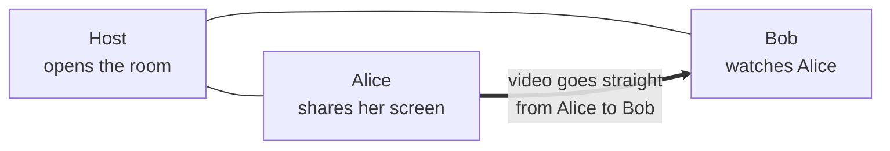

# ScreenShare

**Share your screen with the people on your network: no accounts, no cloud, just your LAN or VPN.**

> 🇧🇷 [Leia em português](README.pt-BR.md)

ScreenShare is a desktop app for Windows and macOS. One person opens a **room**; everyone else on the same network sees it appear and joins with a click (or a PIN, if the room is private). **Anyone in the room can share their screen**, several people at once, and everyone picks which streams they want to watch. Streams run at up to 1080p60 using the graphics card's hardware encoder, with the computer's sound if you want it. There is a chat, a list of who is watching whom, and simple moderation for the host.

Everything stays on your network. There is no server to sign up for and nothing is sent over the internet.



## Highlights

- 🔎 **Rooms find you**: rooms on your network show up by themselves; on a VPN, type the host's address.
- 🔒 **Public or private rooms**, with a PIN that the host can change at any time.
- 🖥️ **Everyone can share**, several screens at once, in a grid or a spotlight. Nothing plays until you choose it.
- 🎚️ **Quality your way**: the streamer sets the maximum, each viewer picks what they receive, and small windows automatically cost less bandwidth.
- 🔊 **Computer sound**, including 5.1/7.1 headsets, and an option to **leave your Discord call out** so friends don't hear themselves (Windows).
- 💬 **Chat, profile pictures, and host controls**: remove people, stop streams, mute the chat.
- 🔁 **Recovers by itself** after short network drops, and falls back to TCP when a network blocks WebRTC.

## How to run it

### What you need

- [Node.js](https://nodejs.org/) **20.19+** or **22.12+** (includes npm) and [Git](https://git-scm.com/).
- Windows 10/11 or macOS. The app also runs on Linux for development.

### Run it from the source code

```bash
git clone https://github.com/nsfxu/lan-screenshare.git
cd lan-screenshare
npm install
npm run dev
```

The app window opens. Click **Create room** to host, or wait for rooms on your network to appear and click **Join**.

### Try it with two people on one computer

```bash
npm run build
npx electron . --profile=alice
npx electron . --profile=bob
```

Each `--profile` has its own settings, so the two windows behave like two different people.

### Build an installer

There are no ready-made downloads yet; build one yourself:

```bash
npm run dist:win   # Windows installer (.exe), run on Windows
npm run dist:mac   # macOS disk image (.dmg), run on a Mac
```

The installer is written to `release/<version>/`. Everyone in a room needs the same app version.

### Check your changes

```bash
npm run typecheck
npm test
```

## Documentation

The full documentation, in English and Portuguese, is in [`docs/`](docs/README.md):

- [User guide](docs/en-US/user-guide.md): every feature and setting.
- [Troubleshooting](docs/en-US/troubleshooting.md): when something doesn't work.
- [Development guide](docs/en-US/development.md): scripts, debugging and installers.
- [Architecture](docs/en-US/architecture.md), [protocol](docs/en-US/protocol.md), [media pipeline](docs/en-US/media-pipeline.md) and [security](docs/en-US/security.md): how it works inside.
- [Contributing](docs/en-US/contributing.md) and [testing](docs/en-US/testing.md): how to help.

AI coding agents: start with [`AGENTS.md`](AGENTS.md).

## License

MIT, as declared in `package.json`.
