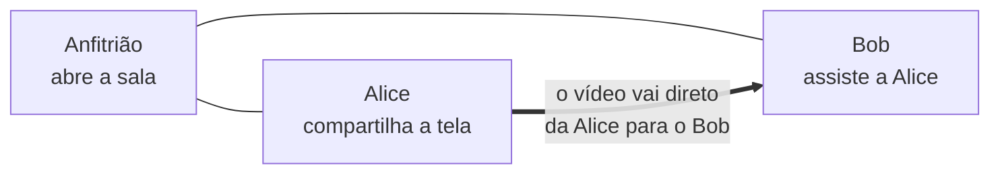

# ScreenShare

**Compartilhe sua tela com as pessoas da sua rede: sem contas, sem nuvem, só a sua LAN ou VPN.**

> 🇺🇸 [Read in English](README.md)

O ScreenShare é um aplicativo de desktop para Windows e macOS. Uma pessoa abre uma **sala**; todo mundo na mesma rede vê a sala aparecer e entra com um clique (ou com um PIN, se a sala for privada). **Qualquer pessoa na sala pode compartilhar a tela**, várias ao mesmo tempo, e cada um escolhe quais transmissões quer assistir. As transmissões chegam a 1080p60 usando o codificador de hardware da placa de vídeo, com o som do computador se você quiser. Tem chat, uma lista de quem está assistindo quem e moderação simples para o anfitrião.

Tudo fica na sua rede. Não existe servidor para se cadastrar e nada é enviado pela internet.



## Destaques

- 🔎 **As salas aparecem sozinhas**: as salas da sua rede surgem automaticamente; numa VPN, digite o endereço do anfitrião.
- 🔒 **Salas públicas ou privadas**, com um PIN que o anfitrião pode trocar a qualquer momento.
- 🖥️ **Todo mundo pode compartilhar**, várias telas ao mesmo tempo, em grade ou em destaque. Nada toca até você escolher.
- 🎚️ **Qualidade do seu jeito**: quem transmite define o máximo, cada espectador escolhe o que recebe, e janelas pequenas gastam menos banda automaticamente.
- 🔊 **Som do computador**, inclusive com headsets 5.1/7.1, e uma opção para **deixar a chamada do Discord de fora** para seus amigos não ouvirem a própria voz (Windows).
- 💬 **Chat, fotos de perfil e controles do anfitrião**: remover pessoas, parar transmissões, silenciar o chat.
- 🔁 **Se recupera sozinho** depois de quedas curtas de rede e usa TCP quando a rede bloqueia o WebRTC.

## Como rodar

### O que você precisa

- [Node.js](https://nodejs.org/) **20.19+** ou **22.12+** (já vem com o npm) e [Git](https://git-scm.com/).
- Windows 10/11 ou macOS. O app também roda no Linux para desenvolvimento.

### Rodar a partir do código-fonte

```bash
git clone https://github.com/nsfxu/lan-screenshare.git
cd lan-screenshare
npm install
npm run dev
```

A janela do app abre. Clique em **Create room** para criar uma sala, ou espere as salas da sua rede aparecerem e clique em **Join**.

### Testar com duas pessoas no mesmo computador

```bash
npm run build
npx electron . --profile=alice
npx electron . --profile=bob
```

Cada `--profile` tem suas próprias configurações, então as duas janelas se comportam como duas pessoas diferentes.

### Gerar um instalador

Ainda não há downloads prontos; gere o seu:

```bash
npm run dist:win   # instalador do Windows (.exe), rode no Windows
npm run dist:mac   # imagem de disco do macOS (.dmg), rode num Mac
```

O instalador é gravado em `release/<versão>/`. Todos na mesma sala precisam da mesma versão do app.

### Conferir suas alterações

```bash
npm run typecheck
npm test
```

## Documentação

A documentação completa, em inglês e português, está em [`docs/`](docs/README.md):

- [Guia do usuário](docs/pt-BR/user-guide.md): todos os recursos e configurações.
- [Solução de problemas](docs/pt-BR/troubleshooting.md): quando algo não funciona.
- [Guia de desenvolvimento](docs/pt-BR/development.md): scripts, depuração e instaladores.
- [Arquitetura](docs/pt-BR/architecture.md), [protocolo](docs/pt-BR/protocol.md), [pipeline de mídia](docs/pt-BR/media-pipeline.md) e [segurança](docs/pt-BR/security.md): como funciona por dentro.
- [Como contribuir](docs/pt-BR/contributing.md) e [testes](docs/pt-BR/testing.md): como ajudar.

Agentes de IA: comecem por [`AGENTS.md`](AGENTS.md).

## Licença

[MIT](LICENSE): você pode usar, modificar e compartilhar o ScreenShare livremente, desde que mantenha o aviso de copyright.
