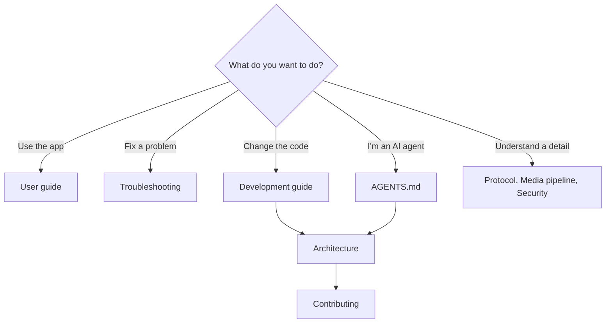
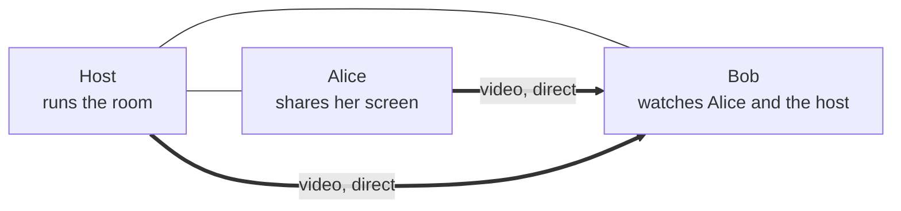

# ScreenShare documentation (English)

Welcome! These pages explain how to use ScreenShare, how it works inside, and how to contribute, whether you are a person or an AI agent.

> **Language:** English · [Português (Brasil)](../pt-BR/README.md)

## Where to start

| Page | For | What's inside |
|---|---|---|
| [User guide](user-guide.md) | Everyone | Rooms, sharing, watching, quality, audio, chat, host controls, every setting, privacy, file locations. |
| [Troubleshooting](troubleshooting.md) | Everyone | Rooms not found, can't join, black video, low quality, audio, CPU, macOS permissions. |
| [Development guide](development.md) | Contributors | Requirements, scripts, running several instances, build pipeline, debugging, installers, tech stack. |
| [Architecture](architecture.md) | Contributors | Processes, source layout, main classes, key flows, where state lives. |
| [Protocol reference](protocol.md) | Contributors | mDNS, `/info`, every WebSocket message, signaling sequences, TCP packet format, errors, limits. |
| [Media pipeline](media-pipeline.md) | Contributors | Capture, codecs, WebRTC, quality control, TCP fallback, system audio, previews, stats, measured results. |
| [Security](security.md) | Contributors | Threat model, controls, certificate pinning, Electron hardening, known limitations. |
| [Testing](testing.md) | Contributors | Automated tests, writing tests, driving the real app headlessly, release checklist. |
| [Contributing](contributing.md) | Contributors and AI agents | Ground rules, workflow, code style, checklists, docs rules, AI guidance. |
| [Glossary](glossary.md) | Everyone | The words used in the code and docs. |

AI agents: read [`AGENTS.md`](../../AGENTS.md) at the repository root first.

## ScreenShare in one minute

ScreenShare is a desktop app (Windows and macOS) for sharing screens with people on the same local network or VPN. One person creates a **room**; others find it automatically and join, with a **PIN** if the room is private. **Anyone** in the room can share their screen (with system audio), several people at once, and everyone chooses **which streams to watch**. There is chat, a people list and host moderation. Nothing leaves your network: no accounts, no cloud.

## Status and known limitations

- **Tested**: Windows 10 with an NVIDIA GPU, several instances on one machine, and the audio features on real Windows machines. Automated tests cover the server, routing, quality logic, crypto, codecs and crop maths.
- **macOS**: the build has not been compiled or run yet. It needs a Mac to build, and signing plus notarisation to distribute. System audio relies on Chromium feature flags (macOS 13+) and is untested.
- **Network conditions**: the adaptive quality logic is unit-tested, but real packet loss hasn't been simulated.
- **TCP fallback**: one encode is shared by all TCP viewers of a streamer, sized for the most demanding one.
- **Latency figures** on WebRTC are estimates (see [media pipeline](media-pipeline.md#statistics-and-latency)).
- **Discovery** needs multicast; on VPNs use **Connect by IP**.
- **Version**: everyone in a room must run the same protocol version (currently 4).
- **Out of scope** for now: remote control, microphone audio, several monitors in one stream, recording, Linux as a supported platform.

## About these docs

- Every page exists in **English** (`docs/en-US/`) and **Brazilian Portuguese** (`docs/pt-BR/`) with the same file names. Please keep them in sync (see [contributing → documentation](contributing.md#documentation)).
- Diagrams are written in [Mermaid](https://mermaid.js.org/) and render on GitHub.
- The original product brief the project started from is kept in [`prompt.md`](../../prompt.md) for history; these docs describe what was actually built.
