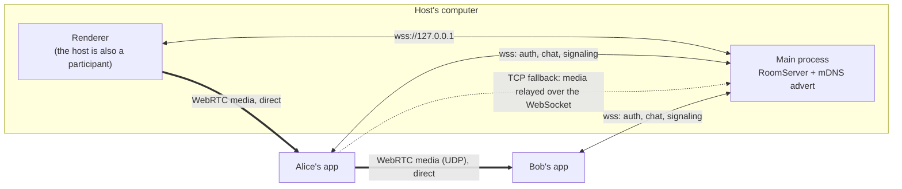
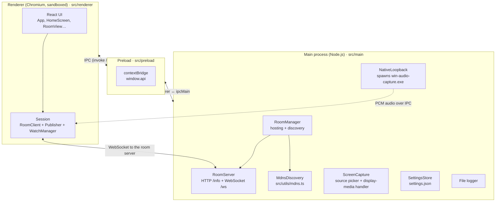
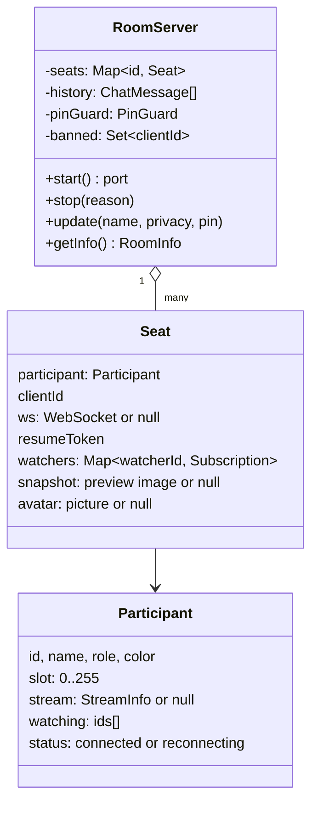
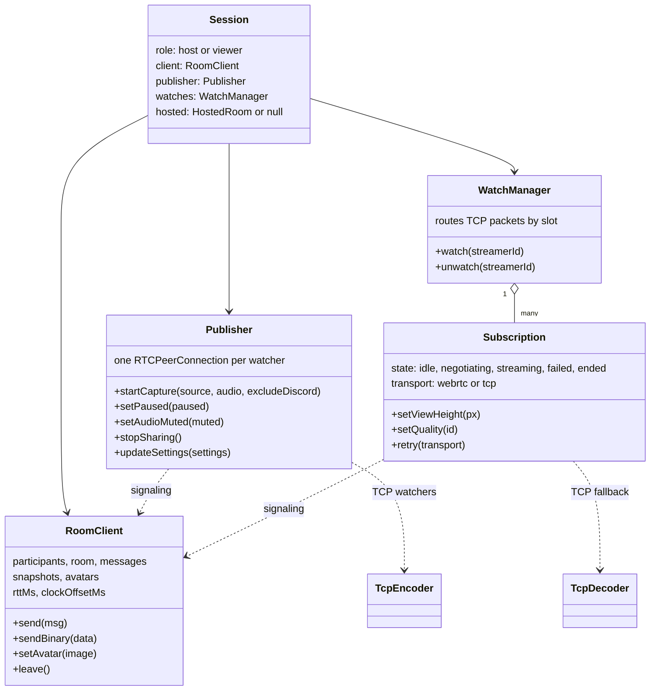
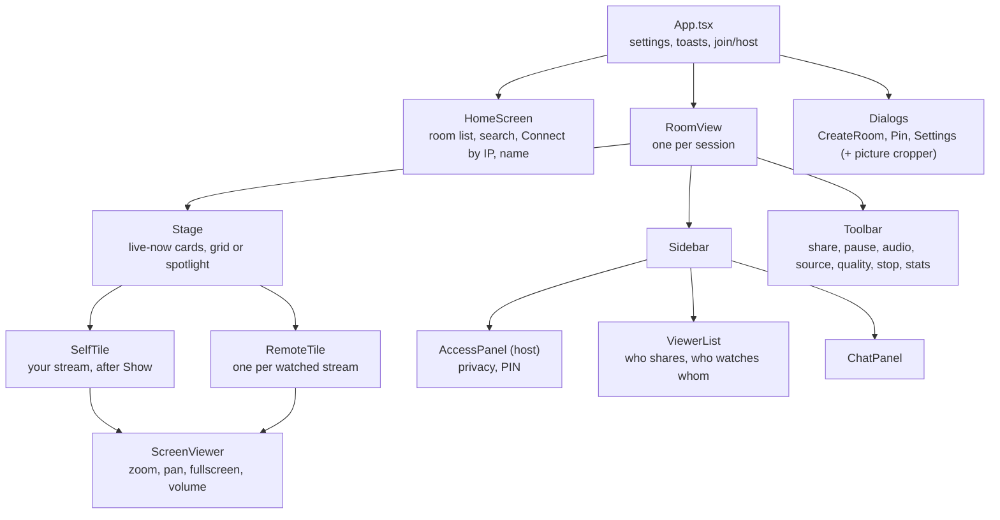
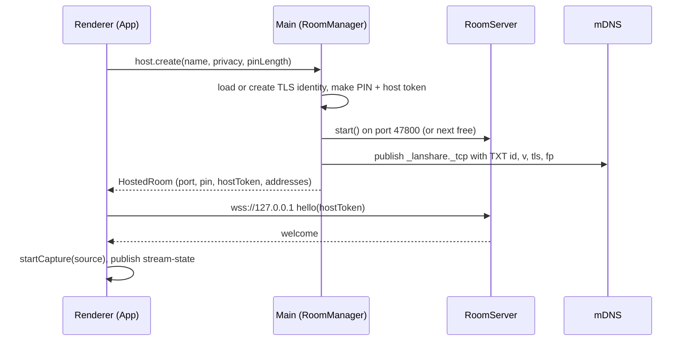
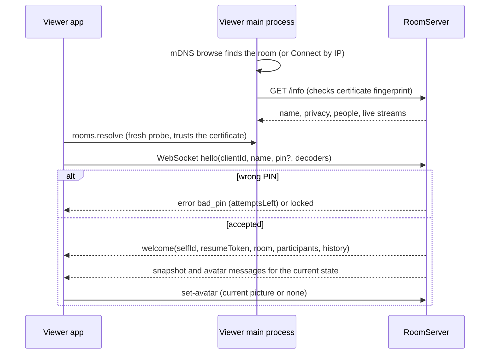
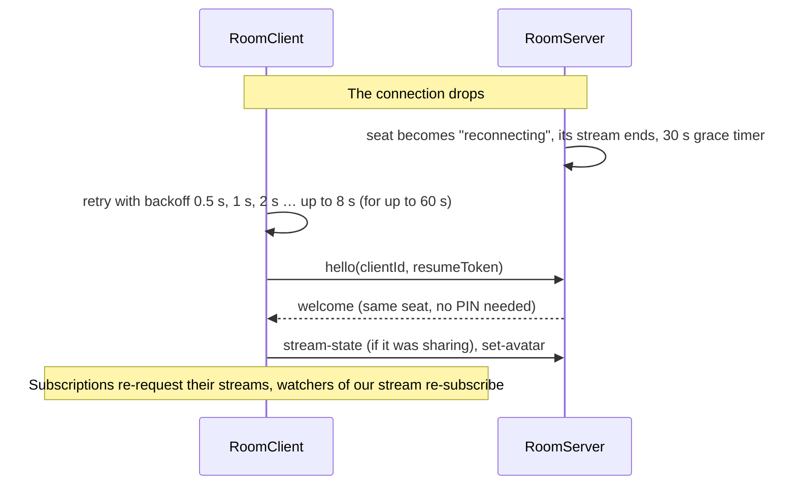

# Architecture

This page explains how ScreenShare is put together: which process does what, how the pieces talk to each other, and why it is built this way. Read it before changing anything non-trivial.

> **Language:** English · [Português (Brasil)](../pt-BR/architecture.md)

## Contents

- [The big picture](#the-big-picture)
- [Design principles](#design-principles)
- [Electron processes](#electron-processes)
- [Source layout](#source-layout)
- [Main process](#main-process)
- [Renderer: the session objects](#renderer-the-session-objects)
- [Renderer: the UI](#renderer-the-ui)
- [Key flows](#key-flows)
- [Where state lives](#where-state-lives)

## The big picture

Every participant runs the same desktop app. One of them **hosts** the room: their app also runs a small server (`RoomServer`) that everyone connects to. The server handles joining, chat, presence and moderation, and it passes WebRTC signaling messages between participants. It **never carries WebRTC video**: video goes directly from each person who shares (a *streamer*) to each person who chose to watch them (a *watcher*).



- **Discovery**: rooms advertise themselves over mDNS (`_lanshare._tcp`). Other apps browse for them and also poll each room's `GET /info` every 3 s for live data. People on VPNs or other subnets can type an address instead (**Connect by IP**).
- **Signaling**: WebRTC offers, answers and ICE candidates travel through the room's WebSocket, but only between a streamer and one of its current watchers.
- **Media**: one `RTCPeerConnection` per streamer→watcher pair. When UDP is blocked, that single pair falls back to a **TCP path**: the streamer encodes with WebCodecs and the server relays the encoded chunks.

## Design principles

These choices explain most of the code. Please keep them unless there is a strong reason not to.

1. **LAN only, no external services.** No accounts, no cloud, no STUN/TURN servers. Everything works on an isolated network.
2. **The server is thin.** It authenticates, relays and enforces rules. It does not encode, decode or mix media.
3. **Nothing plays unless you ask.** Watching is explicit. Your own stream is not played back either until you click **Show**. This saves bandwidth and GPU time.
4. **One connection per watcher.** Each watcher gets its own congestion control, adaptive quality and resolution cap, so one slow viewer never degrades the others.
5. **Only send what is shown.** Watchers report how big they display each stream. Streamers never send more pixels than that, and they split their upload budget fairly.
6. **The server enforces authority.** Host-only actions, PIN checks, rate limits and input validation happen on the server, never only in the UI.
7. **Pure logic lives in `src/shared`.** Quality ladders, codec ordering, crop maths and image validation have no DOM or Node dependencies, so they can be unit tested.

## Electron processes



| Process | Runs | Responsibilities |
|---|---|---|
| **Main** | Node.js | Window lifecycle, settings, logs, hosting a room (`RoomServer`), discovery (mDNS + probing), TLS identity and certificate pinning, the capture source picker, the Windows audio helper. |
| **Preload** | Isolated bridge | Exposes a small, typed API as `window.api` (see `ScreenShareApi` in `src/shared/ipc.ts`). The renderer has no Node access. |
| **Renderer** | Chromium, sandboxed | All UI, all WebRTC and WebCodecs work, the connection to the room (`RoomClient`), sharing (`Publisher`) and watching (`WatchManager`, `Subscription`). |

The host's renderer talks to its own server over `wss://127.0.0.1` exactly like any other participant. It proves it is the host with a random per-room **host token**.

## Source layout

```text
src/
  main/        Electron main process
    index.ts         app start-up, window, IPC handlers, Chromium switches, security settings
    roomManager.ts   hosting (server + TLS + mDNS advert) and discovery (mDNS + manual + /info probes)
    server.ts        RoomServer: auth, chat, presence, moderation, signaling relay, TCP media relay
    screenCapture.ts source list, display-media request handler, macOS permission
    nativeAudio.ts   runs the Windows audio helper and forwards PCM to the renderer
    settings.ts      settings.json load/validate/save
    logger.ts        rotating file logger
  preload/
    index.ts         contextBridge: window.api
  renderer/
    App.tsx          top-level screens, joining/hosting, toasts, settings
    components/      React components (see "Renderer: the UI")
    lib/             session logic: roomClient, publisher, subscription, watches, tcpStream,
                     nativeAudio, codecs, images, session, format, emitter
    styles.css       all styles (dark theme)
  shared/            code used by both sides; no DOM/Node APIs in the pure modules
    types.ts         wire protocol + settings + IPC types
    constants.ts     protocol version, limits, timings
    ipc.ts           IPC channel names and the window.api interface
    quality.ts       quality ladder, adaptive controller, per-watcher limits, budget split
    codecs.ts        codec ordering and SDP tweaks
    crop.ts          profile picture crop maths
    images.ts        data-URL validators for previews and profile pictures
  utils/             main-process helpers
    mdns.ts          DNS-SD advert + browse (bonjour-service, pure JS)
    network.ts       addresses, URLs, /info probing, certificate fingerprints
    crypto.ts        PIN generation/comparison, lockout, random ids
native/
  win-audio-capture/Program.cs   Windows audio helper (C#, built with the compiler that ships with Windows)
scripts/build-win-audio.cjs      builds the helper before `dev`/`build` (no-op off Windows)
tests/                           vitest: server, streams, quality, crop, codecs/TLS, crypto
build/                           packaging resources (macOS entitlements)
```

## Main process

### RoomManager (`src/main/roomManager.ts`)

Owns everything about rooms on this machine.

- **Hosting.** `createRoom()` generates the PIN (private rooms) and the host token, loads or creates the TLS identity, starts a `RoomServer`, and publishes the mDNS advert. `updateRoom()` changes the name, privacy or PIN live. `closeRoom()` stops everything.
- **TLS identity.** A self-signed EC P-256 certificate is generated once and stored in `host-identity.json` (user data folder) for two years, so its fingerprint stays stable and viewers can pin it.
- **Discovery.** It keeps a list of rooms from mDNS and from manual addresses, probes each one at `GET /info` every 3 s (`PROBE_INTERVAL_MS`), and drops rooms that have not answered for 10 s (`ROOM_STALE_MS`).
- **Certificate trust.** It remembers which certificate fingerprints belong to which host (from the mDNS TXT record or from the first probe). `index.ts` asks it to approve self-signed certificates in `setCertificateVerifyProc`.

### RoomServer (`src/main/server.ts`)

One instance per hosted room. It keeps a **seat** per participant:



What it does:

- Serves `GET /info` (public, no secrets) and the WebSocket at `/ws`.
- Checks `hello`: protocol version, host token, PIN (with lockout), capacity, bans, and seat **resume** after a network drop.
- Chat with history (500 messages in memory), rate limit and host moderation.
- Tracks who shares and who watches whom. It relays signaling **only** inside an existing streamer↔watcher pair.
- Relays TCP-fallback media: it prefixes each binary packet with the streamer's **slot** byte, applies per-watcher backpressure, and requests keyframes.
- Stores and redistributes stream previews and profile pictures, with validation and rate limits.

The full message list is in the [protocol reference](protocol.md).

### ScreenCapture and NativeLoopback

- `ScreenCapture` lists screens and windows with thumbnails for the app's own picker, then answers Chromium's `getDisplayMedia()` request with the chosen source (`setDisplayMediaRequestHandler`), with or without loopback audio.
- `NativeLoopback` runs `win-audio-capture.exe` when Chromium can't capture the audio we need (surround devices, or everything except Discord) and forwards its PCM to the renderer over IPC. See [media pipeline → audio](media-pipeline.md#system-audio).

## Renderer: the session objects

When you join or host a room, `src/renderer/lib/session.ts` creates a **Session**:



| Object | File | Job |
|---|---|---|
| `RoomClient` | `lib/roomClient.ts` | The WebSocket to the room: hello/welcome, presence, chat, previews, profile pictures, ping and clock offset, automatic reconnect that resumes the same seat. |
| `Publisher` | `lib/publisher.ts` | Your own share: capture, audio, one `RTCPeerConnection` per watcher, adaptive quality, view-size caps, upload budget, previews, stats. One shared WebCodecs encoder for TCP watchers. |
| `WatchManager` | `lib/watches.ts` | The set of streams you chose to watch. Re-subscribes if a watched streamer comes back within 30 s. Routes relayed TCP packets to the right `Subscription` by slot. |
| `Subscription` | `lib/subscription.ts` | Watching one streamer: asks for WebRTC, falls back to TCP after 8 s or on ICE failure, reports stats and the displayed size and quality choice. |
| `TcpEncoder` / `TcpDecoder` | `lib/tcpStream.ts` | The TCP fallback: WebCodecs encode on the streamer side, decode into a `MediaStreamTrack` on the watcher side. |

## Renderer: the UI



Components subscribe to the session objects' events (`client.on('participants', …)`, `publisher.on('stats', …)`, …) and keep React state as copies. Session objects never import React.

## Key flows

### Hosting a room



### Joining a room



### Sharing and watching

See the sequence diagrams in the [protocol reference](protocol.md#watching-a-stream-webrtc) and the pipeline in [media pipeline](media-pipeline.md).

### Network drop and resume



## Where state lives

| State | Owner | Persisted? |
|---|---|---|
| Settings (name, picture, quality, audio, network…) | `SettingsStore` (main) | `settings.json` in the user data folder |
| Host TLS key and certificate | `RoomManager` | `host-identity.json` (mode 600) |
| Room membership, chat history, previews, pictures | `RoomServer` (host) | Memory only; gone when the room ends |
| PIN | `RoomManager` / `RoomServer` | Memory only, never written to disk |
| Per-stream volume and quality choice | Renderer | `localStorage`, keyed by streamer name |
| Logs | File logger (main) | `screenshare.log`, rotated at 5 MB |

Paths for these files are listed in the [user guide](user-guide.md#where-your-files-are).
