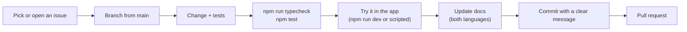

# Contributing

Thanks for helping! This page is for everyone who changes the project: people and AI coding agents alike. It explains the ground rules, the workflow, the code style, and step-by-step checklists for the most common kinds of change.

> **Language:** English · [Português (Brasil)](../pt-BR/contributing.md)

## Contents

- [Ground rules](#ground-rules)
- [Workflow](#workflow)
- [Code style](#code-style)
- [Checklists for common changes](#checklists-for-common-changes)
- [Documentation](#documentation)
- [For AI agents](#for-ai-agents)
- [Pull request checklist](#pull-request-checklist)

## Ground rules

1. **LAN only.** No accounts, cloud services, telemetry, STUN/TURN or anything that needs the internet.
2. **The server stays thin and strict.** It authenticates, relays and enforces rules; it does not process media. Every rule that matters (who may do what, sizes, rates) is enforced on the server.
3. **Explicit watching, only send what is shown.** Don't add anything that plays or sends media nobody asked for.
4. **Protocol compatibility is all or nothing.** Everyone in a room runs the same `PROTOCOL_VERSION`. If a change breaks compatibility, bump it (see [protocol → changing the protocol](protocol.md#changing-the-protocol)).
5. **Security first.** Read [security](security.md) before touching auth, IPC, the server or Electron settings.
6. **Leave it better, not bigger.** Small, focused changes. Don't refactor unrelated code in the same change.

## Workflow



- **Branches**: branch from `main`. Use a short descriptive name, for example `fix/fullscreen-controls` or `feature/avatar-crop`.
- **Commits**: one logical change per commit, so a single feature can be reverted on its own.
- **Commit messages**: a short subject in the imperative (*Add…*, *Fix…*, *Hide…*), a blank line, then what changed and **why**, and finally how it was verified. Example:

  ```text
  Hide the viewer controls in full screen when the mouse is still

  In a window the controls hide when the pointer leaves the video. In
  full screen a CSS rule forced them visible, so they covered the stream.

  - Controls and cursor hide after 2.5 s without mouse movement
  - Windowed behaviour is unchanged

  Verified in the app: controls hide after the delay and come back on move.
  ```

## Code style

There is no formatter configuration in the repository; **match the surrounding code**. In practice:

- TypeScript `strict`. Avoid `any`, except when reading loosely typed browser stats.
- 2-space indentation, single quotes, **no semicolons**, lines up to about 120 characters, no trailing commas.
- Names: `camelCase` for values and functions, `PascalCase` for types, classes and React components, `UPPER_SNAKE_CASE` for constants in `src/shared/constants.ts`.
- **Comments explain why**, not what. Classes and non-obvious functions get a short doc comment. Match the density of the file you edit.
- Put **decision logic in `src/shared`** as pure functions (no DOM, no Node APIs), with unit tests. Keep React components and WebRTC callbacks thin.
- Renderer code never imports Node modules; it goes through `window.api`.
- Constants (limits, timings) live in `src/shared/constants.ts` with a comment, not as magic numbers.
- User-facing text: plain, friendly English, sentence case (*Share screen*, not *Share Screen*). Error messages say what happened and what to do.
- The Windows audio helper must stay valid **C# 5** (see [development](development.md#working-on-the-audio-helper-without-windows)).

## Checklists for common changes

### Add a setting

1. Add the field with a comment to `Settings` in `src/shared/types.ts`.
2. Add a default in `defaults()` and validation in `sanitize()` (`src/main/settings.ts`). Old settings files must keep working.
3. Add the control to `SettingsPanel` (`src/renderer/components/Dialogs.tsx`).
4. If it must apply while in a room, handle it in `updateSessionSettings()` (`src/renderer/lib/session.ts`) and the object it affects (for example `Publisher.updateSettings`).
5. Document it in the settings table of the [user guide](user-guide.md#settings) (both languages).

### Add an IPC call (renderer ↔ main)

1. Add a channel name to `IPC` and the method to `ScreenShareApi` in `src/shared/ipc.ts`.
2. Implement it in `src/preload/index.ts` (`ipcRenderer.invoke` or a `subscribe` for events).
3. Handle it in `registerIpc()` in `src/main/index.ts`. **Coerce every argument** (`String()`, `Number()`, `!!`).
4. Use it from the renderer through `window.api`.

### Add or change a protocol message

Follow [protocol → changing the protocol](protocol.md#changing-the-protocol): types, server validation, client handling, version bump if needed, server test, docs.

### Change how media is sent

1. Read [media pipeline](media-pipeline.md).
2. Put the maths in `src/shared/quality.ts` (or similar) with tests.
3. Apply it through `Publisher.rebalance()` / `applyEncoding()` so all limits combine in one place.
4. Remember the TCP path (`TcpEncoder`) as well as WebRTC.
5. Check it in the app with two instances and read the stats badges (see [testing](testing.md#driving-the-real-app)).

### Change the UI

1. Components subscribe to session objects' events and keep copies in React state; unsubscribe in the effect cleanup.
2. Reuse existing classes in `styles.css` (`btn`, `icon-btn`, `toggle-row`, `modal`, `avatar`…).
3. Check it at the minimum window size (960×600).
4. Give buttons a `title` or `aria-label`.

## Documentation

- Docs live in `docs/en-US/` and `docs/pt-BR/`, with the **same file names** in both folders. When you change one language, change the other in the same pull request. If you can't translate, say so in the pull request and mark the untranslated section with a note so someone else can finish it.
- Diagrams use Mermaid (GitHub renders it). Keep labels short, and quote labels that contain punctuation: `A["Main process (Node)"]`.
- Links between pages are relative (`protocol.md`, `../pt-BR/protocol.md`).
- The top-level `README.md` / `README.pt-BR.md` stay short: what the app is and how to run it. Details go in `docs/`.

## For AI agents

If you are an AI coding agent, start with [`AGENTS.md`](../../AGENTS.md) at the repository root. In short:

- **Orient yourself** with [architecture](architecture.md) and the source layout there. The protocol is in `src/shared/types.ts`; limits and timings are in `src/shared/constants.ts`.
- **Verify before claiming.** Run `npm run typecheck` and `npm test`. For UI or media changes, drive the real app as described in [testing](testing.md#driving-the-real-app), and look at the result (screenshots, stats badges, computed styles).
- **Don't guess platform behaviour** you can't run (Windows audio, macOS permissions). Say what you verified and what still needs a real machine.
- **Keep changes scoped** to the task. Don't bump the protocol, change defaults or reformat files unless that is the task.
- **Update docs in both languages** when behaviour changes.
- **Never weaken server validation** or relay rules to make something work; fix the client instead.

## Pull request checklist

- [ ] `npm run typecheck` passes.
- [ ] `npm test` passes, and new logic or server rules have tests (including rejection paths).
- [ ] The change was tried in the app, or the pull request says why not (for example it needs Windows).
- [ ] `PROTOCOL_VERSION` bumped if old and new apps can no longer talk.
- [ ] Docs updated in **en-US and pt-BR**.
- [ ] No secrets, tokens or PINs written to disk or logs.
- [ ] Commit messages explain why.
