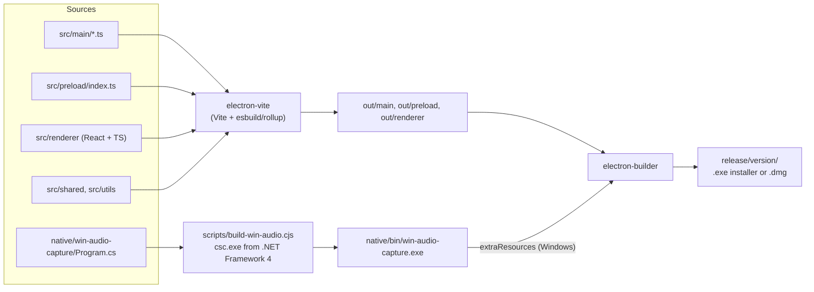
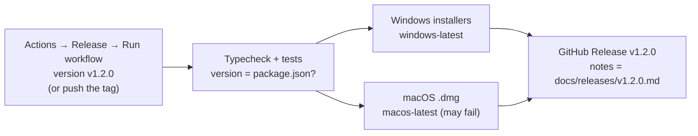

# Development guide

How to set up the project, run it, debug it and build installers.

> **Language:** English · [Português (Brasil)](../pt-BR/development.md)

## Contents

- [Requirements](#requirements)
- [First run](#first-run)
- [Scripts](#scripts)
- [Running several people on one computer](#running-several-people-on-one-computer)
- [How the build works](#how-the-build-works)
- [Debugging](#debugging)
- [Building installers](#building-installers)
- [Releasing](#releasing)
- [Tech stack](#tech-stack)

## Requirements

| Tool | Version | Notes |
|---|---|---|
| Node.js | 20.19+ or 22.12+ | Required by Vite 7 / electron-vite 5. |
| npm | comes with Node | The repo uses `package-lock.json`. |
| Git | any recent | |
| Windows | 10 or 11 | Nothing else. The audio helper is compiled with the C# compiler that ships with Windows (.NET Framework 4). |
| macOS | 13+ recommended | Needed to build the `.dmg`. System audio needs macOS 13+. |
| Linux | optional | The app runs for development (screen capture works on X11), but Linux is not a supported target. |

## First run

```bash
git clone https://github.com/nsfxu/lan-screenshare.git
cd lan-screenshare
npm install
npm run dev
```

`npm run dev` starts electron-vite with hot reload for the renderer: UI changes show up immediately. After changing `src/main` or `src/preload`, stop it and run `npm run dev` again, or start it with `npx electron-vite dev --watch` to rebuild and restart automatically.

Before sending a change, run:

```bash
npm run typecheck
npm test
```

## Scripts

| Script | What it does |
|---|---|
| `npm run dev` | Development mode with hot reload (builds the Windows audio helper first). |
| `npm run build` | Production build of main, preload and renderer into `out/` (builds the helper first). |
| `npm start` | Runs the production build (`electron-vite preview`). |
| `npm test` | Runs all unit and integration tests once (vitest). |
| `npm run test:watch` | Tests in watch mode. |
| `npm run typecheck` | TypeScript checks for the Node side (`tsconfig.node.json`, includes `tests/`) and the web side (`tsconfig.web.json`). |
| `npm run build:native` | Builds `native/bin/win-audio-capture.exe` (no-op on other systems or when up to date). |
| `npm run dist:win` | Build + Windows installer (NSIS, x64 and arm64) into `release/<version>/`. |
| `npm run dist:mac` | Build + macOS disk image (universal) into `release/<version>/`. Must run on a Mac. |
| `npm run dist` | Build + installer for the current platform. |

## Running several people on one computer

Each instance needs its own settings and identity. Use `--profile=<name>` with a production build:

```bash
npm run build
npx electron . --profile=alice
npx electron . --profile=bob
```

`--profile=alice` stores everything in a separate user data folder (`ScreenShare-alice`). One instance creates a room; the other finds it in the list (mDNS on the same machine), or you can use **Connect by IP** with `127.0.0.1:47800`.

On Linux, `--no-sandbox` is needed when running as root, for example inside a container.

## How the build works



- `electron.vite.config.ts` defines three builds: main, preload and renderer (React plugin).
- The audio helper is rebuilt only when `Program.cs` is newer than the `.exe`. `native/bin/` is git-ignored.
- `electron-builder.json` packages `out/**` into an `asar`, adds the helper as an extra resource on Windows, and sets the macOS entitlements and usage descriptions (Screen Recording, Local Network, Bonjour service `_lanshare._tcp`).

### Working on the audio helper without Windows

The helper uses Windows APIs, so it only runs on Windows. You can still check that it **compiles** as C# 5 (the language level of the compiler that ships with Windows) with Mono:

```bash
mcs -langversion:5 -warn:4 -target:exe -out:/tmp/win-audio-capture.exe native/win-audio-capture/Program.cs
```

Keep to C# 5: no string interpolation (`$"..."`), no `?.`, no `nameof`, no expression-bodied members, no `out var`.

## Debugging

- **DevTools**: press **Alt** to show the menu, then *View → Toggle Developer Tools*, or press **Ctrl+Shift+I** (**Cmd+Option+I** on macOS).
- **Logs**: the main process writes to `screenshare.log` (see [where your files are](user-guide.md#where-your-files-are)). In development it also prints to the terminal. Renderer code logs through `window.api.system.log(...)`, which shows up in the same file with a `[renderer]` prefix. Useful prefixes:
  - `[publisher]`: capture, audio, connections to watchers, quality changes;
  - `[watch <id>]`: one watched stream (transport, fallback, quality choice);
  - `[win-audio]`: the Windows audio helper (which process is left out, errors).
- **Settings → Open logs** opens the folder.
- **Stats**: the **Stats** button (streamer) and the badges on each tile (watcher) show fps, bitrate, codec, encoder, RTT and what limits quality.
- **`chrome://webrtc-internals`** isn't reachable from the app window, but WebRTC stats are visible in DevTools through `RTCPeerConnection.getStats()`.

## Building installers

**Windows** (on Windows):

```bash
npm run dist:win
```

This produces `release/<version>/ScreenShare-Setup-<version>-<arch>.exe`: an NSIS installer that lets the user pick the folder and creates a desktop shortcut.

**macOS** (on a Mac):

```bash
npm run dist:mac
```

This produces a universal `.dmg`. Distributing it to other Macs needs an Apple Developer ID certificate for signing and notarisation; see electron-builder's documentation. The macOS build hasn't been tested yet.

## Releasing

Releases are built by GitHub Actions (`.github/workflows/release.yml`) on GitHub's own Windows and macOS machines, so you don't need both systems.



1. Set `version` in `package.json` (installer names use it) and write the release notes in `docs/releases/v1.2.0.md`. Merge both into `main` through a pull request.
2. Start the release in one of two ways:
   - On GitHub: **Actions → Release → Run workflow**, branch `main`, version `v1.2.0`. The workflow creates the tag itself.
   - Or push a tag from your computer: `git tag v1.2.0 && git push origin v1.2.0`. An annotated tag's message is used as the notes when there is no notes file.
3. The workflow checks that the version matches `package.json`, runs the checks, builds the installers, and publishes the release with them attached. The macOS job may fail without blocking a Windows-only release.
4. Say in the notes when the protocol version changed: people on older versions can't join rooms with the new one.

Running the workflow without a version only builds, as a dry run; the installers are then kept as run artifacts.

The Windows build produces three installers: `-x64.exe` (most PCs), `-arm64.exe` (Windows on ARM) and one without a suffix that contains both.

The installers are not code-signed yet: Windows shows a SmartScreen warning (*More info → Run anyway*) and macOS blocks the first launch (right-click the app → *Open*).

## Tech stack

| Area | Choice |
|---|---|
| Desktop shell | Electron 44 (Chromium + Node.js) |
| Build | electron-vite 5, Vite 7, TypeScript 5.9 (strict) |
| UI | React 19, plain CSS (`src/renderer/styles.css`) |
| Media | WebRTC, WebCodecs, MediaStreamTrackProcessor/Generator |
| Networking | `ws` (WebSocket server), Node `http`/`https` |
| Discovery | `bonjour-service` (pure-JS mDNS) |
| TLS identity | `selfsigned` (EC P-256 certificates) |
| Tests | vitest |
| Packaging | electron-builder (NSIS, DMG) |
| Windows audio helper | C# 5, .NET Framework 4, WASAPI via COM interop |

Next: [architecture](architecture.md) · [contributing](contributing.md) · [testing](testing.md)
