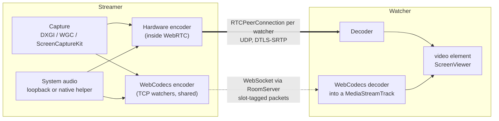
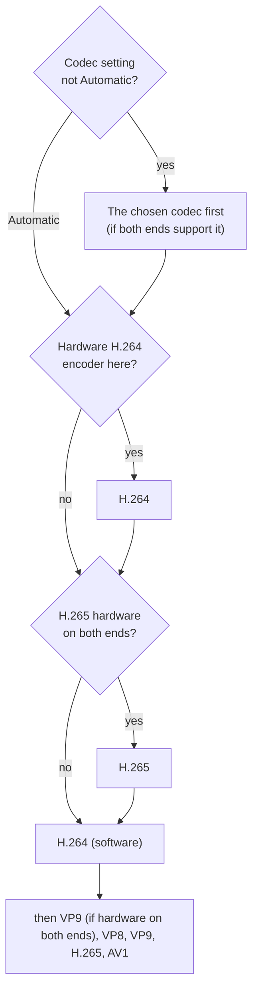
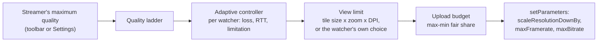
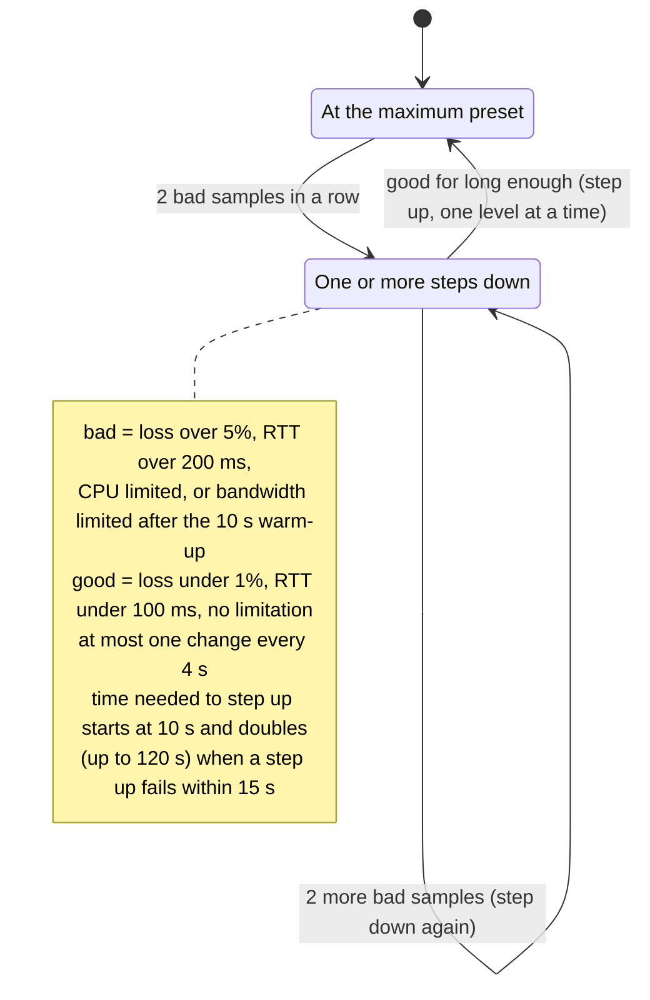
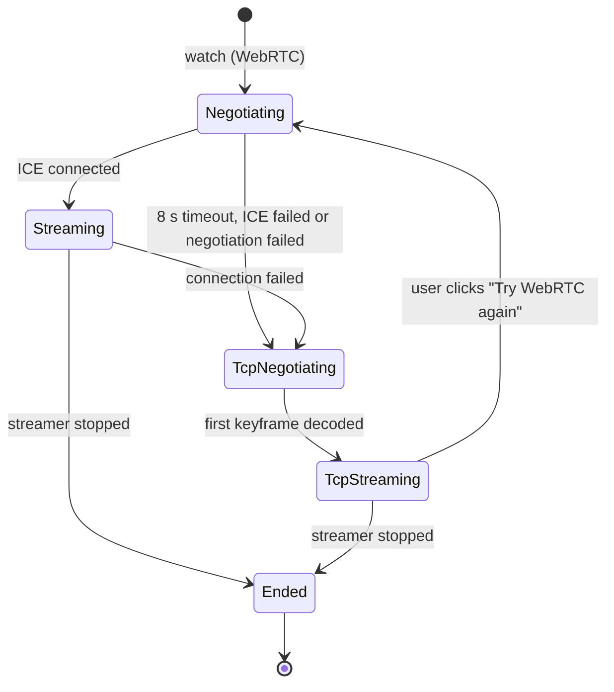
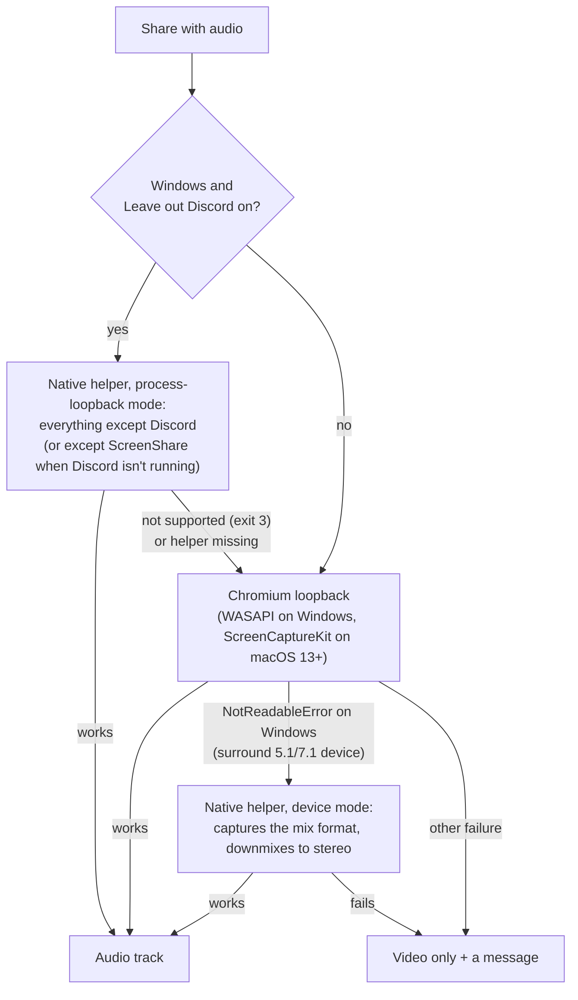

# Media pipeline

How a screen gets from one computer to another: capture, encoding, the two transports, quality control, audio, previews and statistics. Read [architecture](architecture.md) first for the overall structure.

> **Language:** English · [Português (Brasil)](../pt-BR/media-pipeline.md)

## Contents

- [Overview](#overview)
- [Capture](#capture)
- [Codec selection](#codec-selection)
- [WebRTC path](#webrtc-path)
- [Quality control](#quality-control)
- [TCP fallback](#tcp-fallback)
- [System audio](#system-audio)
- [Previews](#previews)
- [Statistics and latency](#statistics-and-latency)
- [Measured results](#measured-results)

## Overview

Each streamer captures **once** and fans out to every watcher. On the WebRTC path each watcher has its own `RTCPeerConnection` (its own encoder settings, congestion control and adaptive quality). On the TCP path, one WebCodecs encoder serves all TCP watchers of that streamer.

## Capture

- The app shows its own source picker (`SourcePicker.tsx`, fed by `window.api.capture.listSources()`), then calls `navigator.mediaDevices.getDisplayMedia()`. The main process answers that call with the chosen source through `session.setDisplayMediaRequestHandler` (`src/main/screenCapture.ts`), so no system dialog appears.
- Chromium uses the native capture APIs:
  - **Windows**: DXGI Desktop Duplication for screens, Windows.Graphics.Capture for single windows.
  - **macOS**: ScreenCaptureKit (the app asks for Screen Recording permission).
- Frames stay on the GPU and go straight to the hardware encoder.
- Capture constraints come from the streamer's **maximum quality** (frame rate, and a height cap unless it is "Native"). Changing it mid-share calls `applyConstraints()` on the live track, with no reconnection.
- `contentHint` is `motion` (keep the frame rate) or `detail` (keep text sharp), from Settings → *Optimize for*.

## Codec selection

At start-up the renderer asks `MediaCapabilities` which codecs can be **encoded** and **decoded**, and whether each is `powerEfficient` (a good sign of hardware support). Every participant sends its decoder list in `hello`, and streamers see it in `watch-request`.

`chooseCodecOrder()` (`src/shared/codecs.ts`) orders codecs per watcher:

A codec the watcher can't decode is never offered. The Settings panel shows the detected encode/decode support.

## WebRTC path

`Publisher.connect()` (`src/renderer/lib/publisher.ts`) for each watcher:

1. Creates an `RTCPeerConnection` with **no ICE servers** (LAN only), `max-bundle`, `rtcp-mux`.
2. Adds the video track with `priority: high` and an initial encoding from the adaptive preset.
3. Always adds an audio transceiver in the **same stream** (keeps lip-sync), so muting or switching sources only swaps the track.
4. Applies the codec order, creates the offer and sends it through the server.
5. When the answer arrives, raises WebRTC's start/min bitrate hints (`mungeBitrates`) so a LAN stream reaches full quality in a second or two, and tunes Opus for music (`mungeOpus`: stereo, 128 kbps average, in-band FEC, no DTX).

Chromium is started with switches that matter here (`src/main/index.ts`): real host ICE candidates instead of mDNS names (they don't resolve across VPNs), H.265 send/receive allowed, no background throttling of a minimized window.

## Quality control

Four independent limits decide what each watcher receives. They are combined in `Publisher.rebalance()` and applied with `RTCRtpSender.setParameters()` (no renegotiation).

### 1. The ladder and the adaptive controller

Presets (`QUALITY_PRESETS` in `src/shared/quality.ts`):

| Preset | Resolution | FPS | Max bitrate |
|---|---|---|---|
| Native60 | source | 60 | 20 Mbps |
| 1080p60 | 1080p | 60 | 15 Mbps |
| 720p60 | 720p | 60 | 10 Mbps |
| 720p30 | 720p | 30 | 5 Mbps |
| 480p30 | 480p | 30 | 2.5 Mbps |

The ladder starts at the streamer's maximum and goes down. Every second `AdaptiveController.update()` reads packet loss, RTT and WebRTC's `qualityLimitationReason` for each watcher:

Turning **Adaptive quality** off keeps each watcher at the maximum preset.

### 2. View limit (only send what is shown)

Each watcher's `ScreenViewer` measures the height it really displays the stream at (tile height × zoom × `devicePixelRatio`) and rounds it **up** to a step: 360, 480, 720, 1080, 1440 or 2160 (`viewHeightStep`). Only step changes are sent (`view-size`).

The watcher can also pick a **quality** in the tile menu (`WATCH_QUALITIES`): Auto, 1080p, 720p, 720p·30, 480p·30, 360p·30. The height sent is the smaller of the displayed step and the choice (`watchLimit`), plus an fps cap for the 30 fps options.

On the streamer side, `limitPreset()` lowers the preset to that height and fps and scales the bitrate with the pixel count and frame rate. Example: a 1080p60 preset shown in a 360p tile costs about 15 Mbps / 9 ≈ 1.7 Mbps.

### 3. Upload budget

Settings → *Upload limit when sharing* (default 100 Mbps, or Unlimited) is the streamer's **total** upload. `splitBudget()` shares it by max-min fairness (water filling): watchers who need little (small tiles) get what they need, and the rest is split among bigger views. TCP watchers count as one demand. It applies immediately, also mid-share.

### 4. Live changes

- Streamer changes the maximum: capture re-constrained, every watcher's controller restarts on the new ladder, the TCP encoder follows.
- Watcher resizes, zooms, goes fullscreen or picks a quality: new `view-size`, applied within a second.
- A new watcher joins or leaves: the budget is split again.

## TCP fallback

(These are simplified; the code's `SubscriptionState` is `idle | negotiating | streaming | failed | ended` plus a separate `transport` field.)

How it works (`src/renderer/lib/tcpStream.ts`):

- **Streamer**: `TcpEncoder` reads frames with `MediaStreamTrackProcessor` and encodes with WebCodecs `VideoEncoder` (tries H.264 Baseline and High, then VP9, then VP8, hardware first; `latencyMode: realtime`). Keyframe every 4 s or on request. Audio uses `TcpAudioEncoder` (Opus). One encoder serves all TCP watchers; it is sized for the most demanding of them (`largestViewLimit`) and gets one share of the upload budget.
- **Latency first**: frames are skipped when the encoder queue or the local socket buffer (4 MB) falls behind, and the next frame is a keyframe.
- **Server**: tags each packet with the streamer's slot, keeps at most 2 MB queued per watcher, and drops video to the next keyframe when a watcher falls behind (see [protocol → TCP fallback](protocol.md#tcp-fallback)).
- **Feedback**: every 2 s the server sends `tcp-feedback {sent, dropped}`, which feeds the TCP encoder's own adaptive controller.
- **Watcher**: `TcpDecoder` decodes with WebCodecs into a `MediaStreamTrackGenerator`, so the same `<video>` element plays both transports.

## System audio

Sharing can include everything the computer plays. Audio travels as a second track in the same stream (WebRTC) or as Opus packets (TCP). Voice processing is off (no echo cancellation, noise suppression or auto gain) because this is system audio, not a microphone.

### The Windows helper (`native/win-audio-capture`)

A small C# program, compiled with the C# compiler that ships with .NET Framework 4 on every Windows 10/11 (`scripts/build-win-audio.cjs`, run automatically before `dev` and `build`). The main process starts it (`src/main/nativeAudio.ts`) and forwards its output to the renderer, which turns it into a `MediaStreamTrack` (`src/renderer/lib/nativeAudio.ts`).

| Mode | Arguments | How |
|---|---|---|
| Device loopback | (none) | WASAPI loopback of the default output device in its own mix format (works with 5.1/7.1 headsets), downmixed to stereo: centre and surrounds at −3 dB, LFE dropped. |
| Everything except one app | `--exclude Discord.exe,DiscordPTB.exe,DiscordCanary.exe,DiscordDevelopment.exe --fallback-pid <ScreenShare pid>` | Windows **process loopback** (Windows 10 2004+ / 11) in *exclude target process tree* mode. It finds Discord's root process (the biggest tree) and rescans every 2 s, so Discord can start, quit or restart mid-share. While Discord isn't running it leaves out ScreenShare itself. Windows converts to 48 kHz stereo. |

Output on stdout: a 10-byte header `"SSA1"` + u32 sample rate + u16 channels (always 2), then interleaved float32 stereo frames. It sends real silence when nothing plays, so the timing stays steady. Exit codes: `1` fatal error, `2` device invalidated, `3` process loopback not available (before the header). It exits when its stdin closes.

Limitations: process loopback can leave out **one** app at a time, and it leaves out *all* of Discord's sound (notifications and soundboard too).

## Previews

Every 5 s (and 1.2 s after starting, switching source or resuming) a streamer grabs a frame, scales it to 320 px wide and sends it as a JPEG data URL (`snapshot`). The server checks the sender is sharing, the type and the size, rate-limits it, stores the latest one for late joiners and clears it when the stream ends. Watchers see previews on the "live now" cards and chips. The streamer keeps its own latest preview locally for its "You" card.

## Statistics and latency

- **Streamer** (`Publisher.collectStats`, every second): per watcher, bitrate, fps, RTT, loss, encode time, encoder implementation, codec and quality limitation. Shown in the Stats panel and the self tile overlay, and sent to watchers as `publisher-stats` (encode time).
- **Watcher** (`Subscription`, every second, sent every 2 s): fps, resolution, bitrate, loss, codec, decoder, dropped frames, audio bitrate, transport, and a latency figure.
- **Latency on WebRTC is an estimate**: capture + encode + ½ RTT + jitter buffer + decode + display. On the TCP path it is measured from the capture timestamp in each packet, corrected by the clock offset to the host (from `ping`/`pong`).

## Measured results

Windows 10, NVIDIA GPU, all instances on one machine (loopback network), before the v4 changes:

| Scenario | Result |
|---|---|
| One stream, WebRTC | 1920×1080 @ 57–58 fps, H.265 via `MediaFoundationVideoEncodeAccelerator (NVIDIA HEVC Encoder MFT)`, encode 4.3 ms/frame, estimated glass-to-glass latency ~30–65 ms |
| Hardware encoder capacity | 8 simultaneous 1080p hardware encodes (H.264 and H.265) at ~57 fps each, ~13 % total CPU, while decoding 8 streams |
| Two people sharing, a third watching both | Both at 1080p ~57 fps; the two streamers also watched each other |
| View-size cap | Two grid tiles (≈276 px tall) → 640×360 each. Spotlight (505 px) → 1280×720. Zoom 212 % → 1920×1080 |
| Upload budget | A streamer's upload went from 6.2–7.5 Mbps to 2.3–3.5 Mbps with a 3 Mbps limit, applied mid-session |
| TCP fallback | Two streams at once over TCP, each routed to its tile by slot, 57–58 fps, WebCodecs hardware H.264 |
| Audio | 440 Hz tone received as 439 Hz (WebRTC ~160 kbps, TCP Opus 128 kbps); a 7.1 headset through the native helper: 880 Hz received as 879 Hz |
| Reconnection | Forced drop → "Reconnecting…", both watched streams renegotiated within ~45 ms |

Automatic codec selection picked H.265 on that machine because the driver reported hardware HEVC encoding as power-efficient but not H.264, even though hardware H.264 encoding worked when forced.

Real packet loss has not been simulated yet; the adaptive controller and the budget split are covered by unit tests.
