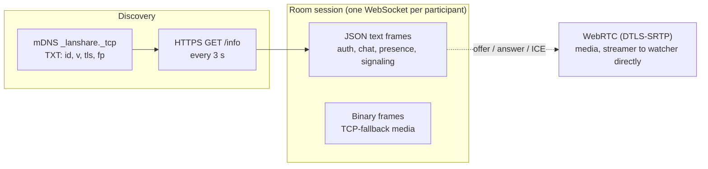
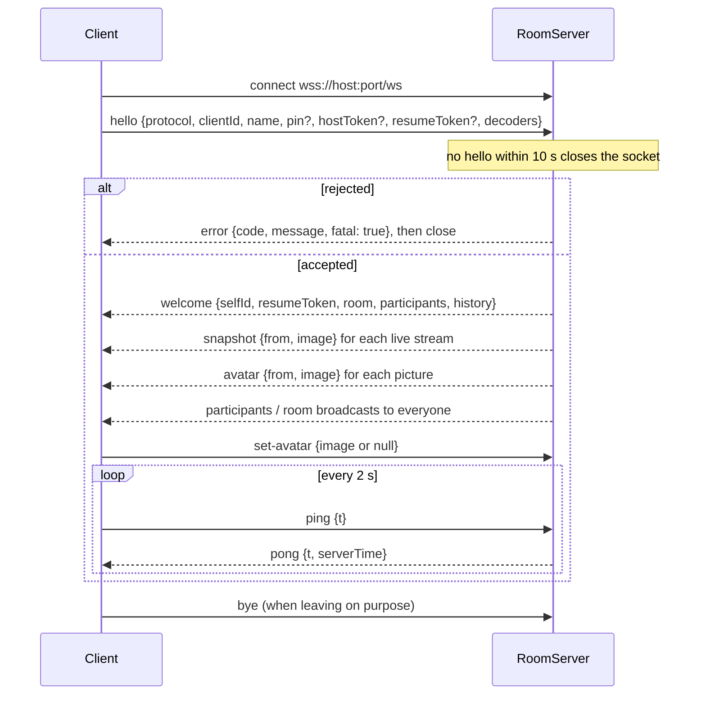
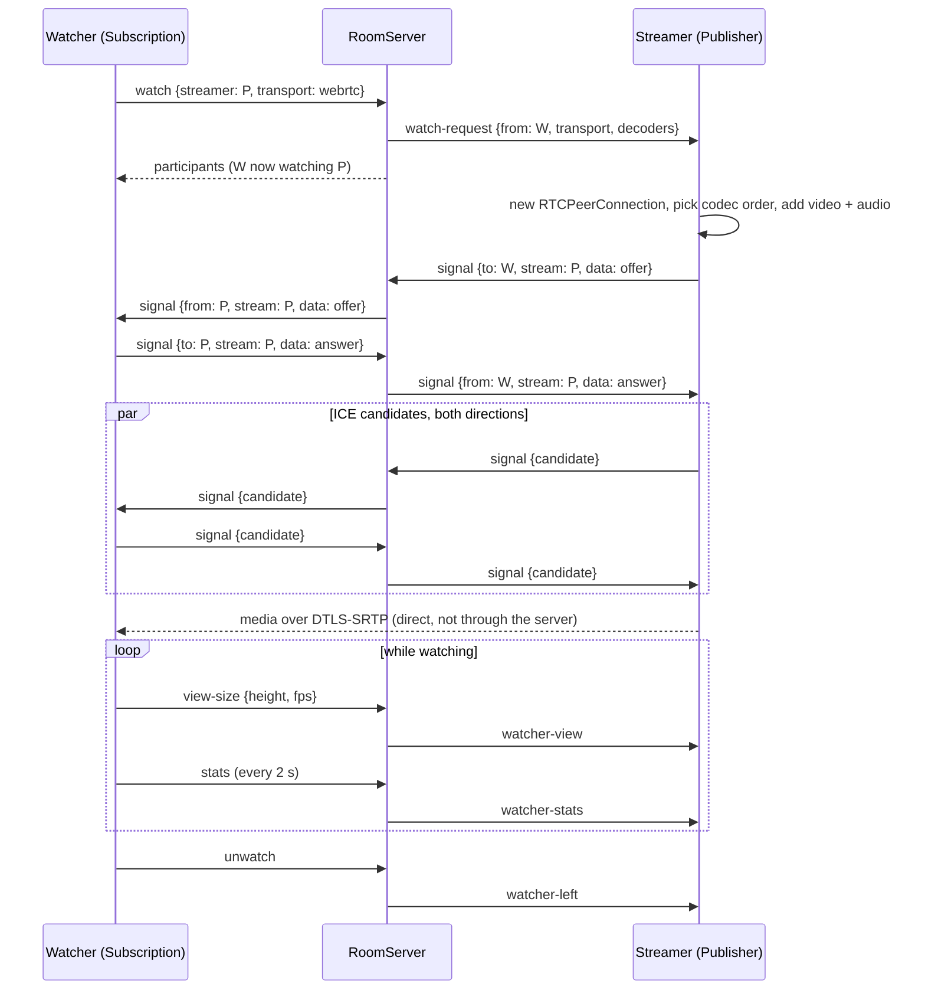
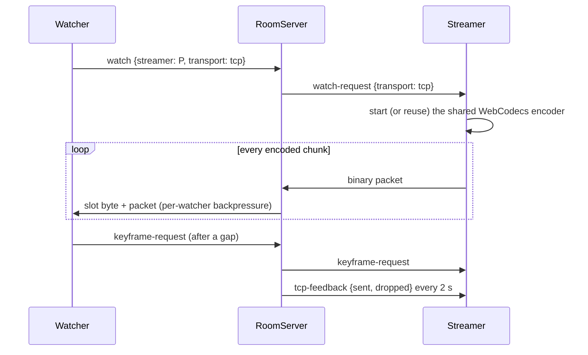

# Wire protocol reference

Everything that travels between apps in a room: discovery, the HTTP probe, the WebSocket messages, and the binary format of the TCP fallback. The source of truth is `src/shared/types.ts` (`ClientMessage`, `ServerMessage`) and `src/shared/constants.ts`.

> **Language:** English · [Português (Brasil)](../pt-BR/protocol.md)

## Contents

- [Versioning](#versioning)
- [Transports at a glance](#transports-at-a-glance)
- [Discovery (mDNS)](#discovery-mdns)
- [HTTP: GET /info](#http-get-info)
- [WebSocket: connection lifecycle](#websocket-connection-lifecycle)
- [Client → server messages](#client--server-messages)
- [Server → client messages](#server--client-messages)
- [Watching a stream (WebRTC)](#watching-a-stream-webrtc)
- [TCP fallback](#tcp-fallback)
- [Errors](#errors)
- [Limits and timings](#limits-and-timings)
- [Changing the protocol](#changing-the-protocol)

## Versioning

- The current version is **`PROTOCOL_VERSION = 4`** (`src/shared/constants.ts`).
- Every `hello` carries it. The server rejects a different version with the fatal error `version_mismatch` ("This room runs a different app version").
- `GET /info` and the mDNS TXT record also report it, so the room list can show incompatible rooms.
- History: v3 introduced multi-stream (anyone can share). v4 added profile pictures (`set-avatar` / `avatar`) and the watcher's frame-rate choice in `view-size` / `watcher-view`.

## Transports at a glance



| Channel | Where | Security |
|---|---|---|
| mDNS advert and browse | UDP multicast, LAN only | Not secret. Carries the certificate fingerprint used for pinning. |
| `GET /info` | `https://<host>:<port>/info` (or `http` when TLS is off) | Public data only. |
| WebSocket | `wss://<host>:<port>/ws` | TLS with a self-signed certificate pinned by fingerprint (default), PIN for private rooms. |
| WebRTC media | Direct UDP (ICE also tries TCP candidates) | Always DTLS-SRTP encrypted. |

The default port is **47800**. If it is busy, the host tries the next 19 ports, then any free port.

## Discovery (mDNS)

The host publishes a DNS-SD service `ScreenShare-<roomId>._lanshare._tcp.local` on the room's port (IPv4 only). The TXT record holds:

| Key | Meaning |
|---|---|
| `id` | Room id |
| `v` | Protocol version |
| `tls` | `1` when the WebSocket uses TLS |
| `fp` | SHA-256 fingerprint of the host's certificate (empty when TLS is off) |

Live data (name, people, privacy, streams) is **not** in the TXT record; it comes from `GET /info`. Browsers re-query every 5 s.

## HTTP: GET /info

Returns `RoomInfo` as JSON, with no secrets:

```json
{
  "id": "k3j9…",
  "name": "Alice's room",
  "hostName": "Alice",
  "privacy": "private",
  "viewerCount": 3,
  "maxUsers": 10,
  "streams": 2,
  "protocol": 4,
  "startedAt": 1790000000000
}
```

The probing side checks the certificate fingerprint against the one advertised over mDNS, if any (`probeRoom` in `src/utils/network.ts`). Any other path returns 404.

## WebSocket: connection lifecycle



- **Host**: the host's own renderer sends `hostToken` instead of a PIN. A wrong token is rejected with `host_only`.
- **Resume**: after a drop, a client that presents the `resumeToken` from its last `welcome` within **30 s** gets the same seat back without the PIN.
- **Clock**: `pong.serverTime` lets clients estimate their clock offset to the host (used to measure latency on the TCP path).
- **Heartbeat**: the server also sends WebSocket pings every 10 s and drops sockets that don't answer.

## Client → server messages

| `type` | Fields | Who may send | What the server does |
|---|---|---|---|
| `hello` | `protocol, clientId, name, pin?, hostToken?, resumeToken?, decoders?` | Anyone, first message only | Authenticates, creates or resumes the seat, sends `welcome`. |
| `chat` | `text` | Anyone | Validates (≤ 2000 chars, ≤ 5 per second, not muted) and broadcasts `chat`. |
| `set-avatar` | `image: string \| null` | Anyone | Validates (JPEG/WebP/PNG data URL ≤ 40 000 chars, ≤ 1 change per second, ignores repeats), stores it, broadcasts `avatar` to everyone including the sender. |
| `signal` | `to, stream, data` | Streamer ↔ one of its watchers | Relays as `signal` only if `to` and `stream` form an existing streamer↔watcher pair. |
| `ping` | `t` | Anyone | Answers `pong`. |
| `bye` | | Anyone | Frees the seat immediately. |
| `stream-state` | `sharing, paused, audio` | Anyone | Starts, updates or ends this participant's stream. Announces start/stop in chat. |
| `publisher-stats` | `encodeMs` | Streamer | Forwards to its watchers as `publisher-stats`. |
| `snapshot` | `image` | Streamer only | Validates (JPEG/WebP ≤ 96 000 chars, ≤ 1 per second), stores, broadcasts to others. |
| `watch` | `streamer, transport` | Anyone | Registers the subscription, sends `watch-request` to the streamer. Re-sending switches transport. Errors: `bad_request`, `not_sharing`. |
| `unwatch` | `streamer` | Watcher | Removes the subscription, sends `watcher-left` to the streamer. |
| `stats` | `streamer, stats, mediaState` | Watcher | Forwards to the streamer as `watcher-stats`. |
| `keyframe-request` | `streamer` | TCP watcher | Forwards to the streamer (at most 1 per second per watcher). |
| `view-size` | `streamer, height, fps` | Watcher | Validates (`height` 90–8640 or null, `fps` 1–240 or null) and forwards as `watcher-view`. |
| `kick` | `userId` | Host | Bans the client id for this room session, closes its socket, announces it. |
| `stop-stream` | `userId` | Host | Ends that stream, tells the streamer (`stream-stopped`) and its watchers. |
| `delete-message` | `id` | Host | Removes the message from history, broadcasts `chat-deleted`. |
| `mute-chat` | `muted` | Host | Toggles chat mute, broadcasts `room`. |
| `end-room` | | Host | Sends `room-ended` to everyone and shuts the server down. |

Host-only messages from anyone else get the non-fatal error `host_only`.

## Server → client messages

| `type` | Fields | Sent to |
|---|---|---|
| `welcome` | `selfId, resumeToken, room, participants, history` | The client that just joined or resumed |
| `error` | `code, message, fatal, retryAfterMs?, attemptsLeft?` | The client concerned (fatal errors close the socket) |
| `room` | `room` (`RoomState`: info + `chatMuted`) | Everyone, when room info changes |
| `participants` | `participants` | Everyone, when presence, streams or watching change |
| `chat` | `message` | Everyone |
| `chat-deleted` | `id` | Everyone |
| `signal` | `from, stream, data` | The other side of a streamer↔watcher pair |
| `pong` | `t, serverTime` | The pinging client |
| `kicked` | | The kicked client (then its socket closes) |
| `room-ended` | `reason` | Everyone, when the room ends |
| `watch-request` | `from, transport, decoders` | A streamer: someone wants to watch |
| `watcher-left` | `id` | A streamer: a watcher stopped watching or left |
| `watcher-stats` | `from, stats, mediaState` | A streamer: what a watcher receives |
| `watcher-view` | `from, height, fps` | A streamer: how a watcher displays the stream and what it chose |
| `keyframe-request` | `from` | A streamer with TCP watchers |
| `tcp-feedback` | `sent, dropped` | A streamer with TCP watchers, every 2 s |
| `stream-stopped` | `reason` | A streamer whose stream the host stopped |
| `publisher-stats` | `from, encodeMs` | Watchers of that streamer |
| `stream-ended` | `streamer` | Watchers of a stream that ended |
| `snapshot` | `from, image \| null` | Everyone except the streamer (null clears it) |
| `avatar` | `from, image \| null` | Everyone, sender included (null removes it) |

`Participant` (in `participants` and `welcome`) contains: `id`, `name`, `role` (`host` or `viewer`), `color`, `joinedAt`, `status` (`connected` or `reconnecting`), `slot` (0–255, used by the TCP relay), `stream` (`{paused, audio, startedAt}` or `null`) and `watching` (ids of the streams this person watches).

## Watching a stream (WebRTC)

The **streamer creates the offer**, the watcher answers. The server only relays between the pair.



The `stream` field names the streamer that owns the connection. Two people who watch each other have two connections, and `stream` keeps their signals apart.

## TCP fallback

A `Subscription` switches to TCP when WebRTC hasn't connected within **8 s**, when ICE fails, or when the watcher enabled **Always use TCP transport**. It sends `watch` again with `transport: "tcp"`.



### Binary packet layout

The streamer sends this (little endian). The server prepends one byte, the streamer's **slot**, before forwarding it, so watchers of several TCP streams can route each packet to the right tile.

| Offset | Size | Field |
|---|---|---|
| (server adds) | 1 | Streamer slot (0–255) |
| 0 | 1 | Kind: `1` video, `2` audio |
| 1 | 1 | Flags: bit 0 = keyframe (video only) |
| 2 | 8 | Capture wall-clock time, ms (float64) |
| 10 | 2 | Video width, or audio sample rate |
| 12 | 2 | Video height, or audio channel count |
| 14 | 1 | Codec string length *n* |
| 15 | *n* | Codec string (ASCII, e.g. `avc1.42E034`, `opus`) |
| 15 + *n* | … | Encoded chunk |

Backpressure: when a watcher's socket has more than **2 MB** queued, the server drops that watcher's video until the next keyframe and asks the streamer for one (at most once per second). Audio packets are only dropped while over the limit. Only participants who are sharing may send binary frames.

## Errors

| Code | Fatal | When |
|---|---|---|
| `bad_request` | Sometimes | Malformed JSON, missing hello, unknown participant, message too long |
| `version_mismatch` | Yes | Different `PROTOCOL_VERSION` |
| `pin_required` | Yes | Private room and no PIN given |
| `bad_pin` | Yes | Wrong PIN (`attemptsLeft` included) |
| `locked` | Yes | Too many wrong PINs from this address (`retryAfterMs` included) |
| `room_full` | Yes | 10 people already in the room |
| `kicked` | Yes | This client id was removed by the host |
| `host_only` | No (Yes for a bad host token) | A host-only action from a non-host |
| `chat_muted` | No | Chat is muted by the host |
| `rate_limited` | No | More than 5 chat messages in a second |
| `not_sharing` | No | Tried to watch someone who isn't sharing |

## Limits and timings

| What | Value | Constant |
|---|---|---|
| People per room (host included) | 10 | `MAX_USERS` |
| PIN length | 4–6 digits (default 6) | `PIN_MIN_LENGTH`, `PIN_MAX_LENGTH` |
| Wrong PINs before lockout / lockout | 3 / 5 min | `MAX_PIN_ATTEMPTS`, `PIN_LOCKOUT_MS` |
| Chat message / history / rate | 2000 chars / 500 messages / 5 per s | `CHAT_*` |
| Display name / room name | 32 / 48 chars | `NAME_MAX_LENGTH`, `ROOM_NAME_MAX_LENGTH` |
| Resume grace after a drop | 30 s | `RESUME_GRACE_MS` |
| Discovery probe / stale room | 3 s / 10 s | `PROBE_INTERVAL_MS`, `ROOM_STALE_MS` |
| WebSocket heartbeat | 10 s | `HEARTBEAT_INTERVAL_MS` |
| WebRTC connect timeout before TCP | 8 s | `WEBRTC_CONNECT_TIMEOUT_MS` |
| Preview size / interval / min interval | ≤ 96 000 chars / 5 s / 1 s | `SNAPSHOT_*` |
| Profile picture size / min interval | ≤ 40 000 chars (128 px JPEG) / 1 s | `AVATAR_*` |
| Max WebSocket message | 16 MB | `MAX_PAYLOAD_BYTES` (server) |
| TCP relay queue per watcher | 2 MB | `TCP_MAX_BUFFERED_BYTES` |

## Changing the protocol

1. Add or change the type in `ClientMessage` / `ServerMessage` (`src/shared/types.ts`) with a short comment saying who sends it and why.
2. Handle it in `RoomServer.handleMessage` (`src/main/server.ts`). **Validate every field**: types, ranges, sizes, and whether this sender is allowed to send it.
3. Handle it in the renderer (`RoomClient.handle`, `Publisher.onMessage` or `Subscription.onMessage`).
4. If old and new apps can no longer talk to each other correctly, bump `PROTOCOL_VERSION`.
5. Add a server test in `tests/streams.test.ts` or `tests/server.test.ts` (the `TestClient` helper makes this short). See [testing](testing.md).
6. Update this page in **both** languages.
