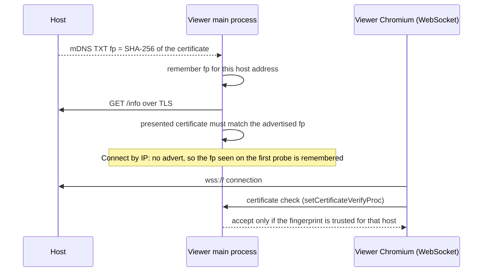

# Security

What ScreenShare protects against, how, and where the limits are. If you change anything that touches authentication, the server, IPC or Electron settings, read this page first.

> **Language:** English · [Português (Brasil)](../pt-BR/security.md)

## Threat model

ScreenShare runs on a local network or VPN that people mostly trust, such as an office, a home or a team VPN. It still assumes that:

- someone on the network may try to **join a private room** without the PIN, or guess it;
- someone may try to **pretend to be the host** or another participant;
- someone may **listen** on the network;
- a participant may send **malformed or oversized data**, or try to use the server to reach people they shouldn't;
- a viewer may try to **record** what they watch.

It does **not** try to protect against a malicious host (the host runs the server and sees all signaling and chat), or against someone with control of a participant's computer.

## Controls at a glance

| Risk | Control | Where |
|---|---|---|
| Joining a private room without the PIN | 4–6 digit PIN from a CSPRNG, compared in constant time | `src/utils/crypto.ts`, `RoomServer.handleHello` |
| Guessing the PIN | 3 wrong PINs lock that address out for 5 minutes | `PinGuard` |
| PIN leaking later | Kept in memory only, never written to disk. The host can regenerate it or set a new one mid-session; people already inside stay connected | `RoomManager`, `RoomServer.update` |
| Impersonating the host | The host's own client proves itself with a random per-room token (constant-time compare) | `hostToken` in `hello` |
| Listening on the network | WebSocket over TLS (default on); WebRTC media is always DTLS-SRTP | `RoomManager.loadCertificate`, WebRTC |
| Fake room / man in the middle | Self-signed certificate **pinned** by SHA-256 fingerprint (from mDNS or the first probe) | `setCertificateVerifyProc` in `src/main/index.ts`, `RoomManager.isTrustedCertificate` |
| Abusing the relay | Signaling is relayed only inside an existing streamer↔watcher pair, and only for that streamer's connection. Only people who share can send media or previews | `RoomServer.handleMessage` (`signal`), `relayMedia` |
| Host-only actions from others | Kick, stop stream, delete message, mute chat and end room are checked on the server | `RoomServer.handleMessage` |
| Rejoining after a kick | The kicked client id is banned for the rest of that room session | `banned` set |
| Oversized or malformed input | Names sanitized and capped; chat length and rate limits; images must match strict data-URL patterns and size caps; view sizes and fps range-checked; 16 MB max message; 10 s to say hello | `server.ts`, `shared/images.ts` |
| Recording what you watch | While you watch any stream, the window is hidden from screen capture and screenshots (`setContentProtection`). The app has no recording or chat export | `RoomView.tsx`, `setViewerProtection` IPC |

## Certificate pinning

Each host generates one self-signed EC P-256 certificate and keeps it for two years in `host-identity.json`, so its fingerprint stays the same across rooms. No certificate authority is involved; trust comes from the fingerprint.

Any certificate that is not trusted for that exact host name is rejected, even if the system would otherwise accept it.

**Trade-off:** with **Connect by IP**, the first probe is *trust on first use*. Someone who can intercept that very first connection could present their own certificate. Rooms found over mDNS don't have this gap because the fingerprint arrives in the advert.

## Electron hardening

Set in `src/main/index.ts`:

- `contextIsolation: true`, `sandbox: true`, `nodeIntegration: false`. The renderer only sees the typed `window.api` from the preload script.
- `window.open` is denied and navigation away from the app page is blocked.
- Permissions: only `media`, `display-capture`, `notifications`, `fullscreen` and `clipboard-sanitized-write` are granted.
- IPC handlers coerce their arguments (`String(...)`, `Number(...)`, booleans) and never run arbitrary code.
- The Windows audio helper receives only fixed arguments (the Discord process names and a numeric PID).

## Known limitations

Be honest about these in reviews and issues:

- **Client ids are self-reported.** The kick ban is by client id, so a determined user can rejoin by changing their id (for example with a new `--profile`). The PIN still applies to private rooms. Changing the PIN after a kick locks them out.
- **The PIN lockout is per IP address.** Several machines behind one address share a counter, and an attacker with many addresses gets 3 tries per address.
- **The host is trusted.** It relays signaling and chat, so it could read or alter them. Media on the WebRTC path flows directly between streamer and watcher and is encrypted, but the host relays the signaling that sets up that encryption, so a malicious host could interfere with it. On the TCP fallback, media passes through the host, readable by it (the TLS WebSocket only protects it on the network).
- **TLS can be turned off** in Settings (for debugging). Then chat, signaling and TCP media are unencrypted on the network.
- **Content protection is best effort.** It stops screenshots and screen recorders on the viewer's machine, not a phone camera.
- **Profile pictures and previews are images from other people.** They are only rendered as `` data URLs of JPEG/WebP/PNG type, never as HTML or SVG.

## Checklist for changes

- Validate every new message field on the **server**: type, range, size, and whether this sender may send it.
- Never relay data between participants who don't already have a reason to talk (the streamer↔watcher rule).
- Never store the PIN or tokens on disk. Compare secrets with `pinsEqual` (constant time).
- New IPC: coerce arguments in the handler, and add the method to `ScreenShareApi` in `src/shared/ipc.ts` rather than exposing `ipcRenderer`.
- New images from the network: validate with a strict pattern and a size cap, as in `src/shared/images.ts`.
- Add a test for the rejection path, not only the happy path.

## Reporting a problem

Open an issue describing the problem and how to reproduce it. If it could let someone into a private room or run code on another machine, please avoid posting a working exploit publicly; describe the impact and contact the maintainers first.
