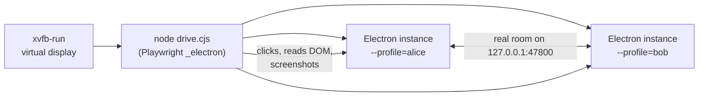

# Testing

How the project is tested today, how to add tests, and how to check a change in the real app, even on a machine without a screen.

> **Language:** English · [Português (Brasil)](../pt-BR/testing.md)

## Contents

- [Quick commands](#quick-commands)
- [What the automated tests cover](#what-the-automated-tests-cover)
- [Writing a server test](#writing-a-server-test)
- [Testing pure logic](#testing-pure-logic)
- [Driving the real app](#driving-the-real-app)
- [Checking the Windows audio helper](#checking-the-windows-audio-helper)
- [Manual checklist before a release](#manual-checklist-before-a-release)

## Quick commands

```bash
npm run typecheck   # both TypeScript projects (Node side incl. tests, web side)
npm test            # all tests once
npm run test:watch  # re-run on change
npx vitest run tests/quality.test.ts   # one file
```

Tests run in Node (`vitest.config.ts`, environment `node`, 15 s timeout). They start real `RoomServer` instances on random ports and talk to them over real WebSockets.

## What the automated tests cover

| File | Covers |
|---|---|
| `tests/server.test.ts` | Public `/info`, joining and chat, PIN required and lockout after 3 tries, PIN change, forged host token, kick and ban, chat mute and deletion, seat resume without PIN, capacity, room end. |
| `tests/streams.test.ts` | Multi-stream: anyone can share, distinct slots, watch rules, signaling only inside streamer↔watcher pairs, several streamers at once, stats and keyframe routing, view-size relay and validation, ending streams (stop, disconnect, host stop, kick), TCP relay tagged by slot with keyframe gating and relay stats, previews (validation, late joiners, clearing), profile pictures (broadcast, late joiners, invalid data, rate limit, removal). |
| `tests/quality.test.ts` | Quality ladder, adaptive controller (step down/up, back-off), view-height steps, per-watcher limits, budget split, watcher quality choices, TCP combined limit. |
| `tests/network.test.ts` | Address parsing and ranking, URLs with IPv6, TLS probe with fingerprint, codec ordering, Opus and bitrate SDP tweaks. |
| `tests/crypto.test.ts` | PIN generation and validation, constant-time comparison, `PinGuard` lockout and reset. |
| `tests/crop.test.ts` | Profile picture crop: centring, clamping, zoom around a point, zoom limits. |

What is **not** covered by automated tests: anything that needs a real browser engine (WebRTC, WebCodecs, capture, the React UI) and the Windows audio helper. Use the techniques below for those.

## Writing a server test

`tests/helpers.ts` provides `TestClient`: it connects, sends `hello` for you, records every message, and lets you `wait()` for a specific one.

```ts
import { afterEach, describe, expect, it } from 'vitest'
import { RoomServer } from '../src/main/server'
import { TestClient } from './helpers'

let server: RoomServer | null = null
afterEach(async () => {
  await server?.stop()
  server = null
})

describe('my feature', () => {
  it('relays the thing to everyone', async () => {
    server = new RoomServer({
      roomId: 'room1', name: 'Test', hostName: 'Host', privacy: 'public',
      pin: null, hostToken: 'secret', port: 0, bindAddress: '127.0.0.1'
    })
    const port = await server.start()

    const host = await TestClient.connect(port, { hostToken: 'secret', name: 'Host' })
    const alice = await TestClient.connect(port, { name: 'Alice', clientId: 'alice' })
    const { selfId } = await alice.wait('welcome')

    alice.send({ type: 'chat', text: 'hi' })
    const msg = await host.wait('chat', (m) => m.message.userId === selfId)
    expect(msg.message.text).toBe('hi')
  })
})
```

`tests/streams.test.ts` has ready-made `startServer()`, `join()` and `share()` helpers. Copy that style. Always test the **rejection** path too (bad data, wrong sender, rate limits).

## Testing pure logic

Keep decision logic out of React and out of WebRTC callbacks, in `src/shared/*.ts` with no DOM or Node imports. It is then trivial to test. Examples: `AdaptiveController`, `splitBudget`, `limitPreset`, `chooseCodecOrder`, `zoomAt` (crop). The Node-side TypeScript config (`tsconfig.node.json`) has no DOM types, so a test can't import a module that uses DOM APIs.

## Driving the real app

For UI, WebRTC and media changes, run the real Electron app and control it with Playwright's Electron support. This works on a headless Linux machine with **Xvfb**, which is how changes were verified during development.



### Setup

```bash
npm install
npx electron-vite build            # the script runs the production build in out/
# Playwright (global or local) and Xvfb must be installed
```

### Example

```js
// drive.cjs: host a room with a fake screen and check the "You" card appears.
const { _electron: electron } = require('playwright')
const repo = process.cwd()

async function launch(profile) {
  const app = await electron.launch({
    executablePath: require('electron'),          // path to the Electron binary
    args: [repo, `--profile=${profile}`, '--no-sandbox'],
    cwd: repo
  })
  // Replace the capture source list with one fake source (Xvfb's list can be flaky).
  await app.evaluate(({ ipcMain }) => {
    ipcMain.removeHandler('capture:list')
    ipcMain.handle('capture:list', () => [
      { id: 'screen:fake:0', name: 'Fake screen', kind: 'screen', thumbnail: '', displayId: '0' }
    ])
  })
  const win = await app.firstWindow()
  // Capture an animated canvas instead of the real screen.
  await win.evaluate(() => {
    navigator.mediaDevices.getDisplayMedia = async () => {
      const c = document.createElement('canvas')
      c.width = 1920
      c.height = 1080
      const g = c.getContext('2d')
      let n = 0
      setInterval(() => {
        g.fillStyle = '#357'
        g.fillRect(0, 0, c.width, c.height)
        g.fillStyle = '#fff'
        g.font = '96px sans-serif'
        g.fillText('frame ' + n++, 80, 540)
      }, 16)
      return c.captureStream(60)
    }
  })
  return { app, win }
}

;(async () => {
  const { app, win } = await launch('alice')
  await win.getByRole('button', { name: /Create room/ }).first().click()
  await win.locator('.source').first().click()
  await win.getByRole('button', { name: /Start sharing/ }).click()
  await win.waitForSelector('.room')
  console.log(await win.locator('.stream-card').allInnerTexts()) // expect the "You" card
  await win.screenshot({ path: 'room.png' })
  await app.close()
})()
```

Save it as `drive.cjs` in the repository root and run it:

```bash
xvfb-run -a -s "-screen 0 1600x1000x24" node drive.cjs
# with a global Playwright install:
NODE_PATH=$(npm root -g) xvfb-run -a -s "-screen 0 1600x1000x24" node drive.cjs
```

Tips:

- **Two people**: launch a second instance with another `--profile`, click **Connect by IP**, type `127.0.0.1:47800`, press Enter, wait a moment for the probe, then click **Join**.
- **Real screen capture** under Xvfb needs the `Composite` and `DAMAGE` extensions (`-s "-screen 0 1600x1000x24 +extension Composite +extension DAMAGE"`) and can still be flaky; the fake canvas above is more reliable.
- **Read what the user would see**: stats badges (`.tile .stat-badge`), computed styles (`getComputedStyle(...).opacity`), or pixels of an image (draw it on a canvas and read `getImageData`).
- **Pretend to be another OS** for platform-only UI: override the `system:app-info` IPC handler to return `platform: 'win32'`.
- **Logs** of each profile are in its user data folder (for example `~/.config/ScreenShare-alice/logs/` on Linux).
- Delete the test profiles' folders afterwards if you want a clean state.

## Checking the Windows audio helper

On Windows, `npm run dev` rebuilds and uses it. To test it by hand:

```bat
native\bin\win-audio-capture.exe > out.raw
native\bin\win-audio-capture.exe --exclude Discord.exe --fallback-pid 0 > out.raw
```

The first 10 bytes are the `SSA1` header. Messages about the device and the excluded process go to stderr. Close stdin (Ctrl+Z, Enter) to stop it.

On other systems, check that it still compiles as C# 5 with Mono (`mcs -langversion:5`), see [development](development.md#working-on-the-audio-helper-without-windows).

## Manual checklist before a release

Run through this on real machines (ideally one Windows and one macOS) on a real network:

- [ ] A room appears on another computer by itself (mDNS), and **Connect by IP** works.
- [ ] Private room: wrong PIN shows attempts left, 3 wrong PINs lock for 5 minutes, the right PIN works.
- [ ] Share a screen and a single window, with and without system audio.
- [ ] Windows: in a Discord call with **Leave out Discord** on, the others don't hear themselves.
- [ ] Windows with a 5.1/7.1 headset: system audio still works.
- [ ] Two people share at once; a third watches both; grid, spotlight, **Watch all**.
- [ ] Your own stream is hidden until **Show**.
- [ ] Streamer quality picker and the watcher's per-tile quality menu both change what is received (see the stats badges).
- [ ] Full screen: controls and cursor hide after 2.5 s, come back on mouse move.
- [ ] Block UDP (or enable **Always use TCP transport**): the stream still plays over TCP.
- [ ] Unplug the network for a few seconds: everyone reconnects and streams resume.
- [ ] Profile picture: pick, crop, change, remove; everyone sees it.
- [ ] Host: switch privacy, new PIN, kick, stop a stream, mute chat, delete a message, end the room.
- [ ] Closing the app while hosting asks for confirmation.
- [ ] While watching, screenshots of the ScreenShare window come out black.
