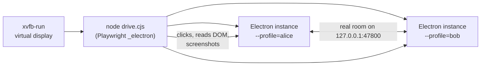

# Testing

How the project is tested today, how to add tests, and how to check a change in the real app, even on a machine without a screen.

> **Language:** English · [Português (Brasil)](../pt-BR/testing.md)

## Contents

- [Quick commands](#quick-commands)
- [What the automated tests cover](#what-the-automated-tests-cover)
- [Writing a server test](#writing-a-server-test)
- [Testing pure logic](#testing-pure-logic)
- [End-to-end tests](#end-to-end-tests)
- [Driving the real app](#driving-the-real-app)
- [Measuring performance](#measuring-performance)
- [Checking the Windows audio helper](#checking-the-windows-audio-helper)
- [Manual checklist before a release](#manual-checklist-before-a-release)

## Quick commands

```bash
npm run typecheck   # both TypeScript projects (Node side incl. tests, web side)
npm test            # all tests once
npm run test:e2e    # the real app, two instances (see end-to-end tests)
npm run test:watch  # re-run on change
npx vitest run tests/quality.test.ts   # one file
```

Tests run in Node (`vitest.config.ts`, environment `node`, 15 s timeout). They start real `RoomServer` instances on random ports and talk to them over real WebSockets.

## What the automated tests cover

| File | Covers |
|---|---|
| `tests/server.test.ts` | Public `/info`, joining and chat, PIN required and lockout after 3 tries, PIN change, forged host token, kick and ban, chat mute and deletion, seat resume without PIN, capacity, room end. |
| `tests/streams.test.ts` | Multi-stream: anyone can share, distinct slots, watch rules, signaling only inside streamer↔watcher pairs, several streamers at once, stats and keyframe routing, view-size relay and validation, ending streams (stop, disconnect, host stop, kick), TCP relay tagged by slot with keyframe gating and relay stats, previews (validation, late joiners, clearing), profile pictures (broadcast, late joiners, invalid data, rate limit, removal). |
| `tests/quality.test.ts` | Quality ladder, adaptive controller (step down/up, back-off), view-height steps, per-watcher limits, budget split, watcher quality choices, TCP combined limit. |
| `tests/network.test.ts` | Address parsing and ranking, URLs with IPv6, TLS probe with fingerprint, codec ordering, Opus and bitrate SDP tweaks. |
| `tests/crypto.test.ts` | PIN generation and validation, constant-time comparison, `PinGuard` lockout and reset. |
| `tests/crop.test.ts` | Profile picture crop: centring, clamping, zoom around a point, zoom limits. |
| `tests/perf.test.ts` | Measuring tool: its switches, percentiles, joining what each streamer sent with what each viewer received, freezes across reconnects, the warm-up left out, the summary table. |
| `tests/renderer/gameCursor.test.ts` | Games that hide the cursor: switching to a fullscreen game's window and back after alt-tab, ignoring brief flashes and other displays, suggesting windowed games, keeping the screen when asked, no retry loop on failure. |

The unit and integration tests don't cover what needs a real browser engine (WebRTC, WebCodecs, capture, the React UI): the [end-to-end tests](#end-to-end-tests) cover the main flows in the real app, and [driving the real app](#driving-the-real-app) by hand covers the rest. The Windows helpers need a Windows machine.

## Writing a server test

`tests/helpers.ts` provides `TestClient`: it connects, sends `hello` for you, records every message, and lets you `wait()` for a specific one.

```ts
import { afterEach, describe, expect, it } from 'vitest'
import { RoomServer } from '../src/main/server'
import { TestClient } from './helpers'

let server: RoomServer | null = null
afterEach(async () => {
  await server?.stop()
  server = null
})

describe('my feature', () => {
  it('relays the thing to everyone', async () => {
    server = new RoomServer({
      roomId: 'room1', name: 'Test', hostName: 'Host', privacy: 'public',
      pin: null, hostToken: 'secret', port: 0, bindAddress: '127.0.0.1'
    })
    const port = await server.start()

    const host = await TestClient.connect(port, { hostToken: 'secret', name: 'Host' })
    const alice = await TestClient.connect(port, { name: 'Alice', clientId: 'alice' })
    const { selfId } = await alice.wait('welcome')

    alice.send({ type: 'chat', text: 'hi' })
    const msg = await host.wait('chat', (m) => m.message.userId === selfId)
    expect(msg.message.text).toBe('hi')
  })
})
```

`tests/streams.test.ts` has ready-made `startServer()`, `join()` and `share()` helpers. Copy that style. Always test the **rejection** path too (bad data, wrong sender, rate limits).

## Testing pure logic

Keep decision logic out of React and out of WebRTC callbacks, in `src/shared/*.ts` with no DOM or Node imports. It is then trivial to test. Examples: `AdaptiveController`, `splitBudget`, `limitPreset`, `chooseCodecOrder`, `zoomAt` (crop). The Node-side TypeScript config (`tsconfig.node.json`) has no DOM types, so a test can't import a module that uses DOM APIs. When the logic has to live in the renderer (it talks to `window.api` or the `Publisher`), test it from `tests/renderer/`, which is type-checked with the web config: stub `window` with `vi.stubGlobal` and pass fakes for the rest, as `tests/renderer/gameCursor.test.ts` does.

## End-to-end tests

`e2e/` runs the real app: two instances (Alice and Bob, the production build in `out/`) in the same room, driven through Playwright's Electron support.

| Test | Covers |
|---|---|
| Public room (`room.spec.ts`) | Alice creates a room and shares; Bob joins with **Join by IP**; nothing plays until he chooses her stream; frames arrive and have the colour of her screen; chat both ways; when she stops sharing (Sharing menu), his stream goes away. |
| Private room (`room.spec.ts`) | A wrong PIN is refused (error under the room, still outside); the right PIN lets Bob in. |
| Automatic quality (`quality.spec.ts`) | Alice shares; the test reports what's in front as the Windows helper would. The Stats panel shows smooth motion before anything is known, sharp text for a normal window, smooth motion for a fullscreen app on the shared screen, sharp text for one on another screen; Automatic is the default and a fixed choice in Settings wins. The panel also shows the whole computer's CPU and memory. |
| Hidden viewers (`hidden.spec.ts`) | Alice and Carol share, Bob watches both. Bob minimized: no frames from either, and Alice sees "not looking (video paused)"; restored: both play again. Alice's tile full screen (simulated): Carol's stream pauses, Alice's keeps playing. |
| Versions (`version.spec.ts`) | A room on a newer protocol says who has to update (by IP, and on its row); someone on a newer version gets the others a one-time notice. |
| Struggle warnings (`struggle.spec.ts`) | Faked `qualityLimitationReason`: a short spike says nothing, a lasting one shows the notice, it clears with the problem, and "Lower to" lowers the quality. |
| Layout (`layout.spec.ts`) | Recent rooms, rejoining, the window title, hidden columns surviving a reload; in a 700 px window the chat and rooms open over the room. |
| People in the sidebar (`members.spec.ts`) | Bob's list under the room, the hover preview, watching from it, the host removing someone. |
| Tiles (`stage.spec.ts`) | The invite tile, a tile per person, watching from a tile, focus and Esc, the ⓘ details for a guest and the host. |
| Chat (`chat.spec.ts`) | The room-named message box, the unread count while hidden, grouping. |
| Menus (`menus.spec.ts`) | The Sharing button's menu (quality, stop), right-click on your own tile and on a stream (quality you receive, stop watching), the host's actions. |
| Focus and volume (`focus.spec.ts`) | Alice shares with a test tone: click to focus and back, the speaker mutes and unmutes, its slider and the menu's change the played volume, double-click full screen (the stream fills the screen with no frame; the strip, controls and name hide after a moment without the mouse and come back when it moves), hiding the strip pauses its stream. |
| Themes (`theme.spec.ts`) | Each theme changes the page colours; the choice survives a reload. |
| Settings (`settings.spec.ts`) | The section list jumps to a section and follows the scrolling. |
| Updates (`update.spec.ts`) | The update status is faked as the main process would send it: Settings → About (automatic checks on by default, a development build doesn't update), downloading, then **Restart to update** in the title bar, which restarts straight away outside a room and asks first while hosting; on macOS **Update to …** opens the page. |

```bash
npm run test:e2e                 # builds, then runs e2e/ (about 5 minutes)
npx playwright test              # without rebuilding (after npm run build)
xvfb-run -a -s "-screen 0 1920x1080x24" npx playwright test   # Linux without a display, as in CI
```

How `e2e/fixtures.ts` keeps them safe and repeatable:

- **Screen capture is an animated canvas**, never your real screen. System audio and the native audio helper are switched off, and the Windows foreground helper never starts: tests report what's in front themselves (`setForeground`).
- **Each person gets a fresh profile** (`--profile=e2e-alice-<pid>`), deleted afterwards. Apps are quit like a user quitting, so a host isn't stuck on the "End room?" confirmation.
- **Your screen stays yours.** Set the screen to open the windows on with `E2E_DISPLAY=3`, or once in a git-ignored `e2e.local.json`: `{ "display": 3 }`. The windows then sit side by side on that screen (`--display`/`--tile`, see [development](development.md#running-several-people-on-one-computer)) and never take focus.
- One test at a time (`workers: 1`): instances share ports and mDNS.

When a test fails, Playwright prints the step and a page snapshot, and the fixture attaches a screenshot of every window (`test-results/`). In CI, [`ci.yml`](../../.github/workflows/ci.yml) runs them on every push and keeps the report as the `e2e-report` artifact, and the release workflow runs them before building installers.

To add a test, use the `people(n)` fixture and the flows in `e2e/fixtures.ts` (`createRoom`, `joinByIp`, `sendChat`, `decodedFrames`, `cornerColour`). Wait for what the user would see (`expect(locator).toBeVisible()`, `expect.poll`), never for fixed times.

## Driving the real app

For UI, WebRTC and media changes, run the real Electron app and control it with Playwright's Electron support. This works on a headless Linux machine with **Xvfb**, which is how changes were verified during development.


```mermaid
flowchart LR
  X["xvfb-run<br/>virtual display"] --> N["node drive.cjs<br/>(Playwright _electron)"]
  N --> A1["Electron instance<br/>--profile=alice"]
  N --> A2["Electron instance<br/>--profile=bob"]
  A1 <-->|"real room on 127.0.0.1:47800"| A2
  N -->|"clicks, reads DOM,<br/>screenshots"| A1
  N --> A2
```

### Setup

```bash
npm install
npx electron-vite build            # the script runs the production build in out/
# Playwright (global or local) and Xvfb must be installed
```

### Example

```js
// drive.cjs: host a room with a fake screen and check the "You" card appears.
const { _electron: electron } = require('playwright')
const repo = process.cwd()

async function launch(profile) {
  const app = await electron.launch({
    executablePath: require('electron'),          // path to the Electron binary
    args: [repo, `--profile=${profile}`, '--no-sandbox'],
    cwd: repo
  })
  // Replace the capture source list with one fake source (Xvfb's list can be flaky).
  await app.evaluate(({ ipcMain }) => {
    ipcMain.removeHandler('capture:list')
    ipcMain.handle('capture:list', () => [
      { id: 'screen:fake:0', name: 'Fake screen', kind: 'screen', thumbnail: '', displayId: '0' }
    ])
  })
  const win = await app.firstWindow()
  // Capture an animated canvas instead of the real screen.
  await win.evaluate(() => {
    navigator.mediaDevices.getDisplayMedia = async () => {
      const c = document.createElement('canvas')
      c.width = 1920
      c.height = 1080
      const g = c.getContext('2d')
      let n = 0
      setInterval(() => {
        g.fillStyle = '#357'
        g.fillRect(0, 0, c.width, c.height)
        g.fillStyle = '#fff'
        g.font = '96px sans-serif'
        g.fillText('frame ' + n++, 80, 540)
      }, 16)
      return c.captureStream(60)
    }
  })
  return { app, win }
}

;(async () => {
  const { app, win } = await launch('alice')
  await win.getByRole('button', { name: /Create room/ }).first().click()
  await win.locator('.source').first().click()
  await win.getByRole('button', { name: /Start sharing/ }).click()
  await win.waitForSelector('.room')
  console.log(await win.locator('.stream-card').allInnerTexts()) // expect the "You" card
  await win.screenshot({ path: 'room.png' })
  await app.close()
})()
```

Save it as `drive.cjs` in the repository root and run it:

```bash
xvfb-run -a -s "-screen 0 1600x1000x24" node drive.cjs
# with a global Playwright install:
NODE_PATH=$(npm root -g) xvfb-run -a -s "-screen 0 1600x1000x24" node drive.cjs
```

Tips:

- **Two people**: launch a second instance with another `--profile`, click **Join by IP**, type `127.0.0.1:47800`, press Enter, wait a moment for the probe, then click **Join**.
- **Real screen capture** under Xvfb needs the `Composite` and `DAMAGE` extensions (`-s "-screen 0 1600x1000x24 +extension Composite +extension DAMAGE"`) and can still be flaky; the fake canvas above is more reliable.
- **Read what the user would see**: stats badges (`.tile .stat-badge`), computed styles (`getComputedStyle(...).opacity`), or pixels of an image (draw it on a canvas and read `getImageData`).
- **Pretend to be another OS** for platform-only UI: override the `system:app-info` IPC handler to return `platform: 'win32'`.
- **Logs** of each profile are in its user data folder (for example `~/.config/ScreenShare-alice/logs/` on Linux).
- Delete the test profiles' folders afterwards if you want a clean state.

## Measuring performance

`npm run perf` starts a streamer and some viewers on one computer, lets them run, and writes what they measured. It's for questions like "how many viewers before the graphics card runs out of hardware encoders?" (the plan is in [`plans/performance.md`](../../plans/performance.md)). It builds the app first, so run it from a clone with `npm install` done.

```bash
npm run perf -- --viewers=4                     # 1 streamer + 4 viewers, 60 s after a 15 s warm-up
npm run perf -- --viewers=8 --view-height=1080 --seconds=90
npm run perf -- --viewers=2 --source=fake       # the animated canvas of the e2e tests (Linux: under xvfb-run)
```

| Option | Meaning |
|---|---|
| `--viewers=<n>` | How many viewers (default 1, at most 9: a room holds 10 people). Each is its own app instance with its own `--profile`, and watches the streamer. |
| `--seconds=<s>` | How long to measure (default 60), after `--warmup=<s>` (default 15). |
| `--source=screen\|fake` | Share the first real screen (default on Windows and macOS) or an animated canvas (default on Linux). |
| `--quality=<preset>` | The streamer's maximum quality: `native60`, `1080p60`, `720p60`, `720p30` or `480p30`. |
| `--view-height=<px>` | Viewers ask for this height instead of their tile's, so a dozen small windows on one computer still ask for 1080p. |
| `--host-only` | Only the streamer: it prints the address and waits (up to 10 minutes) for a viewer from another computer. |
| `--join=<address:port>` | Only viewers, joining a room hosted on another computer. |
| anything else | Passed to every app instance (for Chromium switches being tested). |

**Two computers** (the clean way: viewers on the same computer also use its graphics card to decode): on the streaming PC run `npm run perf -- --host-only --seconds=90`, then on the other `npm run perf -- --join=<address>:47800 --viewers=4 --seconds=90` with an address the first one printed. Start the second within a minute or so of the first, so their measuring windows overlap.

Each run writes `perf-results/<date-time>/` (git-ignored):

- `summary.md`: one row per viewer (the encoder the streamer used for it, fps p50/p5, latency p50/p95, jitter buffer, freezes, keyframes received, dropped frames) and one per streamer (the app's and the computer's CPU, encode time, sent fps). Only the measured window counts, not the warm-up.
- `streamer.jsonl`, `viewer-<n>.jsonl`: one JSON sample per second per stream, as written by `--perf-log`.
- `run.json`: the command, the app version, the OS, CPU and graphics card.

To report results, attach the folder (or at least `summary.md` and `run.json`) to the pull request that asked for them.

**Under the hood.** `scripts/perf/run.cjs` turns the options into `PERF_OPTIONS` for `scripts/perf/perf.spec.ts`, which drives the instances with Playwright like the end-to-end tests. Two switches of the app do the measuring, and do nothing unless given:

- `--perf-log=<file>`: every second, the streamer writes what it sends each watcher (encoder, hardware or not, fps, size, bitrate, encode time, limitation, RTT, and raw counters: keyframes, huge frames, keyframe and resend requests, target and available bitrate) with the app's and the computer's CPU and memory; a watcher writes what it receives (fps, size, latency estimate, jitter buffer delay of that second, freezes, dropped frames, decoder, and raw counters: keyframes, keyframe and resend requests sent, jitter buffer target).
- `--perf-view-height=<px>`: the forced view height above.

The summary is computed by pure functions in `src/shared/perfSummary.ts` (tested in `tests/perf.test.ts`).

On a Linux machine without a graphics card everything is encoded in software, and Chromium may leave the encoder and decoder names blank (the summary then says "without a known encoder"): use such runs to check the tool, not to measure.

## Checking the Windows audio helper

On Windows, `npm run dev` rebuilds and uses it. To test it by hand:

```bat
native\bin\win-audio-capture.exe > out.raw
native\bin\win-audio-capture.exe --exclude Discord.exe --fallback-pid 0 > out.raw
native\bin\win-audio-capture.exe --include-window <HWND> > out.raw
```

The first 10 bytes are the `SSA1` header. Messages about the device and the excluded process go to stderr. Close stdin (Ctrl+Z, Enter) to stop it.

The cursor helper prints a line whenever the cursor visibility or the foreground window changes, for example `hidden 1181390 1 960 540` (window handle, fullscreen, centre of its monitor):

```bat
native\bin\win-cursor-watch.exe
```

On other systems, check that the helpers still compile as C# 5 with Mono (`mcs -langversion:5`), see [development](development.md#working-on-the-audio-helper-without-windows).

## Manual checklist before a release

Run through this on real machines (ideally one Windows and one macOS) on a real network:

- [ ] A room appears on another computer by itself (mDNS), and **Join by IP** works.
- [ ] Private room: wrong PIN shows attempts left, 3 wrong PINs lock for 5 minutes, the right PIN works.
- [ ] Share a screen and a single window, with and without system audio.
- [ ] Windows: in a Discord call with **Leave out Discord** on, the others don't hear themselves.
- [ ] Windows with a 5.1/7.1 headset: system audio still works.
- [ ] Two people share at once; a third watches both; grid, spotlight, **Watch all**.
- [ ] Your own stream is hidden until **Show my stream**.
- [ ] The streamer's maximum quality (the Sharing button's menu, or Stats) and the watcher's Quality you receive (the stream's right-click menu) both change what is received (see the stats badges).
- [ ] Full screen: controls and cursor hide after 2.5 s, come back on mouse move.
- [ ] Block UDP (or enable **Always use TCP transport**): the stream still plays over TCP.
- [ ] Unplug the network for a few seconds: everyone reconnects and streams resume.
- [ ] Profile picture: pick, crop, change, remove; everyone sees it.
- [ ] Host: switch privacy, new PIN, kick, stop a stream, mute chat, delete a message, end the room.
- [ ] Closing the app while hosting asks for confirmation.
- [ ] While watching, screenshots of the ScreenShare window come out black.
