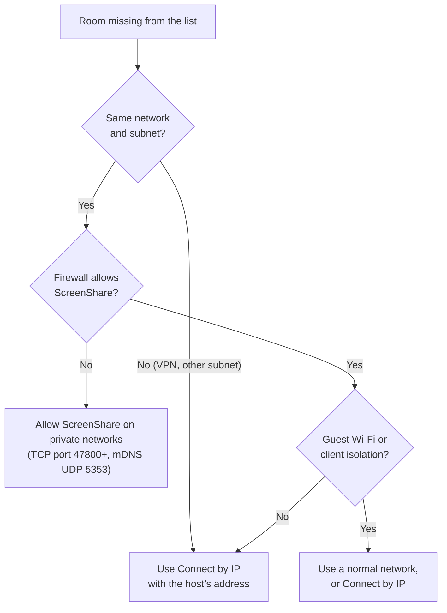

# Troubleshooting

Common problems and how to fix them. If yours isn't here, open **Settings → Open logs** and look at `screenshare.log`; the lines around the problem usually say what went wrong.

> **Language:** English · [Português (Brasil)](../pt-BR/troubleshooting.md)

## Contents

- [The room doesn't show up](#the-room-doesnt-show-up)
- [I can't join](#i-cant-join)
- [The video doesn't start or stays black](#the-video-doesnt-start-or-stays-black)
- [The quality is low](#the-quality-is-low)
- [Audio problems](#audio-problems)
- [High CPU or a hot laptop](#high-cpu-or-a-hot-laptop)
- [macOS permissions](#macos-permissions)
- [Collecting information for a bug report](#collecting-information-for-a-bug-report)

## The room doesn't show up

- Discovery uses **multicast (mDNS)**, which many VPNs, guest Wi-Fi networks and some routers block. **Connect by IP** always works if the host can be reached: the host sees its addresses in the **Access** panel.
- The default port is **47800**. If it was busy, the host picked the next free one; the Access panel shows the right one.
- **Windows firewall**: the first time you host, Windows asks whether to allow ScreenShare. Allow it on **private** networks. If you clicked Cancel, allow it later in *Windows Security → Firewall → Allow an app*.
- A room that stops answering for 10 seconds is removed from the list. It comes back as soon as it answers again.

## I can't join

| Message | What it means | What to do |
|---|---|---|
| *This room runs a different app version* | You and the host run incompatible versions | Everyone updates to the same version. |
| *Wrong PIN* (attempts left) | The PIN doesn't match | Ask the host again: the PIN can change during a session. |
| *Too many wrong PINs. Try again later.* | 3 wrong PINs from your computer | Wait 5 minutes. |
| *Room is full* | 10 people already inside | Wait for someone to leave. |
| *You were removed from this room* | The host removed you | Only the host can help; a new room session clears it. |
| The room is grey / *Unreachable* | The app can't reach the host | Check the network and firewall, or that the host is still running. |
| Certificate error in the log (`rejected certificate`) | The host's certificate doesn't match the one your app saw before | Restart ScreenShare on your side so it learns the host again. If the host deleted `host-identity.json`, that's expected. |

## The video doesn't start or stays black

- **"Connecting…" for a few seconds, then it plays**: normal when your network blocks WebRTC (UDP). After 8 seconds the app switches to the TCP connection by itself. The ↻ button in the tile tries the faster connection again.
- **It never connects**: make sure both computers allow ScreenShare through the firewall. As a last resort, enable **Settings → Network → Always use TCP transport** on the viewer.
- **The streamer sees their own stream is fine but you see black**: the streamer may have paused (the tile says so), or shared a window that is minimized. Ask them to use **Change source**.
- **Your own stream isn't visible to you**: that's on purpose. Click **Show** on your **You** card.
- **Screenshots of the app are black while watching**: also on purpose; recording streams is blocked.

## The quality is low

1. Look at the tile's **stats badges**: resolution, fps and connection type.
2. Check the tile's **quality menu**: it should be **Auto** (or the quality you want).
3. **Auto follows the tile size**: a small tile gets a small stream. Focus the stream (spotlight), go full screen or zoom in and the quality rises within a second.
4. Ask the streamer to check their **quality picker** in the toolbar, and **Settings → Upload limit when sharing** (the default 100 Mbps is shared between everyone watching them; on Wi-Fi 30–60 Mbps is more realistic).
5. The streamer's **Stats → Limited by** tells you why: *bandwidth* (network), *cpu* (computer too busy) or *none*.
6. On the **TCP** connection, latency is a bit higher and one encode is shared by all TCP viewers.

## Audio problems

| Problem | Fix |
|---|---|
| No audio at all | The streamer must enable **Share system audio** (via **Change source** while sharing). The mute button says **No audio** when nothing is captured. |
| No audio with a 5.1/7.1 headset on Windows | The app switches to its own audio helper automatically. If it still fails, set the device to stereo: *Sound settings → device → Properties → Advanced → 2 channel*, then **Change source**. |
| People in my Discord call hear themselves | Turn on **Leave out Discord** when you share (Windows, on by default). If a message says it couldn't be done, your Windows is older than 10 version 2004: use **Mute audio**, or mute Discord's output. |
| Other streams echo in my stream | Your computer plays the streams you watch, and sharing system audio captures that too. With **Leave out Discord** on and Discord closed, the app leaves itself out and this doesn't happen; otherwise (only one app can be left out) lower the volume of the streams you watch, or mute your shared audio. |
| No audio on macOS | Needs macOS 13+ and Screen Recording permission. It is still untested on macOS. |
| Viewer hears nothing but the streamer has audio | Check the tile's volume slider (each stream has its own volume and mute). |

## High CPU or a hot laptop

- Open **Settings → Streaming quality**: the codec table shows **Hardware** or **Software** for each codec. Software encoding uses much more CPU. **Automatic** already prefers hardware H.264.
- Lower the **maximum quality** in the toolbar (for example 720p @ 30 fps).
- Close tiles you're not watching; each watched stream costs decoding.
- Keep your own stream hidden (don't **Show** it) while sharing.

## macOS permissions

- **Screen Recording**: *System Settings → Privacy & Security → Screen Recording* → enable ScreenShare, then restart the app. The source picker shows a button that opens this page when permission is missing.
- **Local Network**: allow it when asked, or rooms won't be found.

## Collecting information for a bug report

Please include:

1. App version (Settings footer) and operating system on each computer involved.
2. What you did, what you expected, what happened.
3. The relevant part of `screenshare.log` from each computer (**Settings → Open logs**). Remove anything private first.
4. For quality problems: a screenshot of the tile's stats badges and of the streamer's **Stats** panel.
