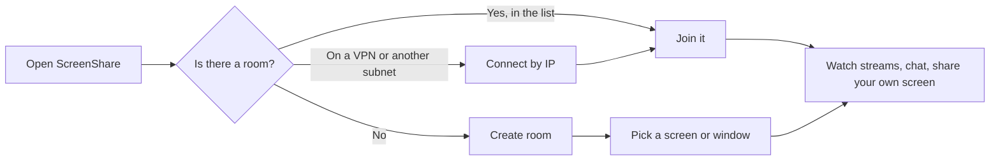

# User guide

Everything you can do in ScreenShare, from finding a room to fine-tuning quality. No technical background needed.

> **Language:** English · [Português (Brasil)](../pt-BR/user-guide.md)

## Contents

- [Before you start](#before-you-start)
- [Your name and picture](#your-name-and-picture)
- [Finding a room](#finding-a-room)
- [Creating a room](#creating-a-room)
- [Sharing your screen](#sharing-your-screen)
- [Watching other people](#watching-other-people)
- [Chat and people](#chat-and-people)
- [If you are the host](#if-you-are-the-host)
- [Settings](#settings)
- [Mouse and keyboard](#mouse-and-keyboard)
- [Privacy](#privacy)
- [Where your files are](#where-your-files-are)

## Before you start

- **Computers**: Windows 10/11 or macOS. System audio on macOS needs macOS 13 or newer. Leaving Discord out of the audio needs Windows 10 version 2004 or newer.
- **Network**: everyone must be on the same local network or VPN. Nothing goes over the internet and there are no accounts.
- **Same version**: everyone in a room must run the same version of the app. Otherwise you'll see "This room runs a different app version".
- **macOS**: the first time you share, macOS asks for **Screen Recording** permission, and it may ask for **Local Network** access. Allow both, then restart the app if asked.

## Your name and picture

- Your **name** is shown at the top right of the home screen. Click it to change it. You can also change it in **Settings → Profile**.
- Your **profile picture** is set in **Settings → Profile → Choose…**. After you pick an image, a crop window opens:
  - drag the picture to move it;
  - scroll, or use the slider, to zoom;
  - the circle shows what other people will see, and a small preview shows the result.

  Click **Use picture** to save it or **Cancel** to keep the old one. **Remove** goes back to your initials. People in the room see the change right away.

## Finding a room

The home screen lists the rooms on your network. It updates by itself (look for the green **live** dot).

Each room card shows whether it is **Public** or **Private** (lock icon), how many streams are live (or *No one sharing*, or *Unreachable*), its name, who hosts it and for how long, how many people are inside, and its address. Use **Search rooms** to filter the list. Rooms you added by IP have a bin button to remove them from the list.

**Connect by IP**: if you are on a VPN or a different subnet, rooms may not appear automatically. Click **Connect by IP** and type the host's address, for example `10.8.0.5` or `192.168.1.20:47800`. The host can see its addresses in the **Access** panel of the room. The default port is 47800.

**Private rooms** ask for a PIN (4 to 6 digits). After 3 wrong PINs, your computer has to wait 5 minutes before trying again.

## Creating a room

1. Click **Create room**.
2. Give it a name and choose **Public** (anyone on the network can join) or **Private** (people need a PIN, which is generated for you; pick 4, 5 or 6 digits).
3. Choose what to share: a whole **screen** or a single **window**.
4. **Share system audio** sends everything playing on your computer. On Windows, **Leave out Discord** (on by default) keeps your Discord call out of it, so people in the same call don't hear themselves through your stream.
5. Click **Start sharing**.

For a private room, the PIN is copied to your clipboard so you can paste it to your friends.

Your computer now runs the room. If you close ScreenShare, the app asks first, because closing it ends the room for everyone.

## Sharing your screen

Anyone in a room can share, not just the host, and several people can share at the same time. Click **Share screen** in the bottom toolbar and choose a screen or window.

While you share, the toolbar gives you:

| Button | What it does |
|---|---|
| **Pause / Resume** | Freezes your stream (and its audio) without ending it. |
| **Mute audio / Unmute audio** | Stops sending system audio while the video keeps going. It says **No audio** if audio isn't being captured. |
| **Change source** | Switch to another screen or window, or change the audio options, without anyone having to reconnect. |
| **Quality picker** | The maximum quality you send (Native, 1080p, 720p at 60 or 30 fps, 480p). It applies immediately. Each viewer may still get less, for example if their window is small or their network is slow. |
| **Stop sharing** | Ends your stream. |
| **Stats** | Resolution, frame rate, upload, encode time, codec, encoder, CPU, memory and what is limiting quality. |

**Your own stream isn't played back to you**, which saves your computer's GPU. You'll see a **You** card with a preview that refreshes every few seconds. Click **Show** to open your stream as a tile, and close the tile (×) to hide it again. You keep sharing either way.

## Watching other people

Nothing plays until you choose. People who are sharing appear as **cards** with a preview that refreshes every 5 seconds.

- Click a card's **Watch** button, or **Watch all**.
- Watched streams play in a **grid**. Click the focus button in a tile's bar to put that stream in the **spotlight**, with the others in a strip. Click it again to go back to the grid.
- Streams you haven't opened stay available in the **Also live** bar at the top.
- Close a tile (×) to stop watching it.

Each tile has:

| Control | What it does |
|---|---|
| **Quality menu** (tile bar) | **Auto** follows the size you watch at, so a small tile uses little bandwidth. You can also cap it at 1080p, 720p, or 720p/480p/360p at 30 fps. Remembered per person. |
| **Volume** | Each stream has its own volume and mute, remembered per person. |
| **Zoom** | Mouse wheel (zooms where your pointer is), or the − / + buttons. Drag to move around while zoomed. Double-click to zoom in 2× or back to fit. |
| **Full screen** | Fills the screen. The controls and the pointer hide after 2.5 s without moving the mouse and come back when you move it. |
| **Stats badges** | Frame rate, latency, resolution, codec and connection type. Turn them off in Settings. |
| **Retry (↻)** | Only shown when a stream fell back to the slower TCP connection. Tries the faster connection again. |

If a stream can't connect in 8 seconds (some VPNs and firewalls block it), the app switches to a TCP connection by itself. It adds a little latency but keeps working.

## Chat and people

- **Chat** is on the right: messages with time and picture, and an emoji picker. Messages are kept only while the room exists.
- **People** shows everyone in the room and what they are doing: *Sharing · 2 watching*, *Watching Alice, Bob*, *Connected* or *Reconnecting*. From here you can also **Watch** or **Stop watching** someone.

If your network drops for a moment, the app reconnects on its own and puts you back in your seat without asking for the PIN again, as long as you're back within 30 seconds. Streams you were watching reconnect automatically.

## If you are the host

The **Access** panel (top of the sidebar) lets you:

- switch between **Public** and **Private** at any time; people already inside stay connected;
- show or hide the **PIN**, **copy** it, **generate a new one**, or **set your own**;
- see the addresses people can use with **Connect by IP**.

In the **People** list you can **stop someone's stream** or **remove** someone from the room (they can't come back to this room session). In the chat you can **delete messages** and **mute the chat** (people still see the history).

**End room** closes the room for everyone.

## Settings

Open Settings with the gear icon (home screen or room header).

| Section | Setting | Default | Meaning |
|---|---|---|---|
| Profile | Profile picture | none | Shown instead of your initials. |
| Profile | Display name | your computer user name | Up to 32 characters. |
| Streaming quality | Maximum quality | 1080p @ 60 fps | The most you send when sharing. Applies immediately. |
| Streaming quality | Adaptive quality | on | Lowers resolution/frame rate per viewer when their network struggles. |
| Streaming quality | Video codec | Automatic | Automatic prefers hardware H.264. You can force H.264, H.265, VP9 or AV1 if both sides support it. The table below shows what your computer supports. |
| Streaming quality | Optimize for | Smooth motion | *Smooth motion* keeps 60 fps. *Sharp text* keeps the resolution. |
| Streaming quality | Upload limit when sharing | 100 Mbps | Your total upload, shared fairly between everyone watching you. Lower it on Wi-Fi or VPN. |
| Network | Encrypt connections (TLS) | on | Encrypts chat and signaling. Video is always encrypted. |
| Network | Always use TCP transport | off | For networks that block UDP. Adds some latency. |
| Network | Hosting port | 47800 | The first port tried when you host. |
| Network | Rejoin last room on startup | off | Joins your last room automatically when the app starts. |
| Behaviour | Chat notifications | on | When the window is in the background. |
| Behaviour | Pause sharing while minimized | off | Resumes when you restore the window. |
| Behaviour | Show FPS and latency overlay | on | The badges on each stream. |
| Behaviour | Share system audio by default | on | Pre-selects the audio switch. |
| Behaviour | Leave out Discord by default | on | Windows only. Pre-selects the Discord switch. |

The footer shows the app version and has **Open logs**.

## Mouse and keyboard

| Where | Action | Result |
|---|---|---|
| A stream | Mouse wheel | Zoom in/out at the pointer |
| A stream | Double-click | Zoom 2× / back to fit |
| A zoomed stream | Drag | Move around |
| Full screen | Move the mouse | Show the controls again |
| Picture crop | Drag / wheel / slider | Move / zoom |
| Picture crop | Arrow keys, Shift + arrows, + and − | Move a little, move more, zoom |
| Any dialog | Esc | Close the top dialog |

## Privacy

- Everything stays on your network. There are no accounts, no cloud and no tracking.
- The PIN exists only in the host's memory and is never saved.
- The app has no recording and no chat export. While you watch a stream, your ScreenShare window is hidden from screenshots and screen recorders on your computer.
- Chat, previews and profile pictures disappear when the room ends.

## Where your files are

| What | Windows | macOS |
|---|---|---|
| Settings (`settings.json`) and host identity (`host-identity.json`) | `%APPDATA%\ScreenShare\` | `~/Library/Application Support/ScreenShare/` |
| Logs (`screenshare.log`) | `%APPDATA%\ScreenShare\logs\` | `~/Library/Logs/ScreenShare/` |

**Settings → Open logs** opens the log folder. Logs rotate at 5 MB (the previous one is kept as `screenshare.old.log`). Deleting `host-identity.json` gives your computer a new certificate the next time you host; people who connected before may need to rediscover your room.

Something not working? See [troubleshooting](troubleshooting.md).
