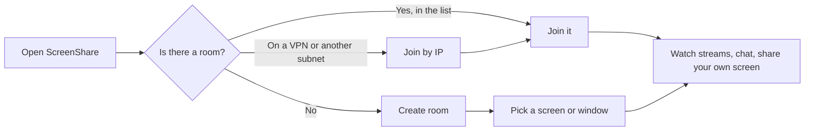

# User guide

Everything you can do in ScreenShare, from finding a room to fine-tuning quality. No technical background needed.

> **Language:** English · [Português (Brasil)](../pt-BR/user-guide.md)

## Contents

- [Before you start](#before-you-start)
- [Your name and picture](#your-name-and-picture)
- [Finding a room](#finding-a-room)
- [Creating a room](#creating-a-room)
- [Sharing your screen](#sharing-your-screen)
- [Watching other people](#watching-other-people)
- [Chat and people](#chat-and-people)
- [If you are the host](#if-you-are-the-host)
- [Settings](#settings)
- [Updates](#updates)
- [Mouse and keyboard](#mouse-and-keyboard)
- [Privacy](#privacy)
- [Where your files are](#where-your-files-are)

## Before you start

- **Computers**: Windows 10/11 or macOS. System audio on macOS needs macOS 13 or newer. Leaving Discord out of the audio needs Windows 10 version 2004 or newer.
- **Network**: everyone must be on the same local network or VPN. Nothing goes over the internet (apart from the update check) and there are no accounts.
- **Compatible versions**: 1.x and 2.x apps can share a room (2.0.0 changed the look, not how apps talk to each other). Only a version that changes the room protocol, such as a future 3.0.0, needs everyone to update; the room list then says who has to, e.g. "This room runs ScreenShare 3.0.0, you have 2.0.0: update to join". When someone in your room runs a newer version, you get a one-time suggestion to update.
- **macOS**: the first time you share, macOS asks for **Screen Recording** permission, and it may ask for **Local Network** access. Allow both, then restart the app if asked.

```mermaid
flowchart LR
  A["Open ScreenShare"] --> B{"Is there a room?"}
  B -->|"Yes, in the list"| C["Join it"]
  B -->|"On a VPN or another subnet"| D["Join by IP"] --> C
  B -->|"No"| E["Create room"] --> F["Pick a screen or window"]
  C --> G["Watch streams, chat, share your own screen"]
  F --> G
```

## Your name and picture

- Your **name** is shown at the bottom of the rooms column, on the left. Click it to change it. You can also change it in **Settings → Profile**.
- Your **profile picture** is set in **Settings → Profile → Choose…**. After you pick an image, a crop window opens:
  - drag the picture to move it;
  - scroll, or use the slider, to zoom;
  - the circle shows what other people will see, and a small preview shows the result.

  Click **Use picture** to save it or **Cancel** to keep the old one. **Remove** goes back to your initials. People in the room see the change right away.

## Finding a room

The window has three columns: **rooms** on the left, the room you're in (or a welcome page) in the middle, and the room's **chat** on the right.

The rooms column lists:

- **Recent rooms**: the last 5 rooms you joined, newest first, with the one you're in highlighted. Click one to go back to it, even if it's on a VPN and not found by itself. Rooms that don't answer show as *offline*. The **×** on a row forgets it.
- **Rooms on your network**: everything else found on your network. It updates by itself (look for the green dot).

Each row shows a lock for private rooms, how many streams are live, and how many people are inside; hover over it for who hosts it, for how long, and its address. A room on an incompatible version says *Update to join* or *Older version* (hover for who needs to update). Rooms you added by IP have a **×** to remove them from the list. Click a room to join it. If you're already in a room, you leave it first; the app asks before that ends a room you host or stops your share.

The button at the top of each side column hides it (the rooms column shrinks to a strip of room initials; the chat button is at the right end of the control bar). The app remembers which columns you hid. In a small window (for example snapped next to a game) the columns make room for the tiles by themselves: below 1100 px wide the chat is closed, and below 760 px the rooms column is a strip. Their buttons then open them over the room, and clicking next to them puts them away.

**Join by IP**: if you are on a VPN or a different subnet, rooms may not appear automatically. Click **Join by IP** (next to **Create room**) and type the host's address, for example `10.8.0.5` or `192.168.1.20:47800`. The host can see its addresses behind the **ⓘ** in the control bar. The default port is 47800.

**Friends on other networks**: put everyone on a [ZeroTier](zerotier.md) network. It takes a few minutes, and rooms then show up in the list as if you were all at home.

**Private rooms** ask for a PIN (4 to 6 digits) right under the room in the list. After 3 wrong PINs, your computer has to wait 5 minutes before trying again.

## Creating a room

1. Click **Create room**.
2. Give it a name and choose **Public** (anyone on the network can join) or **Private** (people need a PIN, which is generated for you; pick 4, 5 or 6 digits).
3. Choose what to share: a whole **screen** or a single **window**.
4. **Share system audio** sends everything playing on your computer. On Windows, **Leave out Discord** (on by default) keeps your Discord call out of it, so people in the same call don't hear themselves through your stream. When you share a single **window** on Windows, **Only this app's sound** (on by default) sends just that app's sound, for example only your game, without Discord, music or notifications.
5. Click **Start sharing**.

For a private room, the PIN is copied to your clipboard so you can paste it to your friends.

Your computer now runs the room. If you close ScreenShare, the app asks first, because closing it ends the room for everyone.

## Sharing your screen

Anyone in a room can share, not just the host, and several people can share at the same time. Click **Share screen** in the control bar under the tiles (right of the red leave button) and choose a screen or window.

While you share, the button becomes a green **Sharing** button. Click it (or right-click your own tile) for the sharing menu:

| Option | What it does |
|---|---|
| **Change source…** | Switch to another screen or window, or change the audio options, without anyone having to reconnect. |
| **Mute audio / Unmute audio** | Stops sending system audio while the video keeps going. It says **No audio** if audio isn't being captured. |
| **Quality you send** | The maximum quality you send (Native, 1080p, 720p at 60 or 30 fps, 480p). It applies immediately; each viewer may still get less, for example if their window is small or their network is slow. |
| **Stop sharing** | Ends your stream. |

**Stats** (the sliders button next to it) shows your stream's resolution, frame rate, upload, encode time, codec, encoder, CPU and memory (the app's and the whole computer's, games included) and what is limiting quality, and also lets you change the quality you send.

The red button left of it leaves the room (for the host, it ends the room for everyone, after asking).

**When your stream struggles**, the room tells you why: your computer can't encode fast enough, your upload can't keep up with everyone watching, or your graphics card ran out of hardware encoders (some viewers are then encoded by the CPU). The notice only appears when the problem lasts several seconds, goes away once it's solved, and won't come back for the same reason for 10 minutes. **Lower to …** lowers your maximum quality one step.

**Your own stream isn't played back to you**, which saves your computer's GPU. Your own tile shows a preview that refreshes about once a minute. Click **Show my stream** to play it; **Hide my stream** in its right-click menu hides it again. You keep sharing either way.

**Playing a game while sharing your screen on Windows 10?** Windows would show your mouse cursor to viewers even when the game hides it. So while a fullscreen game hides the cursor, the app shares the game's window instead, which looks the same without the cursor, and goes back to your screen when you alt-tab. The room shows a notice while this happens. See [troubleshooting](troubleshooting.md#viewers-see-my-mouse-cursor-in-a-game) for windowed games.

## Watching other people

Everyone in the room has a **tile** in the middle: their picture and name. Tiles keep a 16:9 shape and grow as large as the window allows. Nothing plays until you choose: people who are sharing have a red **Live** badge, and their tile shows a preview of their stream, taken when they start and refreshed about once a minute.

- Click **Watch stream** on their tile, click them in the rooms column (hover first to see their preview), or **Watch all** in the control bar. Their tile then plays their stream, with their name over its top. Click them in the rooms column again, or **Stop watching** in the stream's right-click menu, to stop; an eye marks the streams you watch.
- **The first stream you watch opens in the spotlight**, with everyone else in a strip below. **Watch all**, or a second stream, keeps the grid.
- **Click a tile** to put it in the **spotlight** (clicking one in the strip focuses it instead). Click the focused tile again, the grid button under it (left), or press **Esc** to go back to the grid.
- **Only streams** (the funnel button at the left of the control bar, or the same option in any tile's right-click menu) leaves out the people who aren't sharing, so the streams get all the space. It's remembered; while nobody shares, everyone shows anyway.
- **Who's watching**: a stream's name bar shows an eye with how many people watch it and their pictures; point at it for their names. A stream you muted shows a crossed-out speaker next to the name.
- The room's name is in the title bar, at the top of the window.
- **Double-click a stream** to fill the screen with it, like a video player: the stream takes the whole screen, and the strip and the controls float over its bottom. After 2.5 s without moving the mouse everything but the picture hides (the strip, the controls, the name, the stats badges and the pointer); move the mouse to bring them back. **Esc** or the button at the bottom right brings the window back.
- In the spotlight, **Hide others** puts the strip away so the focused tile gets the whole height; the streams in it stop sending you video until you show them again (you still hear them).
- When you're alone in your room, an **Invite people** tile shows the address to give people on a VPN.

**Right-click a stream** for everything about it:

| Option | What it does |
|---|---|
| **Volume** (slider) and **Mute** | Each stream has its own volume and mute, remembered per person. |
| **Stop watching**, **Focus**, **Full screen** | As above. |
| **Quality you receive** | **Auto** follows the size you watch at, so a small tile uses little bandwidth. You can also cap it at 1080p, 720p, or 720p/480p/360p at 30 fps. Remembered per person. |
| **Try the faster connection again** | Only when the stream fell back to the slower TCP connection. |
| **Stop *name*'s stream**, **Remove from room** | Host only. |

**Under a focused stream**, the speaker mutes it, or unmutes it back to the last volume; point at the speaker for its volume slider. The button next to it fills the screen.

The **stats badges** on a stream show its frame rate, latency, resolution, codec and connection type; turn them off in **Settings → Appearance**.

If a stream can't connect in 8 seconds (some VPNs and firewalls block it), the app switches to a TCP connection by itself. It adds a little latency but keeps working.

While you **minimize** the app, or put one tile in full screen, the streams you can't see stop sending you video (you still hear them), which saves the streamer's upload and your network. The picture comes back within a second when you look again. The streamer sees you as "not looking" under your name.

## Chat and people

- **Chat** is on the right: messages with time and picture, and an emoji picker. Messages someone sends within 5 minutes of each other share one name and picture (hover over one to see its time). Hide the chat with the chat button at the right end of the control bar; while it's hidden, that button counts the new messages. Messages are kept only while the room exists.
- **People** are listed under the room you're in, in the rooms column: who hosts it, who is **Live** (or **Paused**), and who is reconnecting. While you share, the people watching you show how it's going under their name (*watching you · 60 fps · 20 ms*, or *not looking*).

If your network drops for a moment, the app reconnects on its own and puts you back in your seat without asking for the PIN again, as long as you're back within 30 seconds. Streams you were watching reconnect automatically.

## If you are the host

The **ⓘ** in the control bar, next to the share button, shows the room's details: privacy, how long it has been open, who hosts it and the round trip to it (and, for guests, the address to copy). For the host, it also lets you:

- switch between **Public** and **Private** at any time; people already inside stay connected;
- show or hide the **PIN**, **copy** it, **generate a new one**, or **set your own**;
- see the addresses people can use with **Join by IP**.

Right-clicking a person (their tile, or their name in the rooms column, where a **⋯** button also appears on hover) lets you **stop their stream** or **remove** them from the room (they can't come back to this room session). In the chat you can **delete messages** and **mute the chat** (people still see the history).

**End room for everyone** (also behind the **ⓘ**, or the red button in the control bar) closes the room for everyone.

## Settings

Open Settings with the gear icon at the bottom of the rooms column. The list on its left jumps to a section, and follows as you scroll.

| Section | Setting | Default | Meaning |
|---|---|---|---|
| Profile | Profile picture | none | Shown instead of your initials. |
| Profile | Display name | your computer user name | Up to 32 characters. |
| Appearance | Theme | Classic | The app's colours: **Classic** (blue on blue-grey), **Graphite** (neutral greys and indigo, so streams look true to colour), **Midnight** (blue-black and teal) or **Charcoal** (warm greys and violet). Applies immediately. |
| Appearance | Show FPS and latency on streams | on | The badges on each stream. |
| Sharing | Maximum quality | 1080p @ 60 fps | The most you send when sharing. Applies immediately. |
| Sharing | Optimize for | Automatic | *Smooth motion* keeps 60 fps. *Sharp text* keeps the resolution. *Automatic* (Windows) uses smooth motion while a fullscreen game or video is in front of what you share, and sharp text on the desktop; on macOS it means smooth motion. The Stats panel shows which one is in use. |
| Sharing | Upload limit when sharing | 100 Mbps | Your total upload, shared fairly between everyone watching you. Lower it on Wi-Fi or VPN. |
| Sharing | Share system audio by default | on | Pre-selects the audio switch. |
| Sharing | Only the shared app's sound by default | on | Windows only. Pre-selects **Only this app's sound** when you share a window. |
| Sharing | Leave out Discord by default | on | Windows only. Pre-selects the Discord switch. |
| Sharing | Pause sharing while minimized | off | Resumes when you restore the window. |
| Notifications | Chat notifications | on | When the window is in the background. |
| Connection | Rejoin last room on startup | off | Joins your last room automatically when the app starts. |
| Connection | Encrypt connections (TLS) | on | Encrypts chat and signaling. Video is always encrypted. |
| Connection | Always use TCP transport | off | For networks that block UDP. Adds some latency. |
| Connection | Hosting port | 47800 | The first port tried when you host. |
| Advanced | Video codec | Automatic | Automatic prefers hardware H.264. You can force H.264, H.265, VP9 or AV1 if both sides support it. The table below it shows what your computer supports. |
| Advanced | Adaptive quality | on | Lowers resolution/frame rate per viewer when their network struggles. |
| About | Check for updates automatically | on | See [updates](#updates). |

**About** shows the app version and has **Open logs**.

## Updates

The app looks for a new version on the [releases page](https://github.com/nsfxu/lan-screenshare/releases) shortly after it starts and every few hours.

- **Windows**: a new version downloads quietly in the background. When it's ready, a green **Restart to update** button appears in the title bar (and in **Settings → About**). Click it when it suits you: the app closes, installs the update and opens again. If you're in a room it asks first, because restarting leaves the room (or ends it, if you host). Nothing installs by itself when you close the app.
- **macOS**: the title bar shows **Update to …**, which opens the download page. Apple only lets signed apps replace themselves, and ScreenShare isn't signed yet.

**Settings → About** shows where things are and has **Check now**. Turn off **Check for updates automatically** if you don't want the app to contact GitHub; you can still check by hand. Versions before 2.2.0 don't update themselves: download 2.2.0 once, and later versions come by themselves.

## Mouse and keyboard

| Where | Action | Result |
|---|---|---|
| A tile | Click | Focus it / back to the grid |
| A stream | Double-click | Full screen |
| A tile | Right-click | Its menu (volume, quality, …) |
| A focused stream | Esc | Leave full screen, then back to the grid |
| Full screen | Move the mouse | Show the strip and controls again |
| Picture crop | Drag / wheel / slider | Move / zoom |
| Picture crop | Arrow keys, Shift + arrows, + and − | Move a little, move more, zoom |
| Any dialog | Esc | Close the top dialog |

## Privacy

- Everything stays on your network. There are no accounts, no cloud and no tracking. The one thing the app does on the internet is check GitHub for updates, which sends nothing about you beyond what any download does, and can be turned off.
- The PIN exists only in the host's memory and is never saved.
- The app has no recording and no chat export. While you watch a stream, your ScreenShare window is hidden from screenshots and screen recorders on your computer.
- Chat, previews and profile pictures disappear when the room ends.

## Where your files are

| What | Windows | macOS |
|---|---|---|
| Settings (`settings.json`) and host identity (`host-identity.json`) | `%APPDATA%\ScreenShare\` | `~/Library/Application Support/ScreenShare/` |
| Logs (`screenshare.log`) | `%APPDATA%\ScreenShare\logs\` | `~/Library/Logs/ScreenShare/` |

**Settings → About → Open logs** opens the log folder. Logs rotate at 5 MB (the previous one is kept as `screenshare.old.log`). Deleting `host-identity.json` gives your computer a new certificate the next time you host; people who connected before may need to rediscover your room.

Something not working? See [troubleshooting](troubleshooting.md).
