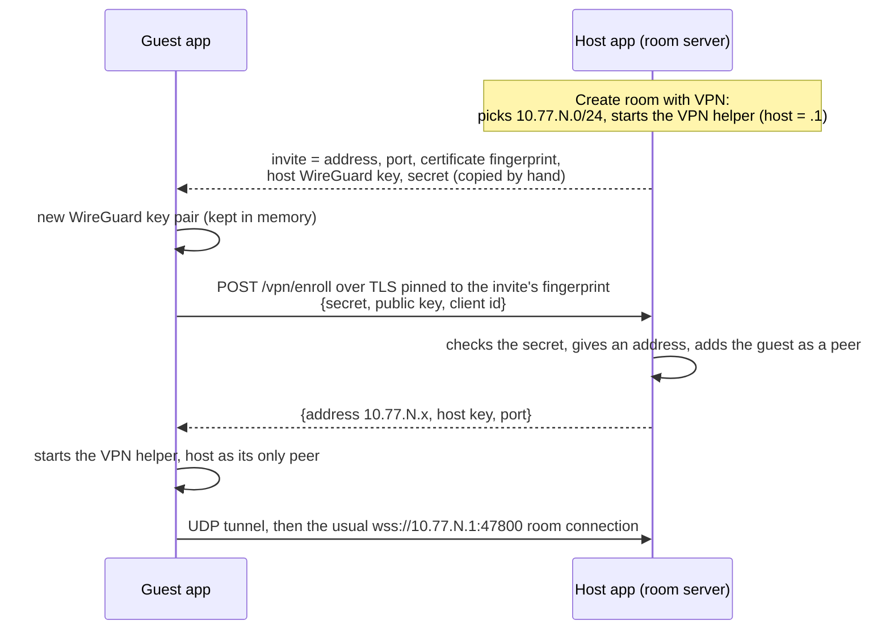

# VPN rooms

A **VPN room** lets people who are *not* on your network join your room. When you create the room you can open a small VPN (WireGuard) that lives only as long as the room; guests join it with an invite and then use the room like anyone else: they see who shares and watch the streams.

> **Language:** English · [Português (Brasil)](../pt-BR/vpn-rooms.md)

## Contents

- [What you need](#what-you-need)
- [Hosting a VPN room](#hosting-a-vpn-room)
- [Joining a VPN room](#joining-a-vpn-room)
- [How it works](#how-it-works)
- [Limits](#limits)
- [Troubleshooting](#troubleshooting)

## What you need

| | Host | Guest |
|---|---|---|
| System | Windows 10/11, macOS or Linux | Windows 10/11, macOS or Linux |
| Software | Nothing to install: the VPN helper (WireGuard and, on Windows, the Wintun driver library) comes inside ScreenShare. On Linux, polkit (`pkexec`) asks for the password | the same |
| Permission | The administrator permission (UAC on Windows, your password on macOS and Linux), once when the room opens | The same, once when joining |
| Network | A way in from outside: a public address (not behind CGNAT) and the room's port (47800 unless you changed it) reaching this computer, **for both TCP and UDP**. ScreenShare finds the address and, if your router has UPnP on, opens the port for you | Nothing: the guest only makes outgoing connections |

If the helper is missing (a build made without Go, see [development](development.md#the-vpn-helper)), **Create room** says so and the VPN switch stays off.

## Hosting a VPN room

1. Click **Create room** and set it up as usual.
2. Turn on **Open Remote access for this room**, and type the address your friends connect to: your public IP, or a name that points to it.
3. Click **Start sharing** and enter your administrator password when asked.
4. Click the **ⓘ** next to the room's name and press **Copy Remote invite**. Send that line to the people you invite.

The panel shows how many guests have joined. Closing the room takes the VPN down.

**Treat the invite like a password.** It holds a secret that lets whoever has it into the VPN, and it works until you end the room. The room's own **PIN** still applies on top: a private room asks every guest for it.

## Joining a VPN room

1. Click **Join Remote**, choose **Remote invite**, paste the invite and click **Connect**.
2. Enter your administrator password when asked.
3. The room opens by itself. If it is private, the PIN is asked right under it.

While you are connected the rooms column shows **Remote connected** with a **Disconnect** button. Leaving the room doesn't disconnect the VPN: do that yourself, or quit the app (it also goes down if the app crashes).

## The address and the router's port, found for you

Turning on **Open Remote access for this room** looks around so you don't have to:

- **Your address.** It asks `api.ipify.org` which address the internet sees (this is the only outside service ScreenShare uses, and only at this moment), and falls back to your router's own address when that fails. The field is filled in; change it if you use a name.
- **The router's port.** It looks for a router that speaks UPnP and, if one answers, opens the room's port for TCP and UDP while the room lasts. The opening is leased for an hour and renewed, and closed when the room ends, so a crash leaves nothing open for long. Untick **Open the port on my router** to do it yourself.
- **CGNAT.** If your provider shares one public address between customers, no port can be opened for you and nobody outside your network can reach this computer; the dialog says so. Friends on your own network can still join, and moving to a connection with its own address fixes it.

If the router doesn't answer (UPnP is often off), forward the port yourself; the room's details say so.

## How it works

- **The host is the hub.** Everyone's tunnel ends at the host, and the host forwards packets between guests, so a guest reaches the others through it. Media still uses one WebRTC connection per streamer→watcher pair, but across a VPN room those packets travel through the host's computer and connection. If forwarding doesn't work, the app falls back to the room's TCP path like on any network where UDP is blocked.
- **One privileged step.** Only the bundled helper (`ssvpn`) runs as administrator, after the system's permission prompt. It creates the virtual network interface (Wintun on Windows, utun on macOS, TUN on Linux), gives it its address and route, and opens WireGuard's control socket to your user only (a named pipe limited to your account on Windows). Keys and guests are then set by the app over that socket, so no secret appears in a command line, a file or the process list, and adding a guest never asks for the permission again. Before asking, the app checks the helper's files against checksums made when it was built, so a swapped file is never started with those rights. The helper removes everything when the app exits or crashes, or the VPN is closed.
- **Per room, per session.** The network (`10.77.N.0/24`, with `N` chosen so it doesn't clash with yours) and the keys are made when the room opens and forgotten when it closes.
- The code is in `src/main/vpn/` (see [architecture](architecture.md#vpn-rooms)); the enrolment request is in the [protocol reference](protocol.md#http-post-vpnenroll).

## Limits

- **Windows is new and has only been checked by building it.** The helper compiles for Windows, but it hasn't run on a real Windows machine yet: [check it by hand](testing.md#checking-vpn-rooms). It needs the installer's default (all users) install, because the helper gets administrator rights.
- **One VPN at a time**: you can host one or be a guest of one.
- **At most 10 people**, like any room (the host and 9 guests).
- **The host must be reachable** from outside. If both sides are behind NAT with no forwarded port, the tunnel can't start; ScreenShare uses no relay or STUN server, by design.
- **The host's connection carries the video** between guests. Few guests watching a lot is the host's upload.
- IPv4 only inside the VPN.

## Troubleshooting

| Message or symptom | What to do |
|---|---|
| *This build of ScreenShare has no VPN helper* | You run a build made without Go. Use the official release, or run `npm run build:vpn` (needs Go). |
| *…is not the one that came with ScreenShare, so it was not started* | The helper's files changed after installing. Reinstall ScreenShare. |
| *VPN rooms need polkit…* (Linux) | Install the `polkit` package, so there is a dialog to ask for the password. |
| *Administrator permission was not given…* | The password dialog was cancelled. Try again. |
| *Could not reach the host at …* | The TCP port isn't forwarded, the address in the invite is wrong, or the host closed the room. |
| *This is not the computer that made the invite* | The certificate isn't the one in the invite: wrong address, or someone else answers there. Ask for a new invite. |
| *The host did not accept this invite* | The invite is from a room that ended, or was altered. Ask for a new one. |
| *Too many wrong tries* | 3 wrong invites from your address lock it for 5 minutes. |
| *The VPN is up, but the room does not answer through it* | The UDP side isn't reaching the host: forward the same port for **UDP** too. |
| *Your network already uses 10.77.x…* | Rare clash with your own network. The host can close and reopen the room to get another range. |
| *The VPN room is full* | The room has its 9 guests. |
| Leftover interface after a crash | It goes away by itself within seconds. If not, restart the computer or remove the `utun`/`ssvpn0`/Wintun interface. |
