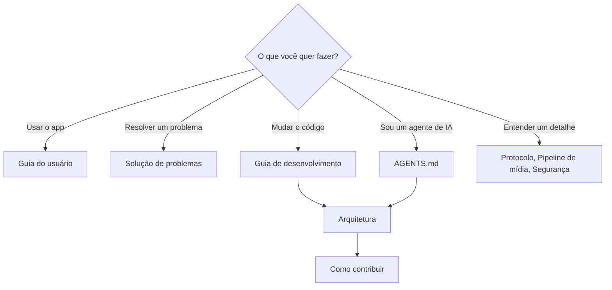
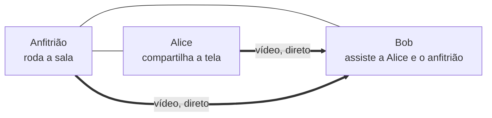

# Documentação do ScreenShare (Português)

Bem-vindo! Estas páginas explicam como usar o ScreenShare, como ele funciona por dentro e como contribuir, seja você uma pessoa ou um agente de IA.

> **Idioma:** [English](../en-US/README.md) · Português (Brasil)

## Por onde começar

| Página | Para | O que tem |
|---|---|---|
| [Guia do usuário](user-guide.md) | Todos | Salas, compartilhar, assistir, qualidade, áudio, chat, controles do anfitrião, todas as configurações, privacidade, onde ficam os arquivos. |
| [Solução de problemas](troubleshooting.md) | Todos | Salas que não aparecem, não consegue entrar, vídeo preto, qualidade baixa, áudio, CPU, permissões do macOS. |
| [Guia de desenvolvimento](development.md) | Quem contribui | Requisitos, scripts, várias instâncias, build, depuração, instaladores, tecnologias. |
| [Arquitetura](architecture.md) | Quem contribui | Processos, organização do código, classes principais, fluxos, onde fica cada estado. |
| [Referência do protocolo](protocol.md) | Quem contribui | mDNS, `/info`, todas as mensagens do WebSocket, sequências de sinalização, formato dos pacotes TCP, erros, limites. |
| [Pipeline de mídia](media-pipeline.md) | Quem contribui | Captura, codecs, WebRTC, controle de qualidade, fallback TCP, áudio do sistema, prévias, estatísticas, resultados medidos. |
| [Segurança](security.md) | Quem contribui | Modelo de ameaças, controles, fixação de certificado, endurecimento do Electron, limitações conhecidas. |
| [Testes](testing.md) | Quem contribui | Testes automáticos, como escrever testes, controlar o app sem tela, checklist de versão. |
| [Como contribuir](contributing.md) | Quem contribui e agentes de IA | Regras básicas, fluxo de trabalho, estilo de código, checklists, regras da documentação, orientações para IA. |
| [Glossário](glossary.md) | Todos | Os termos usados no código e na documentação. |

Agentes de IA: leiam primeiro o [`AGENTS.md`](../../AGENTS.md) na raiz do repositório.

## O ScreenShare em um minuto

O ScreenShare é um app de desktop (Windows e macOS) para compartilhar a tela com pessoas da mesma rede local ou VPN. Uma pessoa cria uma **sala**; as outras a encontram automaticamente e entram, com um **PIN** se a sala for privada. **Qualquer pessoa** na sala pode compartilhar a tela (com o áudio do sistema), várias ao mesmo tempo, e cada um escolhe **quais transmissões assistir**. Tem chat, lista de pessoas e moderação do anfitrião. Nada sai da sua rede: sem contas, sem nuvem.

## Situação atual e limitações conhecidas

- **Testado**: Windows 10 com GPU NVIDIA, várias instâncias no mesmo computador, e os recursos de áudio em máquinas Windows reais. Os testes automáticos cobrem o servidor, o roteamento, a lógica de qualidade, criptografia, codecs e o cálculo do recorte.
- **macOS**: o build ainda não foi compilado nem executado. Precisa de um Mac para gerar, e de assinatura e notarização para distribuir. O áudio do sistema depende de flags do Chromium (macOS 13+) e não foi testado.
- **Condições de rede**: a lógica de qualidade adaptativa tem testes unitários, mas perda de pacotes real ainda não foi simulada.
- **Fallback TCP**: uma única codificação é dividida entre todos os espectadores TCP de quem transmite, dimensionada para o mais exigente.
- **Os números de latência** no WebRTC são estimativas (veja [pipeline de mídia](media-pipeline.md#estatísticas-e-latência)).
- **A descoberta** precisa de multicast; em VPNs use **Connect by IP**.
- **Versão**: todos na sala precisam da mesma versão do protocolo (hoje, a 4).
- **Fora do escopo** por enquanto: controle remoto, áudio do microfone, vários monitores numa transmissão, gravação, Linux como plataforma suportada.

## Sobre esta documentação

- Toda página existe em **inglês** (`docs/en-US/`) e **português do Brasil** (`docs/pt-BR/`) com os mesmos nomes de arquivo. Mantenha as duas em sincronia (veja [como contribuir → documentação](contributing.md#documentação)).
- Os diagramas são escritos em [Mermaid](https://mermaid.js.org/) e aparecem renderizados no GitHub.
- O documento original de onde o projeto começou está guardado em [`prompt.md`](../../prompt.md) como histórico; esta documentação descreve o que foi de fato construído.
