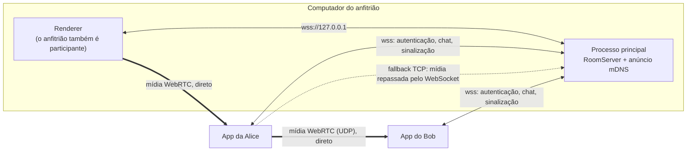
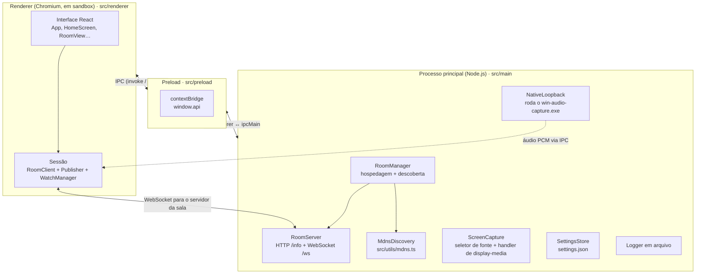
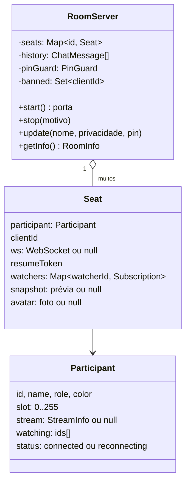
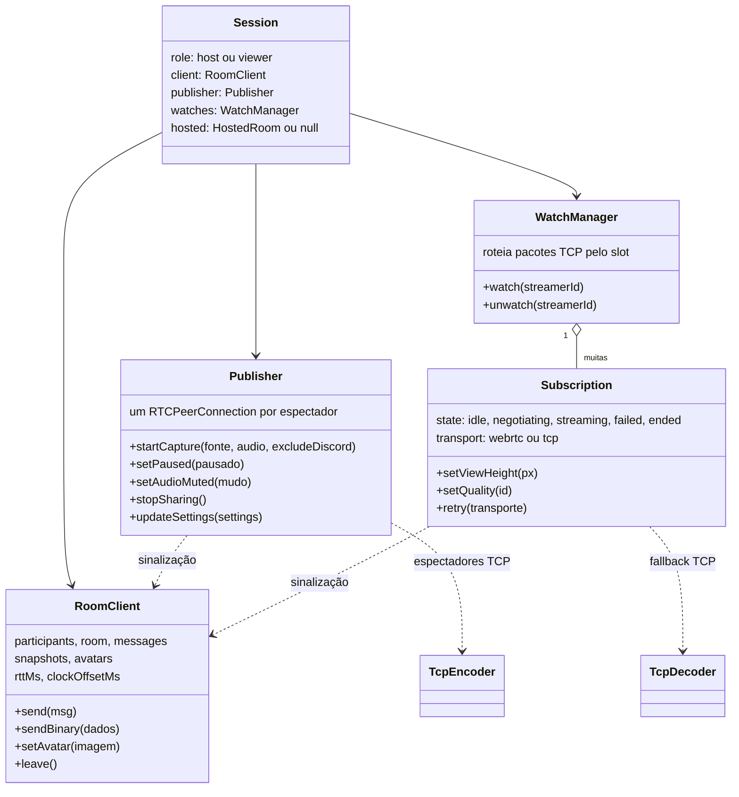
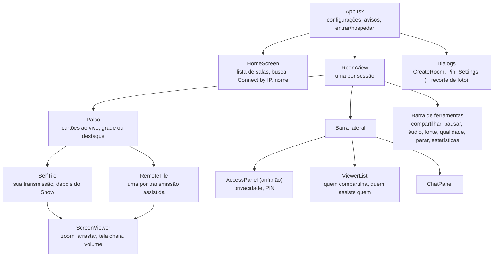
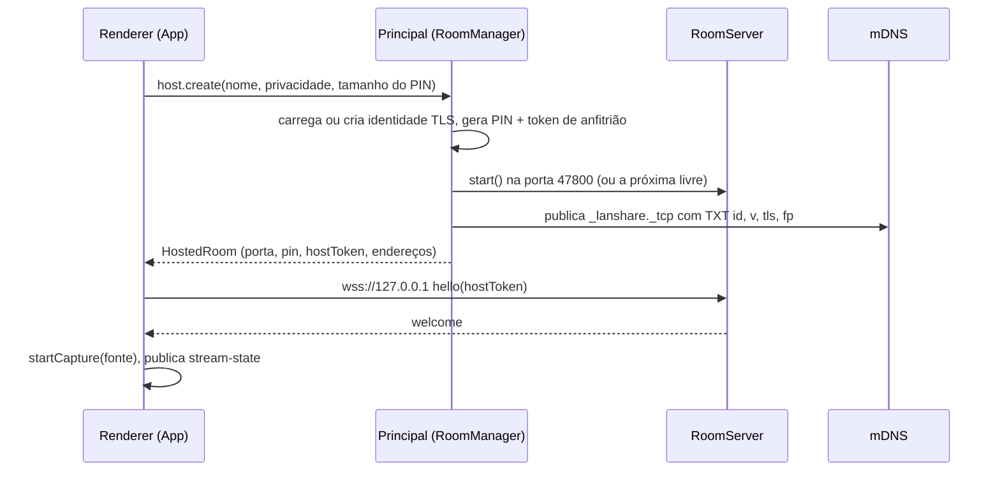
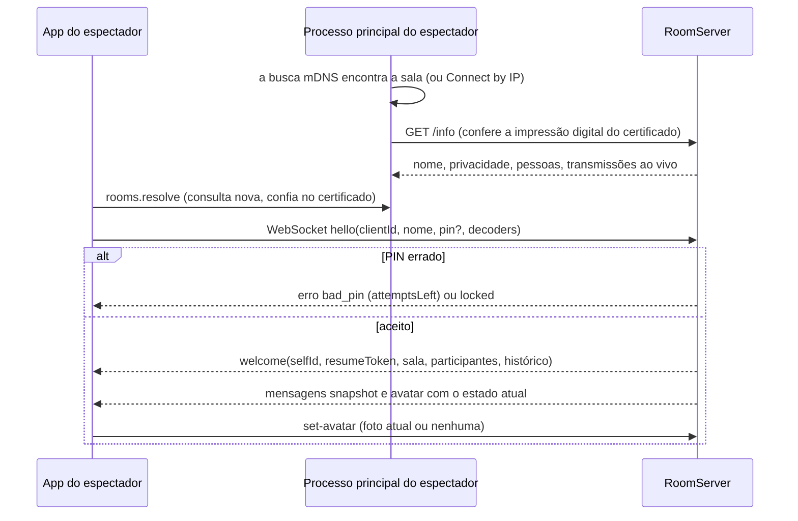
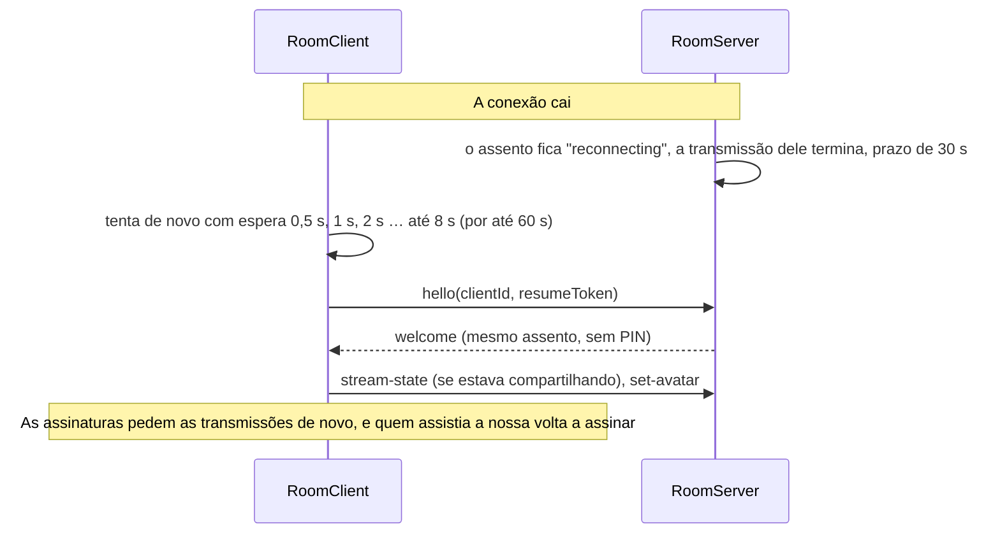

# Arquitetura

Esta página explica como o ScreenShare é montado: qual processo faz o quê, como as partes conversam entre si e por que foi construído assim. Leia antes de fazer qualquer mudança que não seja trivial.

> **Idioma:** [English](../en-US/architecture.md) · Português (Brasil)

## Conteúdo

- [Visão geral](#visão-geral)
- [Princípios de design](#princípios-de-design)
- [Processos do Electron](#processos-do-electron)
- [Organização do código](#organização-do-código)
- [Processo principal](#processo-principal)
- [Renderer: os objetos da sessão](#renderer-os-objetos-da-sessão)
- [Renderer: a interface](#renderer-a-interface)
- [Fluxos principais](#fluxos-principais)
- [Onde fica cada estado](#onde-fica-cada-estado)

## Visão geral

Todos os participantes rodam o mesmo app de desktop. Um deles é o **anfitrião** (*host*) da sala: o app dele também roda um pequeno servidor (`RoomServer`) ao qual todos se conectam. O servidor cuida da entrada na sala, do chat, da presença e da moderação, e repassa as mensagens de sinalização do WebRTC entre os participantes. Ele **nunca transporta o vídeo do WebRTC**: o vídeo vai direto de cada pessoa que compartilha (quem *transmite*, o *streamer*) para cada pessoa que escolheu assisti-la (o *espectador*, ou *watcher*).



- **Descoberta**: as salas se anunciam por mDNS (`_lanshare._tcp`). Os outros apps procuram por elas e também consultam o `GET /info` de cada sala a cada 3 s para ter dados atualizados. Quem está em VPN ou em outra sub-rede pode digitar o endereço (**Connect by IP**).
- **Sinalização**: ofertas, respostas e candidatos ICE do WebRTC passam pelo WebSocket da sala, mas só entre quem transmite e um dos seus espectadores atuais.
- **Mídia**: um `RTCPeerConnection` por par transmissor→espectador. Quando o UDP está bloqueado, só aquele par passa para o **caminho TCP**: quem transmite codifica com WebCodecs e o servidor repassa os pedaços codificados.

## Princípios de design

Essas escolhas explicam a maior parte do código. Mantenha-as, a não ser que haja um motivo forte.

1. **Só rede local, sem serviços externos.** Sem contas, sem nuvem, sem servidores STUN/TURN. Tudo funciona numa rede isolada.
2. **O servidor é enxuto.** Ele autentica, repassa e aplica regras. Não codifica, não decodifica e não mistura mídia.
3. **Nada toca sem você pedir.** Assistir é explícito. Nem a sua própria transmissão é exibida para você até clicar em **Show**. Isso economiza banda e GPU.
4. **Uma conexão por espectador.** Cada espectador tem seu próprio controle de congestionamento, qualidade adaptativa e limite de resolução, então um espectador lento nunca piora os outros.
5. **Só enviar o que aparece na tela.** Os espectadores informam o tamanho em que exibem cada transmissão. Quem transmite nunca envia mais pixels do que isso e divide sua banda de upload de forma justa.
6. **O servidor garante a autoridade.** Ações exclusivas do anfitrião, verificação de PIN, limites de taxa e validação de dados acontecem no servidor, nunca só na interface.
7. **Lógica pura fica em `src/shared`.** Escada de qualidade, ordem de codecs, cálculo do recorte e validação de imagens não dependem de DOM nem de Node, então podem ter testes unitários.

## Processos do Electron



| Processo | Roda em | Responsabilidades |
|---|---|---|
| **Principal** (*main*) | Node.js | Ciclo de vida da janela, configurações, logs, hospedar uma sala (`RoomServer`), descoberta (mDNS + consultas), identidade TLS e fixação de certificado, seletor de fonte de captura, auxiliar de áudio do Windows. |
| **Preload** | Ponte isolada | Expõe uma API pequena e tipada como `window.api` (veja `ScreenShareApi` em `src/shared/ipc.ts`). O renderer não tem acesso ao Node. |
| **Renderer** | Chromium, em sandbox | Toda a interface, todo o trabalho com WebRTC e WebCodecs, a conexão com a sala (`RoomClient`), o compartilhamento (`Publisher`) e a visualização (`WatchManager`, `Subscription`). |

O renderer do anfitrião fala com o próprio servidor por `wss://127.0.0.1`, exatamente como qualquer outro participante. Ele prova que é o anfitrião com um **token de anfitrião** aleatório, gerado para cada sala.

## Organização do código

```text
src/
  main/        processo principal do Electron
    index.ts         inicialização, janela, handlers de IPC, flags do Chromium, segurança
    roomManager.ts   hospedagem (servidor + TLS + anúncio mDNS) e descoberta (mDNS + manual + consultas /info)
    server.ts        RoomServer: autenticação, chat, presença, moderação, repasse de sinalização e de mídia TCP
    screenCapture.ts lista de fontes, handler de display-media, permissão no macOS
    nativeAudio.ts   roda o auxiliar de áudio do Windows e repassa o PCM para o renderer
    settings.ts      carrega/valida/salva o settings.json
    logger.ts        logger em arquivo com rotação
  preload/
    index.ts         contextBridge: window.api
  renderer/
    App.tsx          telas principais, entrar/hospedar, avisos, configurações
    components/      componentes React (veja "Renderer: a interface")
    lib/             lógica da sessão: roomClient, publisher, subscription, watches, tcpStream,
                     nativeAudio, codecs, images, session, format, emitter
    styles.css       todos os estilos (tema escuro)
  shared/            código usado pelos dois lados; os módulos puros não usam APIs de DOM/Node
    types.ts         tipos do protocolo, das configurações e do IPC
    constants.ts     versão do protocolo, limites, tempos
    ipc.ts           nomes dos canais de IPC e a interface window.api
    quality.ts       escada de qualidade, controlador adaptativo, limites por espectador, divisão de banda
    codecs.ts        ordem dos codecs e ajustes no SDP
    crop.ts          cálculo do recorte da foto de perfil
    images.ts        validadores de data URL para prévias e fotos de perfil
  utils/             utilitários do processo principal
    mdns.ts          anúncio e busca DNS-SD (bonjour-service, JS puro)
    network.ts       endereços, URLs, consulta /info, impressões digitais de certificado
    crypto.ts        geração/comparação de PIN, bloqueio, ids aleatórios
native/
  win-audio-capture/Program.cs   auxiliar de áudio do Windows (C#, compilado com o compilador que vem no Windows)
scripts/build-win-audio.cjs      compila o auxiliar antes do `dev`/`build` (não faz nada fora do Windows)
tests/                           vitest: servidor, transmissões, qualidade, recorte, codecs/TLS, cripto
build/                           recursos de empacotamento (entitlements do macOS)
```

## Processo principal

### RoomManager (`src/main/roomManager.ts`)

Cuida de tudo que envolve salas neste computador.

- **Hospedagem.** `createRoom()` gera o PIN (salas privadas) e o token de anfitrião, carrega ou cria a identidade TLS, inicia um `RoomServer` e publica o anúncio mDNS. `updateRoom()` muda o nome, a privacidade ou o PIN com a sala no ar. `closeRoom()` encerra tudo.
- **Identidade TLS.** Um certificado autoassinado EC P-256 é gerado uma vez e guardado em `host-identity.json` (pasta de dados do usuário) por dois anos, para que a impressão digital (*fingerprint*) não mude e os espectadores possam fixá-la.
- **Descoberta.** Mantém uma lista de salas vindas do mDNS e de endereços manuais, consulta o `GET /info` de cada uma a cada 3 s (`PROBE_INTERVAL_MS`) e remove as salas que não respondem há 10 s (`ROOM_STALE_MS`).
- **Confiança no certificado.** Lembra quais impressões digitais pertencem a qual host (vindas do registro TXT do mDNS ou da primeira consulta). O `index.ts` pede a ele para aprovar certificados autoassinados em `setCertificateVerifyProc`.

### RoomServer (`src/main/server.ts`)

Uma instância por sala hospedada. Ele mantém um **assento** (*seat*) por participante:



O que ele faz:

- Serve o `GET /info` (público, sem segredos) e o WebSocket em `/ws`.
- Verifica o `hello`: versão do protocolo, token de anfitrião, PIN (com bloqueio), capacidade, banimentos e a **retomada** do assento depois de uma queda de rede.
- Chat com histórico (500 mensagens em memória), limite de taxa e moderação pelo anfitrião.
- Sabe quem compartilha e quem assiste quem. Repassa sinalização **somente** dentro de um par transmissor↔espectador existente.
- Repassa a mídia do fallback TCP: coloca na frente de cada pacote binário o byte de **slot** de quem transmite, aplica contrapressão por espectador e pede quadros-chave.
- Guarda e redistribui prévias das transmissões e fotos de perfil, com validação e limites de taxa.

A lista completa de mensagens está na [referência do protocolo](protocol.md).

### ScreenCapture e NativeLoopback

- `ScreenCapture` lista telas e janelas com miniaturas para o seletor do próprio app e depois responde ao pedido `getDisplayMedia()` do Chromium com a fonte escolhida (`setDisplayMediaRequestHandler`), com ou sem áudio de loopback.
- `NativeLoopback` roda o `win-audio-capture.exe` quando o Chromium não consegue capturar o áudio que precisamos (dispositivos surround, ou tudo menos o Discord) e repassa o PCM para o renderer via IPC. Veja [pipeline de mídia → áudio](media-pipeline.md#áudio-do-sistema).

## Renderer: os objetos da sessão

Quando você entra numa sala ou hospeda uma, `src/renderer/lib/session.ts` cria uma **Session**:



| Objeto | Arquivo | Função |
|---|---|---|
| `RoomClient` | `lib/roomClient.ts` | O WebSocket da sala: hello/welcome, presença, chat, prévias, fotos de perfil, ping e diferença de relógio, reconexão automática que retoma o mesmo assento. |
| `Publisher` | `lib/publisher.ts` | O seu compartilhamento: captura, áudio, um `RTCPeerConnection` por espectador, qualidade adaptativa, limites de tamanho de exibição, banda de upload, prévias, estatísticas. Um codificador WebCodecs compartilhado para os espectadores TCP. |
| `WatchManager` | `lib/watches.ts` | O conjunto de transmissões que você escolheu assistir. Volta a assinar se quem transmitia voltar em até 30 s. Entrega os pacotes TCP repassados à `Subscription` certa pelo slot. |
| `Subscription` | `lib/subscription.ts` | Assistir uma pessoa: pede WebRTC, cai para TCP depois de 8 s ou numa falha de ICE, informa estatísticas, o tamanho de exibição e a qualidade escolhida. |
| `TcpEncoder` / `TcpDecoder` | `lib/tcpStream.ts` | O fallback TCP: codificação WebCodecs do lado de quem transmite, decodificação para um `MediaStreamTrack` do lado do espectador. |

## Renderer: a interface



Os componentes assinam os eventos dos objetos da sessão (`client.on('participants', …)`, `publisher.on('stats', …)`, …) e guardam cópias no estado do React. Os objetos da sessão nunca importam React.

## Fluxos principais

### Hospedar uma sala



### Entrar numa sala



### Compartilhar e assistir

Veja os diagramas de sequência na [referência do protocolo](protocol.md#assistir-uma-transmissão-webrtc) e o fluxo completo no [pipeline de mídia](media-pipeline.md).

### Queda de rede e retomada



## Onde fica cada estado

| Estado | Dono | Persistido? |
|---|---|---|
| Configurações (nome, foto, qualidade, áudio, rede…) | `SettingsStore` (principal) | `settings.json` na pasta de dados do usuário |
| Chave e certificado TLS do anfitrião | `RoomManager` | `host-identity.json` (permissão 600) |
| Participantes, histórico do chat, prévias, fotos | `RoomServer` (anfitrião) | Só em memória; somem quando a sala termina |
| PIN | `RoomManager` / `RoomServer` | Só em memória, nunca gravado em disco |
| Volume e qualidade escolhidos por transmissão | Renderer | `localStorage`, pelo nome de quem transmite |
| Logs | Logger em arquivo (principal) | `screenshare.log`, com rotação em 5 MB |

Os caminhos desses arquivos estão no [guia do usuário](user-guide.md#onde-ficam-seus-arquivos).
