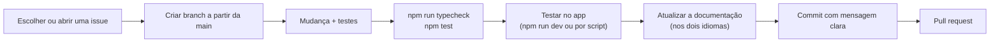

# Como contribuir

Obrigado por ajudar! Esta página é para todo mundo que altera o projeto: pessoas e agentes de IA. Ela explica as regras básicas, o fluxo de trabalho, o estilo de código e checklists passo a passo para os tipos de mudança mais comuns.

> **Idioma:** [English](../en-US/contributing.md) · Português (Brasil)

## Conteúdo

- [Regras básicas](#regras-básicas)
- [Fluxo de trabalho](#fluxo-de-trabalho)
- [Estilo de código](#estilo-de-código)
- [Checklists para mudanças comuns](#checklists-para-mudanças-comuns)
- [Documentação](#documentação)
- [Para agentes de IA](#para-agentes-de-ia)
- [Checklist do pull request](#checklist-do-pull-request)

## Regras básicas

1. **Só rede local.** Nada de contas, serviços em nuvem, telemetria, STUN/TURN ou qualquer coisa que precise de internet.
2. **O servidor continua enxuto e rígido.** Ele autentica, repassa e aplica regras; não processa mídia. Toda regra que importa (quem pode fazer o quê, tamanhos, taxas) é garantida no servidor.
3. **Assistir é explícito, só enviar o que aparece.** Não adicione nada que toque ou envie mídia que ninguém pediu.
4. **Compatibilidade de protocolo é tudo ou nada.** Todos na sala usam o mesmo `PROTOCOL_VERSION`. Se uma mudança quebra a compatibilidade, aumente a versão (veja [protocolo → alterando o protocolo](protocol.md#alterando-o-protocolo)).
5. **Segurança em primeiro lugar.** Leia [segurança](security.md) antes de mexer em autenticação, IPC, no servidor ou nas configurações do Electron.
6. **Deixe melhor, não maior.** Mudanças pequenas e focadas. Não refatore código sem relação na mesma mudança.

## Fluxo de trabalho



- **Branches**: crie a partir da `main`, com um nome curto e descritivo, por exemplo `fix/fullscreen-controls` ou `feature/avatar-crop`.
- **Commits**: uma mudança lógica por commit, para que um recurso possa ser revertido sozinho.
- **Mensagens de commit**: em inglês, como o resto do histórico. Um assunto curto no imperativo (*Add…*, *Fix…*, *Hide…*), uma linha em branco, depois o que mudou e **por quê**, e por fim como foi verificado. Exemplo:

  ```text
  Hide the viewer controls in full screen when the mouse is still

  In a window the controls hide when the pointer leaves the video. In
  full screen a CSS rule forced them visible, so they covered the stream.

  - Controls and cursor hide after 2.5 s without mouse movement
  - Windowed behaviour is unchanged

  Verified in the app: controls hide after the delay and come back on move.
  ```

## Estilo de código

Não há configuração de formatador no repositório; **siga o código ao redor**. Na prática:

- TypeScript `strict`. Evite `any`, exceto ao ler estatísticas do navegador com tipos frouxos.
- Indentação de 2 espaços, aspas simples, **sem ponto e vírgula**, linhas de até cerca de 120 caracteres, sem vírgulas sobrando no fim.
- Nomes: `camelCase` para valores e funções, `PascalCase` para tipos, classes e componentes React, `UPPER_SNAKE_CASE` para constantes em `src/shared/constants.ts`.
- **Comentários explicam o porquê**, não o quê. Classes e funções não óbvias ganham um comentário de documentação curto. Siga a densidade de comentários do arquivo que você edita.
- Coloque a **lógica de decisão em `src/shared`** como funções puras (sem DOM, sem APIs do Node), com testes unitários. Mantenha os componentes React e os callbacks do WebRTC enxutos.
- O código do renderer nunca importa módulos do Node; ele passa pelo `window.api`.
- Constantes (limites, tempos) ficam em `src/shared/constants.ts` com um comentário, não como números mágicos.
- Textos da interface: em inglês simples e amigável, com só a primeira letra maiúscula (*Share screen*, não *Share Screen*). Mensagens de erro dizem o que aconteceu e o que fazer.
- O auxiliar de áudio do Windows precisa continuar sendo **C# 5** válido (veja [desenvolvimento](development.md#trabalhando-no-auxiliar-de-áudio-sem-windows)).

## Checklists para mudanças comuns

### Adicionar uma configuração

1. Adicione o campo, com um comentário, em `Settings` no `src/shared/types.ts`.
2. Adicione um padrão em `defaults()` e a validação em `sanitize()` (`src/main/settings.ts`). Arquivos de configuração antigos precisam continuar funcionando.
3. Adicione o controle no `SettingsPanel` (`src/renderer/components/Dialogs.tsx`).
4. Se precisar valer dentro de uma sala, trate em `updateSessionSettings()` (`src/renderer/lib/session.ts`) e no objeto afetado (por exemplo `Publisher.updateSettings`).
5. Documente na tabela de configurações do [guia do usuário](user-guide.md#configurações) (nos dois idiomas).

### Adicionar uma chamada de IPC (renderer ↔ principal)

1. Adicione um nome de canal em `IPC` e o método em `ScreenShareApi` no `src/shared/ipc.ts`.
2. Implemente em `src/preload/index.ts` (`ipcRenderer.invoke`, ou um `subscribe` para eventos).
3. Trate em `registerIpc()` no `src/main/index.ts`. **Converta cada argumento** (`String()`, `Number()`, `!!`).
4. Use pelo renderer via `window.api`.

### Adicionar ou alterar uma mensagem do protocolo

Siga [protocolo → alterando o protocolo](protocol.md#alterando-o-protocolo): tipos, validação no servidor, tratamento no cliente, aumento da versão se preciso, teste de servidor, documentação.

### Mudar como a mídia é enviada

1. Leia o [pipeline de mídia](media-pipeline.md).
2. Coloque as contas em `src/shared/quality.ts` (ou parecido), com testes.
3. Aplique por `Publisher.rebalance()` / `applyEncoding()`, para todos os limites se combinarem num só lugar.
4. Lembre do caminho TCP (`TcpEncoder`) além do WebRTC.
5. Confira no app com duas instâncias e leia os selos de estatística (veja [testes](testing.md#controlando-o-app-de-verdade)).

### Mudar a interface

1. Os componentes assinam os eventos dos objetos da sessão e guardam cópias no estado do React; cancele a assinatura na limpeza do effect.
2. Reaproveite as classes que já existem no `styles.css` (`btn`, `icon-btn`, `toggle-row`, `modal`, `avatar`…).
3. Confira no tamanho mínimo da janela (960×600).
4. Dê um `title` ou `aria-label` aos botões.

## Documentação

- A documentação fica em `docs/en-US/` e `docs/pt-BR/`, com os **mesmos nomes de arquivo** nas duas pastas. Ao mudar um idioma, mude o outro no mesmo pull request. Se você não conseguir traduzir, diga isso no pull request e marque a seção não traduzida com um aviso, para outra pessoa terminar.
- Os diagramas usam Mermaid (o GitHub renderiza). Mantenha os rótulos curtos e coloque entre aspas os que tiverem pontuação: `A["Processo principal (Node)"]`.
- Os links entre páginas são relativos (`protocol.md`, `../en-US/protocol.md`).
- Os `README.md` / `README.pt-BR.md` da raiz continuam curtos: o que é o app e como rodar. Os detalhes ficam em `docs/`.

## Para agentes de IA

Se você é um agente de IA, comece pelo [`AGENTS.md`](../../AGENTS.md) na raiz do repositório. Em resumo:

- **Situe-se** com a [arquitetura](architecture.md) e a organização do código descrita lá. O protocolo está em `src/shared/types.ts`; limites e tempos em `src/shared/constants.ts`.
- **Verifique antes de afirmar.** Rode `npm run typecheck` e `npm test`. Para mudanças de interface ou de mídia, controle o app de verdade como descrito em [testes](testing.md#controlando-o-app-de-verdade) e confira o resultado (capturas de tela, selos de estatística, estilos calculados).
- **Não adivinhe comportamentos de plataforma** que você não consegue rodar (áudio do Windows, permissões do macOS). Diga o que foi verificado e o que ainda precisa de uma máquina real.
- **Mantenha as mudanças no escopo** da tarefa. Não aumente a versão do protocolo, não mude padrões e não reformate arquivos, a não ser que essa seja a tarefa.
- **Atualize a documentação nos dois idiomas** quando o comportamento mudar.
- **Nunca afrouxe a validação do servidor** ou as regras de repasse para fazer algo funcionar; corrija o cliente.

## Checklist do pull request

- [ ] `npm run typecheck` passa.
- [ ] `npm test` passa, e lógica nova ou regras novas do servidor têm testes (inclusive os caminhos de recusa).
- [ ] A mudança foi testada no app, ou o pull request explica por que não (por exemplo, precisa de Windows).
- [ ] `PROTOCOL_VERSION` aumentado se apps antigos e novos não conseguem mais conversar.
- [ ] Documentação atualizada em **en-US e pt-BR**.
- [ ] Nenhum segredo, token ou PIN gravado em disco ou em logs.
- [ ] As mensagens de commit explicam o porquê.
