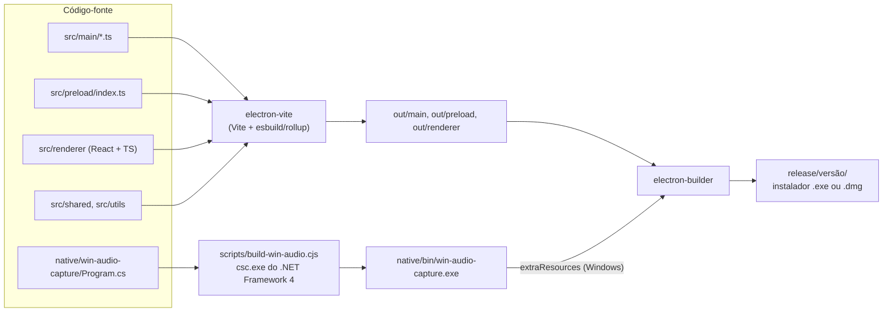
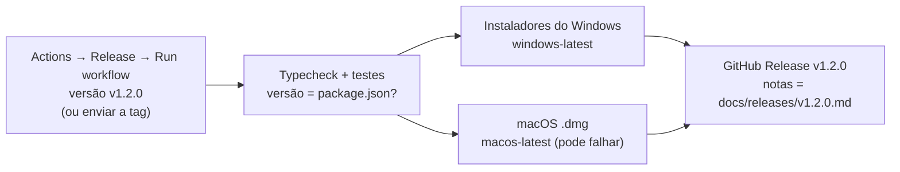

# Guia de desenvolvimento

Como preparar o projeto, rodar, depurar e gerar instaladores.

> **Idioma:** [English](../en-US/development.md) · Português (Brasil)

## Conteúdo

- [Requisitos](#requisitos)
- [Primeira execução](#primeira-execução)
- [Scripts](#scripts)
- [Várias pessoas no mesmo computador](#várias-pessoas-no-mesmo-computador)
- [Como o build funciona](#como-o-build-funciona)
- [Depuração](#depuração)
- [Gerando instaladores](#gerando-instaladores)
- [Publicando uma versão](#publicando-uma-versão)
- [Tecnologias](#tecnologias)

## Requisitos

| Ferramenta | Versão | Observações |
|---|---|---|
| Node.js | 20.19+ ou 22.12+ | Exigido pelo Vite 7 / electron-vite 5. |
| npm | vem com o Node | O repositório usa `package-lock.json`. |
| Git | qualquer versão recente | |
| Windows | 10 ou 11 | Nada além disso. O auxiliar de áudio é compilado com o compilador C# que vem no Windows (.NET Framework 4). |
| macOS | 13+ recomendado | Necessário para gerar o `.dmg`. O áudio do sistema precisa do macOS 13+. |
| Linux | opcional | O app roda para desenvolvimento (a captura de tela funciona no X11), mas o Linux não é uma plataforma suportada. |

## Primeira execução

```bash
git clone https://github.com/nsfxu/lan-screenshare.git
cd lan-screenshare
npm install
npm run dev
```

O `npm run dev` inicia o electron-vite com recarregamento automático do renderer: mudanças na interface aparecem na hora. Depois de mudar algo em `src/main` ou `src/preload`, pare e rode `npm run dev` de novo, ou inicie com `npx electron-vite dev --watch` para recompilar e reiniciar automaticamente.

Antes de enviar uma mudança, rode:

```bash
npm run typecheck
npm test
```

## Scripts

| Script | O que faz |
|---|---|
| `npm run dev` | Modo de desenvolvimento com recarregamento automático (compila antes o auxiliar de áudio do Windows). |
| `npm run build` | Build de produção do main, preload e renderer em `out/` (compila antes o auxiliar). |
| `npm start` | Roda o build de produção (`electron-vite preview`). |
| `npm test` | Roda todos os testes unitários e de integração uma vez (vitest). |
| `npm run test:watch` | Testes em modo observação. |
| `npm run typecheck` | Verificação do TypeScript do lado Node (`tsconfig.node.json`, inclui `tests/`) e do lado web (`tsconfig.web.json`). |
| `npm run build:native` | Compila `native/bin/win-audio-capture.exe` (não faz nada em outros sistemas ou se já estiver atualizado). |
| `npm run dist:win` | Build + instalador do Windows (NSIS, x64 e arm64) em `release/<versão>/`. |
| `npm run dist:mac` | Build + imagem de disco do macOS (universal) em `release/<versão>/`. Precisa rodar num Mac. |
| `npm run dist` | Build + instalador para a plataforma atual. |

## Várias pessoas no mesmo computador

Cada instância precisa das próprias configurações e identidade. Use `--profile=<nome>` com um build de produção:

```bash
npm run build
npx electron . --profile=alice
npx electron . --profile=bob
```

O `--profile=alice` guarda tudo numa pasta de dados separada (`ScreenShare-alice`). Uma instância cria a sala; a outra a encontra na lista (mDNS no mesmo computador), ou você pode usar **Connect by IP** com `127.0.0.1:47800`.

No Linux, é preciso `--no-sandbox` quando se roda como root, por exemplo dentro de um contêiner.

## Como o build funciona



- O `electron.vite.config.ts` define três builds: main, preload e renderer (com o plugin do React).
- O auxiliar de áudio só é recompilado quando o `Program.cs` é mais novo que o `.exe`. A pasta `native/bin/` é ignorada pelo git.
- O `electron-builder.json` empacota `out/**` num `asar`, adiciona o auxiliar como recurso extra no Windows e define os entitlements e as descrições de uso do macOS (Gravação de Tela, Rede Local, serviço Bonjour `_lanshare._tcp`).

### Trabalhando no auxiliar de áudio sem Windows

O auxiliar usa APIs do Windows, então só roda no Windows. Mesmo assim, dá para conferir se ele **compila** como C# 5 (o nível de linguagem do compilador que vem no Windows) usando o Mono:

```bash
mcs -langversion:5 -warn:4 -target:exe -out:/tmp/win-audio-capture.exe native/win-audio-capture/Program.cs
```

Mantenha o C# 5: nada de interpolação de strings (`$"..."`), `?.`, `nameof`, membros com corpo de expressão ou `out var`.

## Depuração

- **DevTools**: aperte **Alt** para mostrar o menu e vá em *View → Toggle Developer Tools*, ou aperte **Ctrl+Shift+I** (**Cmd+Option+I** no macOS).
- **Logs**: o processo principal escreve em `screenshare.log` (veja [onde ficam seus arquivos](user-guide.md#onde-ficam-seus-arquivos)). Em desenvolvimento ele também imprime no terminal. O código do renderer registra logs por `window.api.system.log(...)`, que vão para o mesmo arquivo com o prefixo `[renderer]`. Prefixos úteis:
  - `[publisher]`: captura, áudio, conexões com espectadores, mudanças de qualidade;
  - `[watch <id>]`: uma transmissão assistida (transporte, fallback, qualidade escolhida);
  - `[win-audio]`: o auxiliar de áudio do Windows (qual processo fica de fora, erros).
- **Settings → Open logs** abre a pasta.
- **Estatísticas**: o botão **Stats** (quem transmite) e os selos em cada quadro (espectador) mostram fps, bitrate, codec, codificador, RTT e o que limita a qualidade.
- A página **`chrome://webrtc-internals`** não é acessível pela janela do app, mas as estatísticas do WebRTC aparecem no DevTools por `RTCPeerConnection.getStats()`.

## Gerando instaladores

**Windows** (no Windows):

```bash
npm run dist:win
```

Gera `release/<versão>/ScreenShare-Setup-<versão>-<arch>.exe`: um instalador NSIS que deixa o usuário escolher a pasta e cria um atalho na área de trabalho.

**macOS** (num Mac):

```bash
npm run dist:mac
```

Gera um `.dmg` universal. Para distribuir para outros Macs é preciso um certificado Apple Developer ID para assinar e notarizar; veja a documentação do electron-builder. O build de macOS ainda não foi testado.

## Publicando uma versão

As versões são geradas pelo GitHub Actions (`.github/workflows/release.yml`) nas máquinas Windows e macOS do próprio GitHub, então você não precisa ter os dois sistemas.



1. Ajuste o `version` no `package.json` (os nomes dos instaladores usam esse valor) e escreva as notas da versão em `docs/releases/v1.2.0.md`. Junte os dois na `main` por um pull request.
2. Inicie a publicação de um destes jeitos:
   - No GitHub: **Actions → Release → Run workflow**, branch `main`, versão `v1.2.0`. O próprio workflow cria a tag.
   - Ou envie uma tag do seu computador: `git tag v1.2.0 && git push origin v1.2.0`. Se não houver arquivo de notas, a mensagem de uma tag anotada vira as notas.
3. O workflow confere se a versão bate com o `package.json`, roda as verificações, gera os instaladores e publica a versão com eles anexados. O job do macOS pode falhar sem impedir uma versão só para Windows.
4. Avise nas notas quando a versão do protocolo mudar: quem estiver numa versão antiga não consegue entrar nas salas da nova.

Rodar o workflow sem versão só gera os instaladores, como um teste; eles ficam guardados como artefatos da execução.

O build do Windows gera três instaladores: `-x64.exe` (a maioria dos PCs), `-arm64.exe` (Windows em ARM) e um sem sufixo que contém os dois.

Os instaladores ainda não são assinados: o Windows mostra um aviso do SmartScreen (*Mais informações → Executar assim mesmo*) e o macOS bloqueia a primeira abertura (clique com o botão direito no app → *Abrir*).

## Tecnologias

| Área | Escolha |
|---|---|
| Aplicativo de desktop | Electron 44 (Chromium + Node.js) |
| Build | electron-vite 5, Vite 7, TypeScript 5.9 (strict) |
| Interface | React 19, CSS puro (`src/renderer/styles.css`) |
| Mídia | WebRTC, WebCodecs, MediaStreamTrackProcessor/Generator |
| Rede | `ws` (servidor WebSocket), `http`/`https` do Node |
| Descoberta | `bonjour-service` (mDNS em JS puro) |
| Identidade TLS | `selfsigned` (certificados EC P-256) |
| Testes | vitest |
| Empacotamento | electron-builder (NSIS, DMG) |
| Auxiliar de áudio do Windows | C# 5, .NET Framework 4, WASAPI via interop COM |

Próximos passos: [arquitetura](architecture.md) · [como contribuir](contributing.md) · [testes](testing.md)
