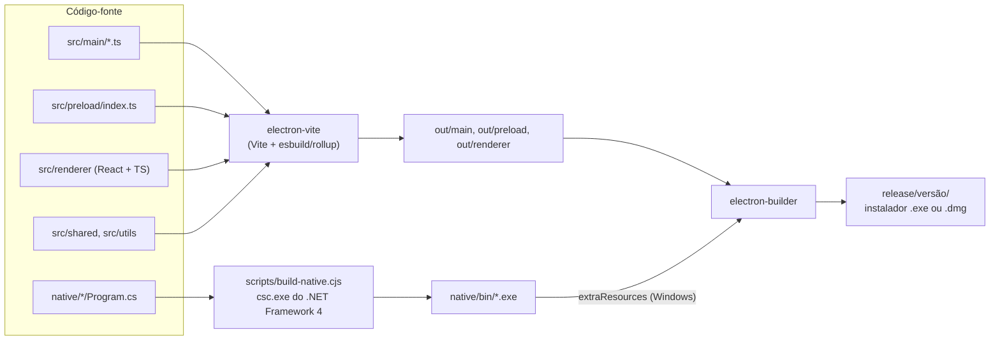
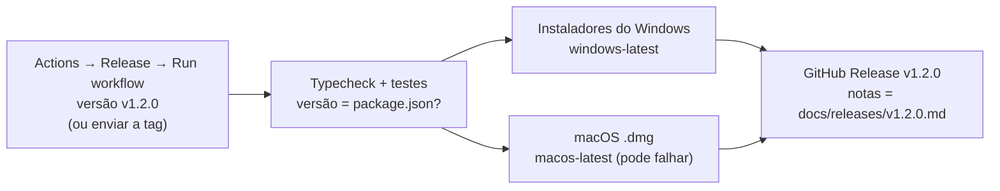

# Guia de desenvolvimento

Como preparar o projeto, rodar, depurar e gerar instaladores.

> **Idioma:** [English](../en-US/development.md) · Português (Brasil)

## Conteúdo

- [Requisitos](#requisitos)
- [Primeira execução](#primeira-execução)
- [Scripts](#scripts)
- [Várias pessoas no mesmo computador](#várias-pessoas-no-mesmo-computador)
- [Como o build funciona](#como-o-build-funciona)
- [Depuração](#depuração)
- [Gerando instaladores](#gerando-instaladores)
- [Versões e o changelog](#versões-e-o-changelog)
- [Publicando uma versão](#publicando-uma-versão)
- [Tecnologias](#tecnologias)

## Requisitos

| Ferramenta | Versão | Observações |
|---|---|---|
| Node.js | 20.19+ ou 22.12+ | Exigido pelo Vite 7 / electron-vite 5. |
| npm | vem com o Node | O repositório usa `package-lock.json`. |
| Git | qualquer versão recente | |
| Windows | 10 ou 11 | Nada além disso. O auxiliar de áudio é compilado com o compilador C# que vem no Windows (.NET Framework 4). |
| macOS | 13+ recomendado | Necessário para gerar o `.dmg`. O áudio do sistema precisa do macOS 13+. |
| Linux | opcional | O app roda para desenvolvimento (a captura de tela funciona no X11), mas o Linux não é uma plataforma suportada. |

## Primeira execução

```bash
git clone https://github.com/nsfxu/lan-screenshare.git
cd lan-screenshare
npm install
npm run dev
```

O `npm run dev` inicia o electron-vite com recarregamento automático do renderer: mudanças na interface aparecem na hora. Depois de mudar algo em `src/main` ou `src/preload`, pare e rode `npm run dev` de novo, ou inicie com `npx electron-vite dev --watch` para recompilar e reiniciar automaticamente.

Antes de enviar uma mudança, rode:

```bash
npm run typecheck
npm test
```

## Scripts

| Script | O que faz |
|---|---|
| `npm run dev` | Modo de desenvolvimento com recarregamento automático (compila antes o auxiliar de áudio do Windows). |
| `npm run build` | Build de produção do main, preload e renderer em `out/` (compila antes o auxiliar). |
| `npm start` | Roda o build de produção (`electron-vite preview`). |
| `npm test` | Roda todos os testes unitários e de integração uma vez (vitest). |
| `npm run test:watch` | Testes em modo observação. |
| `npm run test:e2e` | Compila e roda os testes de ponta a ponta: duas instâncias reais do app numa sala (veja [testes](testing.md#testes-de-ponta-a-ponta)). |
| `npm run typecheck` | Verificação do TypeScript do lado Node (`tsconfig.node.json`, inclui `tests/`) e do lado web (`tsconfig.web.json`). |
| `npm run build:native` | Compila os auxiliares do Windows em `native/bin/` (`win-audio-capture.exe`, `win-cursor-watch.exe`); não faz nada em outros sistemas ou se já estiverem atualizados. |
| `npm run dist:win` | Build + instalador do Windows (NSIS, x64 e arm64) em `release/<versão>/`. |
| `npm run dist:mac` | Build + imagens de disco do macOS (Intel e Apple Silicon) em `release/<versão>/`. Precisa rodar num Mac. |
| `npm run dist` | Build + instalador para a plataforma atual. |
| `npm run release -- <major\|minor\|patch>` | Prepara uma versão: número, seção do changelog e rascunho das notas (veja [publicando uma versão](#publicando-uma-versão)). Use `--dry-run` para só ver o resultado. |

## Várias pessoas no mesmo computador

Cada instância precisa das próprias configurações e identidade. Use `--profile=<nome>` com um build de produção:

```bash
npm run build
npx electron . --profile=alice
npx electron . --profile=bob
```

O `--profile=alice` guarda tudo numa pasta de dados separada (`ScreenShare-alice`). Uma instância cria a sala; a outra a encontra na lista (mDNS no mesmo computador), ou você pode usar **Join by IP** com `127.0.0.1:47800`.

Para deixá-las fora da tela que você está usando, adicione `--display=<n>` (a tela, numerada como no seletor de fontes: "Tela 3") e `--tile=<i>/<total>` (espaços lado a lado nela). Uma janela posicionada assim abre sem pegar o foco:

```bash
npx electron . --profile=alice --display=3 --tile=1/2
npx electron . --profile=bob --display=3 --tile=2/2
```

No Linux, é preciso `--no-sandbox` quando se roda como root, por exemplo dentro de um contêiner.

## Como o build funciona


```mermaid
flowchart LR
  subgraph Sources["Código-fonte"]
    M["src/main/*.ts"]
    P["src/preload/index.ts"]
    R["src/renderer (React + TS)"]
    S["src/shared, src/utils"]
    C["native/*/Program.cs"]
  end
  EV["electron-vite<br/>(Vite + esbuild/rollup)"]
  CSC["scripts/build-native.cjs<br/>csc.exe do .NET Framework 4"]
  OUT["out/main, out/preload, out/renderer"]
  EXE["native/bin/*.exe"]
  EB["electron-builder"]
  REL["release/versão/<br/>instalador .exe ou .dmg"]
  M --> EV
  P --> EV
  R --> EV
  S --> EV
  EV --> OUT
  C --> CSC --> EXE
  OUT --> EB
  EXE -->|"extraResources (Windows)"| EB
  EB --> REL
```

- O `electron.vite.config.ts` define três builds: main, preload e renderer (com o plugin do React).
- Cada auxiliar só é recompilado quando o seu `Program.cs` é mais novo que o seu `.exe`. Se outra instância do app estiver rodando um auxiliar, o `.exe` travado é renomeado para o lado (o Windows permite) e apagado num build seguinte. A pasta `native/bin/` é ignorada pelo git.
- O `electron-builder.json` empacota `out/**` num `asar`, adiciona os auxiliares como recursos extras no Windows e define os entitlements e as descrições de uso do macOS (Gravação de Tela, Rede Local, serviço Bonjour `_lanshare._tcp`).

### Trabalhando no auxiliar de áudio sem Windows

O auxiliar usa APIs do Windows, então só roda no Windows. Mesmo assim, dá para conferir se ele **compila** como C# 5 (o nível de linguagem do compilador que vem no Windows) usando o Mono:

```bash
mcs -langversion:5 -warn:4 -target:exe -out:/tmp/win-audio-capture.exe native/win-audio-capture/Program.cs
mcs -langversion:5 -warn:4 -target:exe -out:/tmp/win-cursor-watch.exe native/win-cursor-watch/Program.cs
```

Mantenha o C# 5: nada de interpolação de strings (`$"..."`), `?.`, `nameof`, membros com corpo de expressão ou `out var`.

## Depuração

- **DevTools**: aperte **Alt** para mostrar o menu e vá em *View → Toggle Developer Tools*, ou aperte **Ctrl+Shift+I** (**Cmd+Option+I** no macOS).
- **Logs**: o processo principal escreve em `screenshare.log` (veja [onde ficam seus arquivos](user-guide.md#onde-ficam-seus-arquivos)). Em desenvolvimento ele também imprime no terminal. O código do renderer registra logs por `window.api.system.log(...)`, que vão para o mesmo arquivo com o prefixo `[renderer]`. Prefixos úteis:
  - `[publisher]`: captura, áudio, conexões com espectadores, mudanças de qualidade;
  - `[watch <id>]`: uma transmissão assistida (transporte, fallback, qualidade escolhida);
  - `[win-audio]`: o auxiliar de áudio do Windows (qual processo fica de fora, erros).
- **Settings → Open logs** abre a pasta.
- **Estatísticas**: o **Stream stats** do menu Sharing (quem transmite) e os selos em cada quadro (espectador) mostram fps, bitrate, codec, codificador, RTT e o que limita a qualidade.
- A página **`chrome://webrtc-internals`** não é acessível pela janela do app, mas as estatísticas do WebRTC aparecem no DevTools por `RTCPeerConnection.getStats()`.

## Gerando instaladores

**Windows** (no Windows):

```bash
npm run dist:win
```

Gera `release/<versão>/ScreenShare-Setup-<versão>-<arch>.exe`: um instalador NSIS que deixa o usuário escolher a pasta e cria um atalho na área de trabalho.

**macOS** (num Mac):

```bash
npm run dist:mac
```

Gera duas imagens de disco: `ScreenShare-<versão>-arm64.dmg` para Apple Silicon e `ScreenShare-<versão>-x64.dmg` para Macs Intel. Para distribuir para outros Macs é preciso um certificado Apple Developer ID para assinar e notarizar; veja a documentação do electron-builder. O build de macOS ainda não foi testado.

## Versões e o changelog

O ScreenShare segue o [Versionamento Semântico](https://semver.org/lang/pt-BR/), onde "incompatível" quer dizer *não consegue dividir uma sala*:

| Aumento | Quando | Exemplo |
|---|---|---|
| **Maior** (major) | O `PROTOCOL_VERSION` mudou (apps antigos não conseguem entrar nas salas novas, então todos precisam atualizar), ou um grande redesenho que mantém o protocolo (2.0.0: o novo layout). As notas dizem qual. | 1.4.2 → 2.0.0 |
| **Menor** (minor) | Novidades que ainda funcionam com outros apps da mesma versão maior | 1.0.0 → 1.1.0 |
| **Correção** (patch) | Só correções | 1.1.0 → 1.1.1 |

O [`CHANGELOG.md`](../../CHANGELOG.md) (em inglês, no formato [Keep a Changelog](https://keepachangelog.com/pt-BR/1.1.0/)) lista toda mudança que o usuário percebe. **Cada pull request adiciona a sua linha em `## [Unreleased]`**, no grupo certo (`### Added`, `### Changed`, `### Fixed`, `### Removed`), escrita para quem usa o app: *"Viewers no longer see your cursor over fullscreen games that hide it"*, e não *"Add GameCursorGuard"*. Mudanças internas (refatorações, testes, documentação) não precisam de linha.

Não mude o `version` do `package.json` à mão; o `npm run release` faz isso.

## Publicando uma versão

As versões são geradas pelo GitHub Actions (`.github/workflows/release.yml`) nas máquinas Windows e macOS do próprio GitHub, então você não precisa ter os dois sistemas.


```mermaid
flowchart LR
  S["Actions → Release → Run workflow<br/>versão v1.2.0<br/>(ou enviar a tag)"] --> C["Typecheck + testes<br/>versão = package.json?"]
  C --> W["Instaladores do Windows<br/>windows-latest"]
  C --> M["macOS .dmg<br/>macos-latest (pode falhar)"]
  W --> R["GitHub Release v1.2.0<br/>notas = docs/releases/v1.2.0.md"]
  M --> R
```

1. Prepare com `npm run release -- minor` (ou `major`, `patch`, ou uma versão exata como `1.2.0`) num branch atualizado a partir da `main`, sem mudanças pendentes. Ele:
   - recusa se o `[Unreleased]` do `CHANGELOG.md` estiver vazio, ou se o `PROTOCOL_VERSION` mudou desde a última versão e o aumento não for maior;
   - move as entradas de Unreleased para uma seção datada `## [1.2.0]` e atualiza os links de comparação;
   - ajusta a versão no `package.json` e no `package-lock.json` (os nomes dos instaladores usam esse valor);
   - faz um rascunho de `docs/releases/v1.2.0.md`: tabela de downloads, se todos precisam atualizar, e as entradas do changelog. Troque os `TODO`s (uma introdução curta e o resumo em português) e deixe o texto bom para os usuários.

   Faça o commit (`Release v1.2.0`) e junte na `main` por um pull request.
2. Inicie a publicação de um destes jeitos:
   - No GitHub: **Actions → Release → Run workflow**, branch `main`, versão `v1.2.0`. O próprio workflow cria a tag.
   - Ou envie uma tag do seu computador: `git tag v1.2.0 && git push origin v1.2.0`. Se não houver arquivo de notas, a mensagem de uma tag anotada vira as notas.
3. O workflow confere se a versão bate com o `package.json`, se o `CHANGELOG.md` tem a seção dela e se as notas não têm mais `TODO`, roda as verificações, gera os instaladores e publica a versão com eles anexados, junto com o `latest.yml`: os apps do Windows já instalados leem esse arquivo para achar a versão nova (a entrada `publish` do `electron-builder.json` aponta para este repositório). Sem ele a publicação falha. O job do macOS pode falhar sem impedir uma versão só para Windows.
4. Quando o protocolo mudar, as notas avisam que todos na sala precisam da versão nova (o rascunho já faz isso).

Rodar o workflow sem versão é um teste: ele gera os instaladores, lista o que seria publicado e guarda os instaladores como artefatos da execução.

Cada sistema tem um instalador por tipo de processador: `-x64` (a maioria dos PCs com Windows, Macs Intel) e `-arm64` (Windows em ARM, Macs Apple Silicon).

Para os instaladores ficarem menores, eles só levam os arquivos de idioma do Chromium em inglês e português (`electronLanguages` no `electron-builder.json`). Num computador configurado em outro idioma, os textos do próprio Chromium e o formato da hora no chat voltam para o inglês dos EUA. Adicione o idioma ali se o app for traduzido.

Os instaladores ainda não são assinados: o Windows mostra um aviso do SmartScreen (*Mais informações → Executar assim mesmo*) e o macOS bloqueia a primeira abertura (clique com o botão direito no app → *Abrir*).

## Tecnologias

| Área | Escolha |
|---|---|
| Aplicativo de desktop | Electron 44 (Chromium + Node.js) |
| Build | electron-vite 5, Vite 7, TypeScript 5.9 (strict) |
| Interface | React 19, CSS puro (`src/renderer/styles.css`) |
| Mídia | WebRTC, WebCodecs, MediaStreamTrackProcessor/Generator |
| Rede | `ws` (servidor WebSocket), `http`/`https` do Node |
| Descoberta | `bonjour-service` (mDNS em JS puro) |
| Identidade TLS | `selfsigned` (certificados EC P-256) |
| Testes | vitest |
| Empacotamento | electron-builder (NSIS, DMG) |
| Auxiliar de áudio do Windows | C# 5, .NET Framework 4, WASAPI via interop COM |

Próximos passos: [arquitetura](architecture.md) · [como contribuir](contributing.md) · [testes](testing.md)
