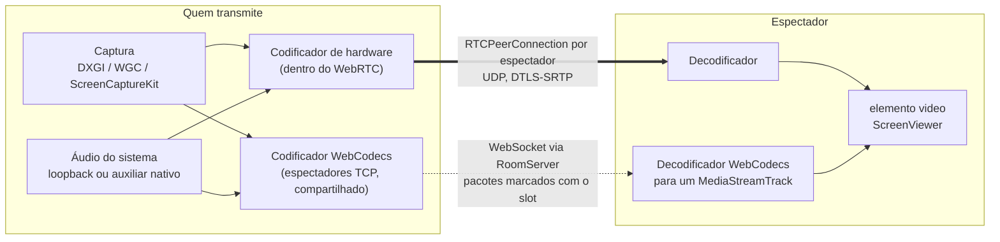
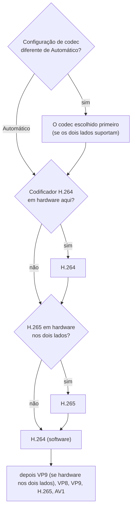
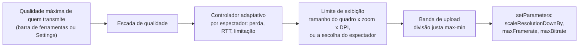
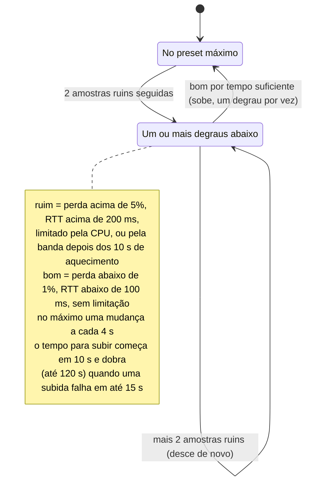
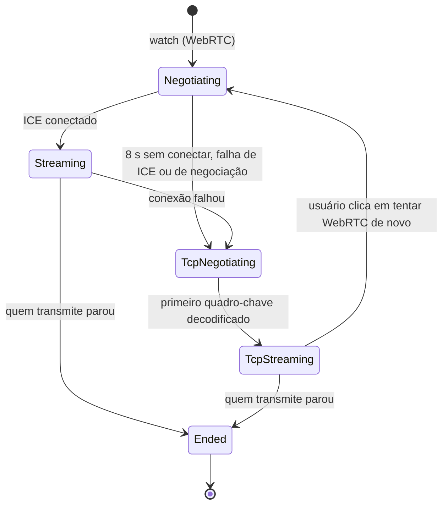
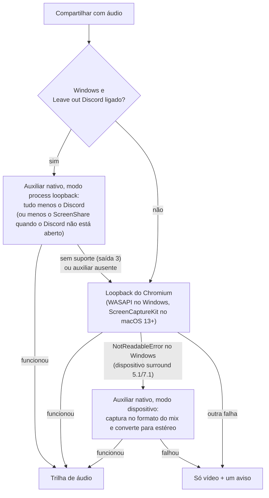

# Pipeline de mídia

Como uma tela vai de um computador para outro: captura, codificação, os dois transportes, controle de qualidade, áudio, prévias e estatísticas. Leia antes a [arquitetura](architecture.md) para ter a visão geral.

> **Idioma:** [English](../en-US/media-pipeline.md) · Português (Brasil)

## Conteúdo

- [Visão geral](#visão-geral)
- [Captura](#captura)
- [Escolha do codec](#escolha-do-codec)
- [Caminho WebRTC](#caminho-webrtc)
- [Controle de qualidade](#controle-de-qualidade)
- [Fallback TCP](#fallback-tcp)
- [Áudio do sistema](#áudio-do-sistema)
- [Prévias](#prévias)
- [Estatísticas e latência](#estatísticas-e-latência)
- [Resultados medidos](#resultados-medidos)

## Visão geral

Quem transmite captura **uma vez** e distribui para todos os espectadores. No caminho WebRTC cada espectador tem seu próprio `RTCPeerConnection` (com suas configurações de codificação, controle de congestionamento e qualidade adaptativa). No caminho TCP, um único codificador WebCodecs atende todos os espectadores TCP daquela pessoa.

## Captura

- O app mostra o próprio seletor de fonte (`SourcePicker.tsx`, alimentado por `window.api.capture.listSources()`) e depois chama `navigator.mediaDevices.getDisplayMedia()`. O processo principal responde a essa chamada com a fonte escolhida via `session.setDisplayMediaRequestHandler` (`src/main/screenCapture.ts`), então nenhuma janela do sistema aparece.
- O Chromium usa as APIs nativas de captura:
  - **Windows**: DXGI Desktop Duplication para telas, Windows.Graphics.Capture para janelas.
  - **macOS**: ScreenCaptureKit (o app pede a permissão de Gravação de Tela).
- Os quadros ficam na GPU e vão direto para o codificador de hardware.
- As restrições de captura vêm da **qualidade máxima** de quem transmite (taxa de quadros, e um limite de altura se não for "Native"). Mudar durante a transmissão chama `applyConstraints()` na trilha ao vivo, sem reconectar.
- O `contentHint` é `motion` (manter a taxa de quadros) ou `detail` (manter o texto nítido), conforme **Settings → Optimize for**.

## Escolha do codec

Ao iniciar, o renderer pergunta ao `MediaCapabilities` quais codecs podem ser **codificados** e **decodificados**, e se cada um é `powerEfficient` (um bom sinal de suporte em hardware). Cada participante envia sua lista de decodificadores no `hello`, e quem transmite a recebe no `watch-request`.

`chooseCodecOrder()` (`src/shared/codecs.ts`) ordena os codecs para cada espectador:

Um codec que o espectador não consegue decodificar nunca é oferecido. A tela de configurações mostra o suporte detectado para codificar e decodificar.

## Caminho WebRTC

`Publisher.connect()` (`src/renderer/lib/publisher.ts`), para cada espectador:

1. Cria um `RTCPeerConnection` **sem servidores ICE** (só rede local), com `max-bundle` e `rtcp-mux`.
2. Adiciona a trilha de vídeo com `priority: high` e uma codificação inicial vinda do preset adaptativo.
3. Sempre adiciona um transceiver de áudio no **mesmo stream** (mantém a sincronia labial), então silenciar ou trocar de fonte só troca a trilha.
4. Aplica a ordem de codecs, cria a oferta e envia pelo servidor.
5. Quando a resposta chega, aumenta as dicas de bitrate inicial/mínimo do WebRTC (`mungeBitrates`) para uma transmissão na rede local chegar à qualidade total em um ou dois segundos, e ajusta o Opus para música (`mungeOpus`: estéreo, média de 128 kbps, FEC embutido, sem DTX).

O Chromium é iniciado com flags importantes aqui (`src/main/index.ts`): candidatos ICE com o IP real em vez de nomes mDNS (que não resolvem através de VPNs), envio e recebimento de H.265 permitidos, e nada de reduzir o ritmo de uma janela minimizada.

## Controle de qualidade

Quatro limites independentes decidem o que cada espectador recebe. Eles são combinados em `Publisher.rebalance()` e aplicados com `RTCRtpSender.setParameters()` (sem renegociar).

### 1. A escada e o controlador adaptativo

Presets (`QUALITY_PRESETS` em `src/shared/quality.ts`):

| Preset | Resolução | FPS | Bitrate máximo |
|---|---|---|---|
| Native60 | a da fonte | 60 | 20 Mbps |
| 1080p60 | 1080p | 60 | 15 Mbps |
| 720p60 | 720p | 60 | 10 Mbps |
| 720p30 | 720p | 30 | 5 Mbps |
| 480p30 | 480p | 30 | 2,5 Mbps |

A escada começa no máximo de quem transmite e vai descendo. A cada segundo, `AdaptiveController.update()` lê a perda de pacotes, o RTT e o `qualityLimitationReason` do WebRTC de cada espectador:

Desligar **Adaptive quality** mantém cada espectador no preset máximo.

### 2. Limite de exibição (só enviar o que aparece)

O `ScreenViewer` de cada espectador mede a altura em que realmente exibe a transmissão (altura do quadro × zoom × `devicePixelRatio`) e arredonda **para cima** para um degrau: 360, 480, 720, 1080, 1440 ou 2160 (`viewHeightStep`). Só as mudanças de degrau são enviadas (`view-size`).

O espectador também pode escolher uma **qualidade** no menu do quadro (`WATCH_QUALITIES`): Auto, 1080p, 720p, 720p·30, 480p·30, 360p·30. A altura enviada é a menor entre o degrau exibido e a escolha (`watchLimit`), mais um limite de fps nas opções de 30 fps.

Do lado de quem transmite, `limitPreset()` reduz o preset para essa altura e fps e ajusta o bitrate pela quantidade de pixels e pela taxa de quadros. Exemplo: um preset 1080p60 exibido num quadro de 360p custa cerca de 15 Mbps / 9 ≈ 1,7 Mbps.

### 3. Banda de upload

**Settings → Upload limit when sharing** (padrão 100 Mbps, ou ilimitado) é o upload **total** de quem transmite. `splitBudget()` divide essa banda de forma justa (max-min, "enchendo os copos"): quem precisa de pouco (quadros pequenos) recebe o que precisa, e o resto é dividido entre as visualizações maiores. Os espectadores TCP contam como uma única demanda. Vale na hora, inclusive durante a transmissão.

### 4. Mudanças ao vivo

- Quem transmite muda o máximo: a captura é ajustada, o controlador de cada espectador recomeça na nova escada, o codificador TCP acompanha.
- O espectador redimensiona, dá zoom, vai para tela cheia ou escolhe uma qualidade: novo `view-size`, aplicado em menos de um segundo.
- Um espectador entra ou sai: a banda é dividida de novo.

## Fallback TCP

(Diagrama simplificado; no código o `SubscriptionState` é `idle | negotiating | streaming | failed | ended`, com um campo `transport` separado.)

Como funciona (`src/renderer/lib/tcpStream.ts`):

- **Quem transmite**: o `TcpEncoder` lê os quadros com `MediaStreamTrackProcessor` e codifica com o `VideoEncoder` do WebCodecs (tenta H.264 Baseline e High, depois VP9, depois VP8, primeiro em hardware; `latencyMode: realtime`). Quadro-chave a cada 4 s ou quando pedido. O áudio usa o `TcpAudioEncoder` (Opus). Um codificador atende todos os espectadores TCP; ele é dimensionado para o mais exigente deles (`largestViewLimit`) e recebe uma parte da banda de upload.
- **Latência em primeiro lugar**: quadros são pulados quando a fila do codificador ou o buffer do socket local (4 MB) fica para trás, e o próximo quadro é um quadro-chave.
- **Servidor**: marca cada pacote com o slot de quem transmite, deixa no máximo 2 MB na fila de cada espectador e descarta o vídeo até o próximo quadro-chave quando um espectador fica para trás (veja [protocolo → fallback TCP](protocol.md#fallback-tcp)).
- **Retorno**: a cada 2 s o servidor envia `tcp-feedback {sent, dropped}`, que alimenta o controlador adaptativo do próprio codificador TCP.
- **Espectador**: o `TcpDecoder` decodifica com WebCodecs para um `MediaStreamTrackGenerator`, então o mesmo elemento `<video>` exibe os dois transportes.

## Áudio do sistema

O compartilhamento pode incluir tudo que o computador toca. O áudio vai como uma segunda trilha no mesmo stream (WebRTC) ou como pacotes Opus (TCP). O processamento de voz fica desligado (sem cancelamento de eco, supressão de ruído ou ganho automático), porque é áudio do sistema, não um microfone.

### O auxiliar do Windows (`native/win-audio-capture`)

Um pequeno programa em C#, compilado com o compilador C# que vem com o .NET Framework 4 em todo Windows 10/11 (`scripts/build-win-audio.cjs`, executado automaticamente antes do `dev` e do `build`). O processo principal o executa (`src/main/nativeAudio.ts`) e repassa a saída para o renderer, que a transforma num `MediaStreamTrack` (`src/renderer/lib/nativeAudio.ts`).

| Modo | Argumentos | Como |
|---|---|---|
| Loopback do dispositivo | (nenhum) | Loopback WASAPI do dispositivo de saída padrão no formato do próprio mix (funciona com headsets 5.1/7.1), convertido para estéreo: centro e surrounds a −3 dB, LFE descartado. |
| Tudo menos um app | `--exclude Discord.exe,DiscordPTB.exe,DiscordCanary.exe,DiscordDevelopment.exe --fallback-pid <pid do ScreenShare>` | **Process loopback** do Windows (Windows 10 2004+ / 11) no modo *excluir a árvore de processos alvo*. Encontra o processo raiz do Discord (a maior árvore) e procura de novo a cada 2 s, então o Discord pode abrir, fechar ou reiniciar durante a transmissão. Enquanto o Discord não está aberto, deixa de fora o próprio ScreenShare. O Windows converte para 48 kHz estéreo. |

Saída no stdout: um cabeçalho de 10 bytes `"SSA1"` + taxa de amostragem u32 + canais u16 (sempre 2), e depois quadros estéreo float32 intercalados. Envia silêncio de verdade quando nada está tocando, para manter o ritmo estável. Códigos de saída: `1` erro fatal, `2` dispositivo invalidado, `3` process loopback indisponível (antes do cabeçalho). Ele termina quando o stdin é fechado.

Limitações: o process loopback só consegue deixar de fora **um** app por vez, e deixa de fora *todo* o som do Discord (notificações e soundboard também).

## Prévias

A cada 5 s (e 1,2 s depois de começar, trocar de fonte ou retomar) quem transmite captura um quadro, reduz para 320 px de largura e envia como data URL JPEG (`snapshot`). O servidor confere se quem enviou está compartilhando, o tipo e o tamanho, limita a taxa, guarda a última para quem entrar depois e apaga quando a transmissão termina. Os espectadores veem as prévias nos cartões "ao vivo" e nos chips. Quem transmite guarda a própria prévia localmente para o cartão "You".

## Estatísticas e latência

- **Quem transmite** (`Publisher.collectStats`, a cada segundo): por espectador, bitrate, fps, RTT, perda, tempo de codificação, implementação do codificador, codec e limitação de qualidade. Aparece no painel Stats e na sobreposição do próprio quadro, e é enviado aos espectadores como `publisher-stats` (tempo de codificação).
- **Espectador** (`Subscription`, a cada segundo, enviado a cada 2 s): fps, resolução, bitrate, perda, codec, decodificador, quadros descartados, bitrate do áudio, transporte e uma medida de latência.
- **A latência no WebRTC é uma estimativa**: captura + codificação + ½ RTT + buffer de jitter + decodificação + exibição. No caminho TCP ela é medida pelo horário de captura em cada pacote, corrigido pela diferença de relógio para o anfitrião (via `ping`/`pong`).

## Resultados medidos

Windows 10, GPU NVIDIA, todas as instâncias no mesmo computador (rede de loopback), antes das mudanças da v4:

| Cenário | Resultado |
|---|---|
| Uma transmissão, WebRTC | 1920×1080 a 57–58 fps, H.265 via `MediaFoundationVideoEncodeAccelerator (NVIDIA HEVC Encoder MFT)`, codificação de 4,3 ms/quadro, latência estimada de ponta a ponta ~30–65 ms |
| Capacidade do codificador de hardware | 8 codificações 1080p simultâneas em hardware (H.264 e H.265) a ~57 fps cada, ~13 % de CPU total, decodificando 8 transmissões ao mesmo tempo |
| Duas pessoas compartilhando, uma terceira assistindo as duas | As duas em 1080p ~57 fps; as duas também se assistiram ao mesmo tempo |
| Limite de exibição | Dois quadros na grade (≈276 px de altura) → 640×360 cada. Destaque (505 px) → 1280×720. Zoom de 212 % → 1920×1080 |
| Banda de upload | O upload de quem transmitia caiu de 6,2–7,5 Mbps para 2,3–3,5 Mbps com um limite de 3 Mbps, aplicado durante a sessão |
| Fallback TCP | Duas transmissões ao mesmo tempo por TCP, cada uma roteada ao seu quadro pelo slot, 57–58 fps, H.264 em hardware via WebCodecs |
| Áudio | Tom de 440 Hz recebido como 439 Hz (WebRTC ~160 kbps, Opus por TCP a 128 kbps); um headset 7.1 pelo auxiliar nativo: 880 Hz recebido como 879 Hz |
| Reconexão | Queda forçada → "Reconnecting…", as duas transmissões assistidas renegociadas em ~45 ms |

A escolha automática de codec ficou com H.265 nessa máquina porque o driver informava a codificação HEVC em hardware como eficiente, mas não a H.264, embora a codificação H.264 em hardware funcionasse quando forçada.

Perda de pacotes real ainda não foi simulada; o controlador adaptativo e a divisão de banda são cobertos por testes unitários.
