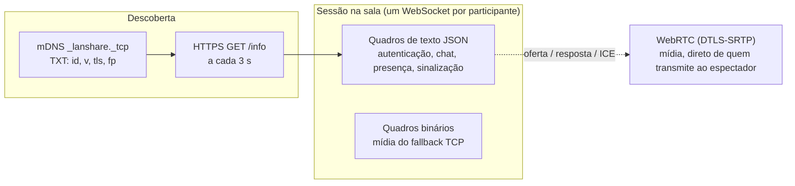
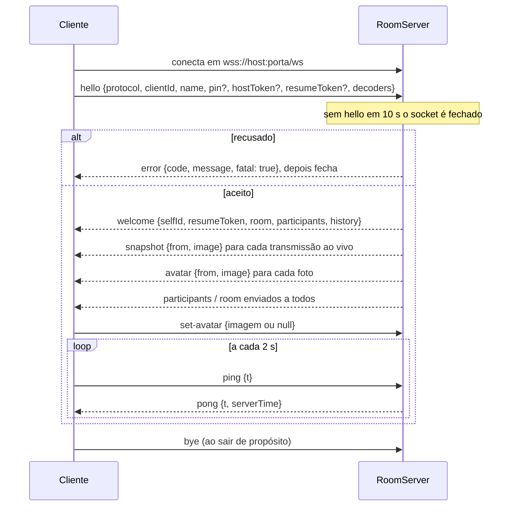
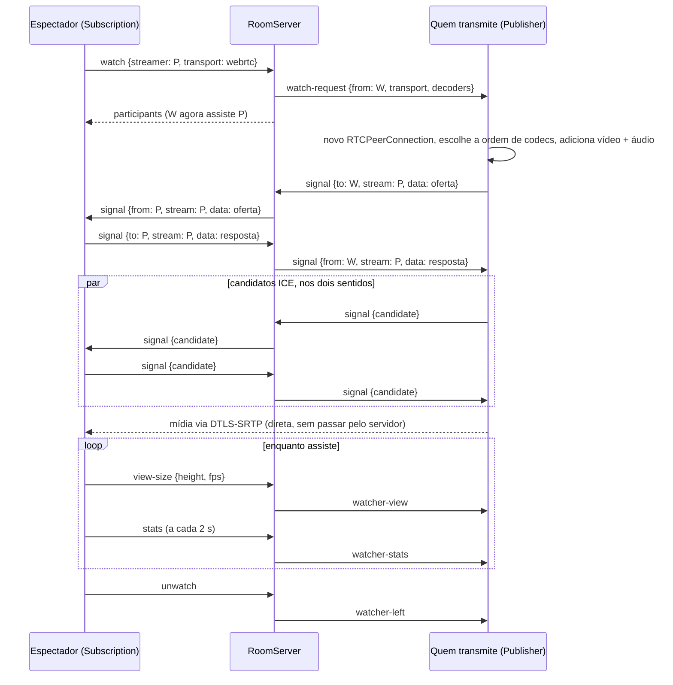
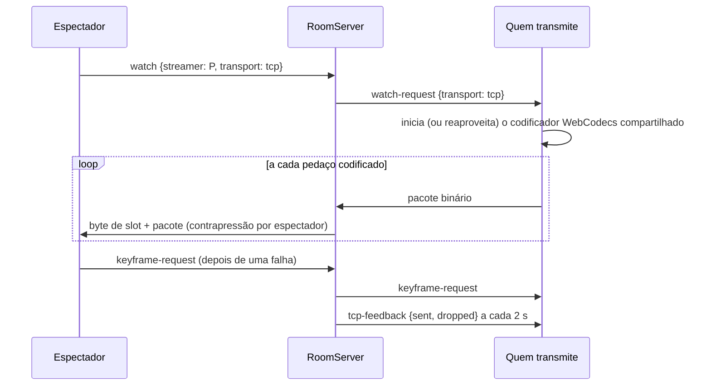

# Referência do protocolo

Tudo o que trafega entre os apps de uma sala: descoberta, a consulta HTTP, as mensagens do WebSocket e o formato binário do fallback TCP. A fonte da verdade é `src/shared/types.ts` (`ClientMessage`, `ServerMessage`) e `src/shared/constants.ts`.

> **Idioma:** [English](../en-US/protocol.md) · Português (Brasil)

## Conteúdo

- [Versionamento](#versionamento)
- [Transportes num relance](#transportes-num-relance)
- [Descoberta (mDNS)](#descoberta-mdns)
- [HTTP: GET /info](#http-get-info)
- [WebSocket: ciclo de vida da conexão](#websocket-ciclo-de-vida-da-conexão)
- [Mensagens cliente → servidor](#mensagens-cliente--servidor)
- [Mensagens servidor → cliente](#mensagens-servidor--cliente)
- [Assistir uma transmissão (WebRTC)](#assistir-uma-transmissão-webrtc)
- [Fallback TCP](#fallback-tcp)
- [Erros](#erros)
- [Limites e tempos](#limites-e-tempos)
- [Alterando o protocolo](#alterando-o-protocolo)

## Versionamento

- A versão atual é **`PROTOCOL_VERSION = 4`** (`src/shared/constants.ts`).
- Todo `hello` informa a versão. O servidor recusa uma versão diferente com o erro fatal `version_mismatch` ("This room runs a different app version").
- O `GET /info` e o registro TXT do mDNS também informam a versão, para a lista de salas poder mostrar salas incompatíveis.
- Histórico: a v3 trouxe várias transmissões (qualquer pessoa pode compartilhar). A v4 adicionou fotos de perfil (`set-avatar` / `avatar`) e a taxa de quadros escolhida pelo espectador em `view-size` / `watcher-view`.

## Transportes num relance



| Canal | Onde | Segurança |
|---|---|---|
| Anúncio e busca mDNS | UDP multicast, só na rede local | Não é secreto. Leva a impressão digital do certificado usada para a fixação. |
| `GET /info` | `https://<host>:<porta>/info` (ou `http` com TLS desligado) | Só dados públicos. |
| WebSocket | `wss://<host>:<porta>/ws` | TLS com certificado autoassinado fixado pela impressão digital (padrão), PIN nas salas privadas. |
| Mídia WebRTC | UDP direto (o ICE também tenta candidatos TCP) | Sempre cifrada com DTLS-SRTP. |

A porta padrão é **47800**. Se estiver ocupada, o anfitrião tenta as próximas 19 portas e depois qualquer porta livre.

## Descoberta (mDNS)

O anfitrião publica um serviço DNS-SD `ScreenShare-<roomId>._lanshare._tcp.local` na porta da sala (só IPv4). O registro TXT contém:

| Chave | Significado |
|---|---|
| `id` | Id da sala |
| `v` | Versão do protocolo |
| `tls` | `1` quando o WebSocket usa TLS |
| `fp` | Impressão digital SHA-256 do certificado do anfitrião (vazia com TLS desligado) |

Os dados ao vivo (nome, pessoas, privacidade, transmissões) **não** estão no TXT; eles vêm do `GET /info`. A busca é repetida a cada 5 s.

## HTTP: GET /info

Devolve um `RoomInfo` em JSON, sem segredos:

```json
{
  "id": "k3j9…",
  "name": "Alice's room",
  "hostName": "Alice",
  "privacy": "private",
  "viewerCount": 3,
  "maxUsers": 10,
  "streams": 2,
  "protocol": 4,
  "startedAt": 1790000000000
}
```

Quem consulta confere a impressão digital do certificado com a anunciada no mDNS, se houver (`probeRoom` em `src/utils/network.ts`). Qualquer outro caminho devolve 404.

## WebSocket: ciclo de vida da conexão



- **Anfitrião**: o renderer do próprio anfitrião envia `hostToken` em vez de PIN. Um token errado é recusado com `host_only`.
- **Retomada**: depois de uma queda, o cliente que apresenta o `resumeToken` do seu último `welcome` em até **30 s** recupera o mesmo assento sem PIN.
- **Relógio**: o `pong.serverTime` permite estimar a diferença de relógio para o anfitrião (usada para medir a latência no caminho TCP).
- **Heartbeat**: o servidor também envia pings do WebSocket a cada 10 s e derruba os sockets que não respondem.

## Mensagens cliente → servidor

| `type` | Campos | Quem pode enviar | O que o servidor faz |
|---|---|---|---|
| `hello` | `protocol, clientId, name, pin?, hostToken?, resumeToken?, decoders?` | Qualquer um, só como primeira mensagem | Autentica, cria ou retoma o assento, envia `welcome`. |
| `chat` | `text` | Qualquer um | Valida (≤ 2000 caracteres, ≤ 5 por segundo, chat não silenciado) e envia `chat` a todos. |
| `set-avatar` | `image: string \| null` | Qualquer um | Valida (data URL JPEG/WebP/PNG ≤ 40 000 caracteres, ≤ 1 troca por segundo, ignora repetições), guarda e envia `avatar` a todos, inclusive a quem mandou. |
| `signal` | `to, stream, data` | Quem transmite ↔ um dos seus espectadores | Repassa como `signal` só se `to` e `stream` formarem um par transmissor↔espectador existente. |
| `ping` | `t` | Qualquer um | Responde `pong`. |
| `bye` | | Qualquer um | Libera o assento na hora. |
| `stream-state` | `sharing, paused, audio` | Qualquer um | Inicia, atualiza ou encerra a transmissão desse participante. Avisa no chat quando começa ou termina. |
| `publisher-stats` | `encodeMs` | Quem transmite | Repassa aos seus espectadores como `publisher-stats`. |
| `snapshot` | `image` | Só quem transmite | Valida (JPEG/WebP ≤ 96 000 caracteres, ≤ 1 por segundo), guarda e envia aos outros. |
| `watch` | `streamer, transport` | Qualquer um | Registra a assinatura e envia `watch-request` a quem transmite. Reenviar troca o transporte. Erros: `bad_request`, `not_sharing`. |
| `unwatch` | `streamer` | Espectador | Remove a assinatura e envia `watcher-left` a quem transmite. |
| `stats` | `streamer, stats, mediaState` | Espectador | Repassa a quem transmite como `watcher-stats`. |
| `keyframe-request` | `streamer` | Espectador TCP | Repassa a quem transmite (no máximo 1 por segundo por espectador). |
| `view-size` | `streamer, height, fps` | Espectador | Valida (`height` 90–8640 ou null, `fps` 1–240 ou null) e repassa como `watcher-view`. |
| `kick` | `userId` | Anfitrião | Bane aquele client id nesta sessão da sala, fecha o socket e avisa no chat. |
| `stop-stream` | `userId` | Anfitrião | Encerra aquela transmissão e avisa quem transmitia (`stream-stopped`) e seus espectadores. |
| `delete-message` | `id` | Anfitrião | Tira a mensagem do histórico e envia `chat-deleted` a todos. |
| `mute-chat` | `muted` | Anfitrião | Liga/desliga o silêncio do chat e envia `room` a todos. |
| `end-room` | | Anfitrião | Envia `room-ended` a todos e desliga o servidor. |

Mensagens exclusivas do anfitrião enviadas por outra pessoa recebem o erro não fatal `host_only`.

## Mensagens servidor → cliente

| `type` | Campos | Enviada para |
|---|---|---|
| `welcome` | `selfId, resumeToken, room, participants, history` | O cliente que acabou de entrar ou retomar |
| `error` | `code, message, fatal, retryAfterMs?, attemptsLeft?` | O cliente envolvido (erros fatais fecham o socket) |
| `room` | `room` (`RoomState`: info + `chatMuted`) | Todos, quando os dados da sala mudam |
| `participants` | `participants` | Todos, quando presença, transmissões ou quem-assiste-quem mudam |
| `chat` | `message` | Todos |
| `chat-deleted` | `id` | Todos |
| `signal` | `from, stream, data` | O outro lado de um par transmissor↔espectador |
| `pong` | `t, serverTime` | Quem mandou o ping |
| `kicked` | | O cliente removido (depois o socket fecha) |
| `room-ended` | `reason` | Todos, quando a sala termina |
| `watch-request` | `from, transport, decoders` | Quem transmite: alguém quer assistir |
| `watcher-left` | `id` | Quem transmite: um espectador parou de assistir ou saiu |
| `watcher-stats` | `from, stats, mediaState` | Quem transmite: o que um espectador está recebendo |
| `watcher-view` | `from, height, fps` | Quem transmite: como o espectador exibe a transmissão e o que escolheu |
| `keyframe-request` | `from` | Quem transmite e tem espectadores TCP |
| `tcp-feedback` | `sent, dropped` | Quem transmite e tem espectadores TCP, a cada 2 s |
| `stream-stopped` | `reason` | Quem transmitia, quando o anfitrião parou a transmissão |
| `publisher-stats` | `from, encodeMs` | Os espectadores daquela transmissão |
| `stream-ended` | `streamer` | Os espectadores de uma transmissão que terminou |
| `snapshot` | `from, image \| null` | Todos menos quem transmite (null apaga) |
| `avatar` | `from, image \| null` | Todos, inclusive quem enviou (null remove) |

Um `Participant` (em `participants` e `welcome`) contém: `id`, `name`, `role` (`host` ou `viewer`), `color`, `joinedAt`, `status` (`connected` ou `reconnecting`), `slot` (0–255, usado no repasse TCP), `stream` (`{paused, audio, startedAt}` ou `null`) e `watching` (ids das transmissões que essa pessoa assiste).

## Assistir uma transmissão (WebRTC)

**Quem transmite cria a oferta**, o espectador responde. O servidor só repassa entre o par.



O campo `stream` indica de quem é a conexão. Duas pessoas que assistem uma à outra têm duas conexões, e o `stream` separa as sinalizações delas.

## Fallback TCP

Uma `Subscription` passa para TCP quando o WebRTC não conectou em **8 s**, quando o ICE falha, ou quando o espectador ligou **Always use TCP transport**. Ela envia `watch` de novo com `transport: "tcp"`.



### Formato do pacote binário

Quem transmite envia isto (little endian). O servidor acrescenta um byte na frente, o **slot** de quem transmite, antes de repassar, para que quem assiste várias transmissões TCP saiba para qual quadro enviar cada pacote.

| Posição | Tamanho | Campo |
|---|---|---|
| (servidor acrescenta) | 1 | Slot de quem transmite (0–255) |
| 0 | 1 | Tipo: `1` vídeo, `2` áudio |
| 1 | 1 | Flags: bit 0 = quadro-chave (só vídeo) |
| 2 | 8 | Horário da captura em ms (float64) |
| 10 | 2 | Largura do vídeo, ou taxa de amostragem do áudio |
| 12 | 2 | Altura do vídeo, ou número de canais do áudio |
| 14 | 1 | Tamanho *n* do nome do codec |
| 15 | *n* | Nome do codec (ASCII, ex.: `avc1.42E034`, `opus`) |
| 15 + *n* | … | Pedaço codificado |

Contrapressão: quando o socket de um espectador tem mais de **2 MB** na fila, o servidor descarta o vídeo desse espectador até o próximo quadro-chave e pede um a quem transmite (no máximo uma vez por segundo). Pacotes de áudio só são descartados enquanto passam do limite. Só quem está compartilhando pode enviar quadros binários.

## Erros

| Código | Fatal | Quando |
|---|---|---|
| `bad_request` | Às vezes | JSON malformado, faltou o hello, participante desconhecido, mensagem longa demais |
| `version_mismatch` | Sim | `PROTOCOL_VERSION` diferente |
| `pin_required` | Sim | Sala privada e nenhum PIN informado |
| `bad_pin` | Sim | PIN errado (inclui `attemptsLeft`) |
| `locked` | Sim | Muitos PINs errados deste endereço (inclui `retryAfterMs`) |
| `room_full` | Sim | Já há 10 pessoas na sala |
| `kicked` | Sim | Este client id foi removido pelo anfitrião |
| `host_only` | Não (Sim para token de anfitrião inválido) | Ação exclusiva do anfitrião feita por outra pessoa |
| `chat_muted` | Não | O anfitrião silenciou o chat |
| `rate_limited` | Não | Mais de 5 mensagens de chat em um segundo |
| `not_sharing` | Não | Tentou assistir alguém que não está compartilhando |

## Limites e tempos

| O quê | Valor | Constante |
|---|---|---|
| Pessoas por sala (com o anfitrião) | 10 | `MAX_USERS` |
| Tamanho do PIN | 4–6 dígitos (padrão 6) | `PIN_MIN_LENGTH`, `PIN_MAX_LENGTH` |
| PINs errados até bloquear / bloqueio | 3 / 5 min | `MAX_PIN_ATTEMPTS`, `PIN_LOCKOUT_MS` |
| Mensagem / histórico / taxa do chat | 2000 caracteres / 500 mensagens / 5 por s | `CHAT_*` |
| Nome de exibição / nome da sala | 32 / 48 caracteres | `NAME_MAX_LENGTH`, `ROOM_NAME_MAX_LENGTH` |
| Prazo de retomada depois de uma queda | 30 s | `RESUME_GRACE_MS` |
| Consulta de descoberta / sala considerada inativa | 3 s / 10 s | `PROBE_INTERVAL_MS`, `ROOM_STALE_MS` |
| Heartbeat do WebSocket | 10 s | `HEARTBEAT_INTERVAL_MS` |
| Tempo do WebRTC antes do TCP | 8 s | `WEBRTC_CONNECT_TIMEOUT_MS` |
| Prévia: tamanho / intervalo / intervalo mínimo | ≤ 96 000 caracteres / 5 s / 1 s | `SNAPSHOT_*` |
| Foto de perfil: tamanho / intervalo mínimo | ≤ 40 000 caracteres (JPEG de 128 px) / 1 s | `AVATAR_*` |
| Maior mensagem no WebSocket | 16 MB | `MAX_PAYLOAD_BYTES` (servidor) |
| Fila do repasse TCP por espectador | 2 MB | `TCP_MAX_BUFFERED_BYTES` |

## Alterando o protocolo

1. Adicione ou altere o tipo em `ClientMessage` / `ServerMessage` (`src/shared/types.ts`) com um comentário curto dizendo quem envia e por quê.
2. Trate a mensagem em `RoomServer.handleMessage` (`src/main/server.ts`). **Valide todos os campos**: tipos, faixas, tamanhos e se quem enviou tem permissão para isso.
3. Trate a mensagem no renderer (`RoomClient.handle`, `Publisher.onMessage` ou `Subscription.onMessage`).
4. Se apps antigos e novos não conseguirem mais conversar corretamente, aumente o `PROTOCOL_VERSION`.
5. Adicione um teste de servidor em `tests/streams.test.ts` ou `tests/server.test.ts` (o auxiliar `TestClient` deixa isso curto). Veja [testes](testing.md).
6. Atualize esta página nos **dois** idiomas.
