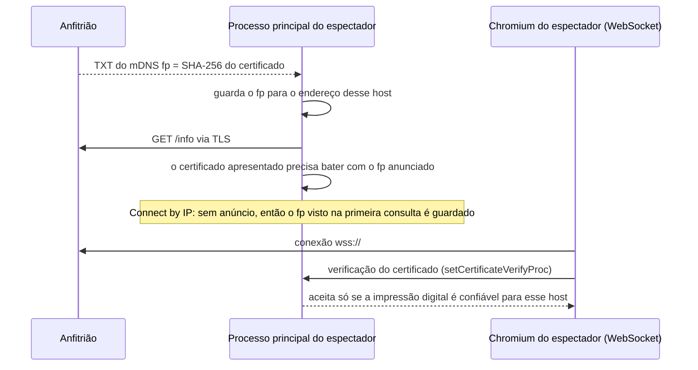

# Segurança

Contra o que o ScreenShare protege, como, e onde estão os limites. Se você for mexer em algo que envolva autenticação, o servidor, IPC ou as configurações do Electron, leia esta página antes.

> **Idioma:** [English](../en-US/security.md) · Português (Brasil)

## Modelo de ameaças

O ScreenShare roda numa rede local ou VPN em que as pessoas confiam, em geral, como um escritório, uma casa ou a VPN de uma equipe. Mesmo assim, ele considera que:

- alguém na rede pode tentar **entrar numa sala privada** sem o PIN, ou adivinhá-lo;
- alguém pode tentar **se passar pelo anfitrião** ou por outro participante;
- alguém pode estar **escutando** a rede;
- um participante pode enviar **dados malformados ou grandes demais**, ou tentar usar o servidor para alcançar quem não devia;
- um espectador pode tentar **gravar** o que assiste.

Ele **não** tenta proteger contra um anfitrião malicioso (o anfitrião roda o servidor e vê toda a sinalização e o chat), nem contra alguém que controle o computador de um participante.

## Controles num relance

| Risco | Controle | Onde |
|---|---|---|
| Entrar numa sala privada sem o PIN | PIN de 4–6 dígitos gerado por um CSPRNG e comparado em tempo constante | `src/utils/crypto.ts`, `RoomServer.handleHello` |
| Adivinhar o PIN | 3 PINs errados bloqueiam aquele endereço por 5 minutos | `PinGuard` |
| O PIN vazar depois | Fica só em memória, nunca vai para o disco. O anfitrião pode gerar outro ou definir um novo durante a sessão; quem já está dentro continua conectado | `RoomManager`, `RoomServer.update` |
| Se passar pelo anfitrião | O app do próprio anfitrião se identifica com um token aleatório por sala (comparação em tempo constante) | `hostToken` no `hello` |
| Escutar a rede | WebSocket sobre TLS (ligado por padrão); a mídia WebRTC é sempre DTLS-SRTP | `RoomManager.loadCertificate`, WebRTC |
| Sala falsa / homem no meio | Certificado autoassinado **fixado** pela impressão digital SHA-256 (do mDNS ou da primeira consulta) | `setCertificateVerifyProc` em `src/main/index.ts`, `RoomManager.isTrustedCertificate` |
| Abusar do repasse | A sinalização só é repassada dentro de um par transmissor↔espectador existente, e só para a conexão daquela transmissão. Só quem compartilha pode enviar mídia ou prévias | `RoomServer.handleMessage` (`signal`), `relayMedia` |
| Ações do anfitrião feitas por outros | Remover, parar transmissão, apagar mensagem, silenciar chat e encerrar a sala são verificados no servidor | `RoomServer.handleMessage` |
| Voltar depois de ser removido | O client id removido fica banido pelo resto daquela sessão da sala | conjunto `banned` |
| Dados grandes demais ou malformados | Nomes limpos e limitados; limites de tamanho e de taxa no chat; imagens precisam seguir padrões rígidos de data URL e limites de tamanho; tamanhos de exibição e fps verificados; mensagem máxima de 16 MB; 10 s para enviar o hello | `server.ts`, `shared/images.ts` |
| Gravar o que se assiste | Enquanto você assiste qualquer transmissão, a janela fica oculta para captura e capturas de tela (`setContentProtection`). O app não tem gravação nem exportação do chat | `RoomView.tsx`, IPC `setViewerProtection` |

## Fixação de certificado

Cada anfitrião gera um certificado autoassinado EC P-256 e o mantém por dois anos em `host-identity.json`, então a impressão digital continua a mesma entre as salas. Nenhuma autoridade certificadora participa; a confiança vem da impressão digital.

Qualquer certificado que não seja confiável para aquele nome de host exato é recusado, mesmo que o sistema fosse aceitá-lo.

**Concessão:** com **Connect by IP**, a primeira consulta é do tipo *confiar no primeiro uso*. Quem conseguisse interceptar exatamente essa primeira conexão poderia apresentar o próprio certificado. As salas encontradas por mDNS não têm essa brecha, porque a impressão digital chega no anúncio.

## Endurecimento do Electron

Definido em `src/main/index.ts`:

- `contextIsolation: true`, `sandbox: true`, `nodeIntegration: false`. O renderer só vê o `window.api` tipado do script de preload.
- `window.open` é negado e a navegação para fora da página do app é bloqueada.
- Permissões: só `media`, `display-capture`, `notifications`, `fullscreen` e `clipboard-sanitized-write` são concedidas.
- Os handlers de IPC convertem seus argumentos (`String(...)`, `Number(...)`, booleanos) e nunca executam código arbitrário.
- O auxiliar de áudio do Windows só recebe argumentos fixos (os nomes dos processos do Discord e um PID numérico).

## Limitações conhecidas

Seja transparente sobre isso em revisões e issues:

- **Os client ids são informados pelo próprio cliente.** O banimento é pelo client id, então alguém determinado pode voltar trocando o id (por exemplo, com um novo `--profile`). O PIN continua valendo nas salas privadas. Trocar o PIN depois de remover alguém impede a volta.
- **O bloqueio de PIN é por endereço IP.** Várias máquinas atrás de um mesmo endereço dividem o contador, e um atacante com muitos endereços tem 3 tentativas por endereço.
- **O anfitrião é confiável.** Ele repassa a sinalização e o chat, então poderia lê-los ou alterá-los. No caminho WebRTC a mídia vai direto entre quem transmite e quem assiste, cifrada, mas é o anfitrião que repassa a sinalização que configura essa cifragem, então um anfitrião malicioso poderia interferir. No fallback TCP, a mídia passa pelo anfitrião, que consegue lê-la (o WebSocket com TLS só a protege na rede).
- **O TLS pode ser desligado** nas configurações (para depuração). Nesse caso, chat, sinalização e mídia TCP trafegam sem cifragem na rede.
- **A proteção de conteúdo é a melhor possível, não absoluta.** Ela impede capturas e gravadores de tela no computador do espectador, não a câmera de um celular.
- **Fotos de perfil e prévias são imagens de outras pessoas.** Elas só são exibidas como `` com data URLs do tipo JPEG/WebP/PNG, nunca como HTML ou SVG.

## Checklist para mudanças

- Valide cada campo novo de mensagem no **servidor**: tipo, faixa, tamanho, e se quem enviou pode enviá-lo.
- Nunca repasse dados entre participantes que não têm motivo para se falar (a regra transmissor↔espectador).
- Nunca grave o PIN ou tokens em disco. Compare segredos com `pinsEqual` (tempo constante).
- IPC novo: converta os argumentos no handler e adicione o método em `ScreenShareApi` (`src/shared/ipc.ts`) em vez de expor o `ipcRenderer`.
- Imagens novas vindas da rede: valide com um padrão rígido e um limite de tamanho, como em `src/shared/images.ts`.
- Teste também o caminho de recusa, não só o caminho feliz.

## Relatando um problema

Abra uma issue descrevendo o problema e como reproduzi-lo. Se ele puder deixar alguém entrar numa sala privada ou executar código em outra máquina, evite publicar um exploit funcional; descreva o impacto e fale com os mantenedores primeiro.
