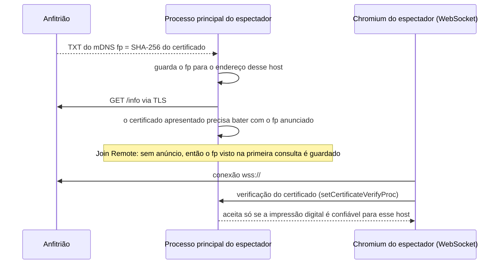

# Segurança

Contra o que o ScreenShare protege, como, e onde estão os limites. Se você for mexer em algo que envolva autenticação, o servidor, IPC ou as configurações do Electron, leia esta página antes.

> **Idioma:** [English](../en-US/security.md) · Português (Brasil)

## Modelo de ameaças

O ScreenShare roda numa rede local ou VPN em que as pessoas confiam, em geral, como um escritório, uma casa ou a VPN de uma equipe. Mesmo assim, ele considera que:

- alguém na rede pode tentar **entrar numa sala privada** sem o PIN, ou adivinhá-lo;
- alguém pode tentar **se passar pelo anfitrião** ou por outro participante;
- alguém pode estar **escutando** a rede;
- um participante pode enviar **dados malformados ou grandes demais**, ou tentar usar o servidor para alcançar quem não devia;
- um espectador pode tentar **gravar** o que assiste.

Ele **não** tenta proteger contra um anfitrião malicioso (o anfitrião roda o servidor e vê toda a sinalização e o chat), nem contra alguém que controle o computador de um participante.

## Controles num relance

| Risco | Controle | Onde |
|---|---|---|
| Entrar numa sala privada sem o PIN | PIN de 4–6 dígitos gerado por um CSPRNG e comparado em tempo constante | `src/utils/crypto.ts`, `RoomServer.handleHello` |
| Adivinhar o PIN | 3 PINs errados bloqueiam aquele endereço por 5 minutos | `PinGuard` |
| O PIN vazar depois | Fica só em memória, nunca vai para o disco. O anfitrião pode gerar outro ou definir um novo durante a sessão; quem já está dentro continua conectado | `RoomManager`, `RoomServer.update` |
| Se passar pelo anfitrião | O app do próprio anfitrião se identifica com um token aleatório por sala (comparação em tempo constante) | `hostToken` no `hello` |
| Escutar a rede | WebSocket sobre TLS (ligado por padrão); a mídia WebRTC é sempre DTLS-SRTP | `RoomManager.loadCertificate`, WebRTC |
| Sala falsa / homem no meio | Certificado autoassinado **fixado** pela impressão digital SHA-256 (do mDNS ou da primeira consulta) | `setCertificateVerifyProc` em `src/main/index.ts`, `RoomManager.isTrustedCertificate` |
| Abusar do repasse | A sinalização só é repassada dentro de um par transmissor↔espectador existente, e só para a conexão daquela transmissão. Só quem compartilha pode enviar mídia ou prévias | `RoomServer.handleMessage` (`signal`), `relayMedia` |
| Ações do anfitrião feitas por outros | Remover, parar transmissão, apagar mensagem, silenciar chat e encerrar a sala são verificados no servidor | `RoomServer.handleMessage` |
| Voltar depois de ser removido | O client id removido fica banido pelo resto daquela sessão da sala | conjunto `banned` |
| Dados grandes demais ou malformados | Nomes limpos e limitados; limites de tamanho e de taxa no chat; imagens precisam seguir padrões rígidos de data URL e limites de tamanho; tamanhos de exibição e fps verificados; mensagem máxima de 16 MB; 10 s para enviar o hello | `server.ts`, `shared/images.ts` |
| Entrar numa sala com VPN sem convite | O convite guarda um segredo aleatório (24 bytes), comparado em tempo constante; 3 segredos errados bloqueiam o endereço por 5 minutos; a inscrição vai por TLS fixado na impressão digital do convite, então o segredo só chega ao anfitrião que o criou | `VpnHost.enrollNow`, `postJson` |
| Abusar do passo de administrador | Só o auxiliar que vem no app roda com direitos de administrador, depois de conferir os arquivos dele com somas de verificação da compilação; as entradas são validadas com rigor e ele não carrega segredo | `native/ssvpn/`, `src/main/vpn/helper.ts`, `elevate.ts` |
| Vazar uma chave da VPN | As chaves WireGuard são criadas em memória e enviadas ao auxiliar de VPN pelo socket de controle (em hexadecimal, nunca em argumentos, arquivo ou log); a chave do anfitrião e o segredo existem só enquanto a sala está aberta | `src/utils/wireguard.ts`, `SystemTunnel` |
| Um convidado tomar o endereço ou a chave de outro | Um endereço por id de cliente, uma chave não pode ser reutilizada por outro cliente, a chave do próprio anfitrião é recusada; o túnel do anfitrião só aceita pacotes de um convidado vindos do endereço que ele recebeu (`AllowedIPs` = `/32`) | `VpnHost` |
| Gravar o que se assiste | Enquanto você assiste qualquer transmissão, a janela fica oculta para captura e capturas de tela (`setContentProtection`). O app não tem gravação nem exportação do chat | `RoomView.tsx`, IPC `setViewerProtection` |

## Fixação de certificado

Cada anfitrião gera um certificado autoassinado EC P-256 e o mantém por dois anos em `host-identity.json`, então a impressão digital continua a mesma entre as salas. Nenhuma autoridade certificadora participa; a confiança vem da impressão digital.

```mermaid
sequenceDiagram
  participant H as Anfitrião
  participant V as Processo principal do espectador
  participant C as Chromium do espectador (WebSocket)
  H-->>V: TXT do mDNS fp = SHA-256 do certificado
  V->>V: guarda o fp para o endereço desse host
  V->>H: GET /info via TLS
  V->>V: o certificado apresentado precisa bater com o fp anunciado
  Note over V: Join Remote: sem anúncio, então o fp visto na primeira consulta é guardado
  C->>H: conexão wss://
  C->>V: verificação do certificado (setCertificateVerifyProc)
  V-->>C: aceita só se a impressão digital é confiável para esse host
```

Qualquer certificado que não seja confiável para aquele nome de host exato é recusado, mesmo que o sistema fosse aceitá-lo.

**Concessão:** com **Join Remote**, a primeira consulta é do tipo *confiar no primeiro uso*. Quem conseguisse interceptar exatamente essa primeira conexão poderia apresentar o próprio certificado. As salas encontradas por mDNS não têm essa brecha, porque a impressão digital chega no anúncio.

## Endurecimento do Electron

Definido em `src/main/index.ts`:

- `contextIsolation: true`, `sandbox: true`, `nodeIntegration: false`. O renderer só vê o `window.api` tipado do script de preload.
- `window.open` é negado e a navegação para fora da página do app é bloqueada.
- Permissões: só `media`, `display-capture`, `notifications`, `fullscreen` e `clipboard-sanitized-write` são concedidas.
- Os handlers de IPC convertem seus argumentos (`String(...)`, `Number(...)`, booleanos) e nunca executam código arbitrário.
- O auxiliar de áudio do Windows só recebe argumentos fixos (os nomes dos processos do Discord e um PID numérico).

## Limitações conhecidas

Seja transparente sobre isso em revisões e issues:

- **Os client ids são informados pelo próprio cliente.** O banimento é pelo client id, então alguém determinado pode voltar trocando o id (por exemplo, com um novo `--profile`). O PIN continua valendo nas salas privadas. Trocar o PIN depois de remover alguém impede a volta.
- **O bloqueio de PIN é por endereço IP.** Várias máquinas atrás de um mesmo endereço dividem o contador, e um atacante com muitos endereços tem 3 tentativas por endereço.
- **O anfitrião é confiável.** Ele repassa a sinalização e o chat, então poderia lê-los ou alterá-los. No caminho WebRTC a mídia vai direto entre quem transmite e quem assiste, cifrada, mas é o anfitrião que repassa a sinalização que configura essa cifragem, então um anfitrião malicioso poderia interferir. No fallback TCP, a mídia passa pelo anfitrião, que consegue lê-la (o WebSocket com TLS só a protege na rede).
- **O acesso remoto consulta um serviço externo e pode abrir uma porta no seu roteador.** Ligá-lo envia uma requisição ao `api.ipify.org` (ele fica sabendo seu endereço, nada mais; se falhar, usa-se o do roteador). Com UPnP, a porta da sala é aberta para a internet enquanto a sala durar, com validade de uma hora que é renovada e apagada no fim. Só a porta da sala fica exposta, e entrar ainda exige o segredo do convite (3 erros bloqueiam um endereço por 5 minutos) e, nas salas privadas, o PIN. A resposta do roteador só é aceita do aparelho que respondeu na sua própria rede, então um estranho não consegue apontar o app para outro servidor.
- **O convite da VPN é um segredo ao portador.** Quem o tiver entra na VPN até a sala acabar; envie-o só a quem você convida. O PIN da sala continua valendo nas salas privadas. O convite é mostrado ao anfitrião e copiado à mão; nunca é salvo.
- **Numa sala com VPN, o anfitrião vê e repassa tudo entre os convidados.** Os pacotes entre dois convidados passam pelo computador do anfitrião; a mídia WebRTC continua cifrada (DTLS-SRTP) de ponta a ponta, mas o anfitrião vê quem fala com quem e poderia descartar ou atrasar o tráfego.
- **No macOS o repasse não é isolado.** Para repassar entre convidados, o anfitrião liga o encaminhamento de IP enquanto a sala está aberta (e o devolve ao estado anterior). No Linux uma regra do `iptables` limita isso ao tráfego entre pontos da VPN; no macOS nada limita, então um convidado poderia enviar pacotes (de mão única: sem NAT, não há respostas) para as outras redes do anfitrião. Não abra uma sala com VPN num computador em uma rede da qual você quer manter os convidados longe sem um firewall no meio.
- **O socket de controle pertence ao seu usuário.** Depois do passo de administrador, qualquer programa rodando como você pode reconfigurar os pares desse túnel, como faria com qualquer outra coisa sua. O passo de administrador em si não pode ser conduzido assim: roda uma vez, a partir de um script fixo.
- **O auxiliar de VPN roda com direitos de administrador.** É um programa pequeno que nós compilamos (o código Go do WireGuard mais alguns comandos do sistema) e que o app inicia depois do pedido de permissão do sistema. O app confere os arquivos dele com somas de verificação feitas na compilação logo antes de pedir, e o instalador os coloca onde só administradores escrevem (por isso a instalação para todos os usuários no Windows), então outro programa rodando como você não consegue trocá-lo por outra coisa. Uma versão de desenvolvimento (rodando do código) pula a conferência, pois você acabou de compilar o auxiliar. As entradas dele são validadas com rigor (um endereço IPv4, números, caminhos absolutos, um id ou SID de dono), e ele publica o status com um rename, nunca escrevendo por um caminho que você poderia ter transformado em link.
- **O Windows não foi verificado.** O lado Windows (Wintun, `netsh`, o named pipe restrito ao seu SID) foi escrito e compilado, mas ainda não rodou numa máquina de verdade.
- **O TLS pode ser desligado** nas configurações (para depuração). Nesse caso, chat, sinalização e mídia TCP trafegam sem cifragem na rede.
- **A proteção de conteúdo é a melhor possível, não absoluta.** Ela impede capturas e gravadores de tela no computador do espectador, não a câmera de um celular.
- **Fotos de perfil e prévias são imagens de outras pessoas.** Elas só são exibidas como `` com data URLs do tipo JPEG/WebP/PNG, nunca como HTML ou SVG.

## Checklist para mudanças

- Valide cada campo novo de mensagem no **servidor**: tipo, faixa, tamanho, e se quem enviou pode enviá-lo.
- Nunca repasse dados entre participantes que não têm motivo para se falar (a regra transmissor↔espectador).
- Nunca grave o PIN ou tokens em disco. Compare segredos com `pinsEqual` (tempo constante).
- IPC novo: converta os argumentos no handler e adicione o método em `ScreenShareApi` (`src/shared/ipc.ts`) em vez de expor o `ipcRenderer`.
- Imagens novas vindas da rede: valide com um padrão rígido e um limite de tamanho, como em `src/shared/images.ts`.
- Teste também o caminho de recusa, não só o caminho feliz.

## Relatando um problema

Abra uma issue descrevendo o problema e como reproduzi-lo. Se ele puder deixar alguém entrar numa sala privada ou executar código em outra máquina, evite publicar um exploit funcional; descreva o impacto e fale com os mantenedores primeiro.
