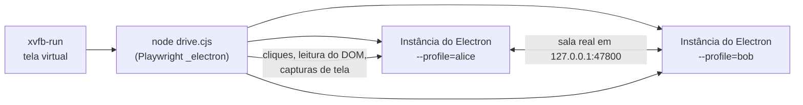

# Testes

Como o projeto é testado hoje, como adicionar testes e como conferir uma mudança no app de verdade, mesmo num computador sem tela.

> **Idioma:** [English](../en-US/testing.md) · Português (Brasil)

## Conteúdo

- [Comandos rápidos](#comandos-rápidos)
- [O que os testes automáticos cobrem](#o-que-os-testes-automáticos-cobrem)
- [Escrevendo um teste de servidor](#escrevendo-um-teste-de-servidor)
- [Testando lógica pura](#testando-lógica-pura)
- [Controlando o app de verdade](#controlando-o-app-de-verdade)
- [Conferindo o auxiliar de áudio do Windows](#conferindo-o-auxiliar-de-áudio-do-windows)
- [Checklist manual antes de uma versão](#checklist-manual-antes-de-uma-versão)

## Comandos rápidos

```bash
npm run typecheck   # os dois projetos TypeScript (lado Node com os testes, lado web)
npm test            # todos os testes uma vez
npm run test:watch  # roda de novo a cada mudança
npx vitest run tests/quality.test.ts   # um arquivo só
```

Os testes rodam no Node (`vitest.config.ts`, ambiente `node`, tempo limite de 15 s). Eles iniciam instâncias reais de `RoomServer` em portas aleatórias e conversam com elas por WebSockets de verdade.

## O que os testes automáticos cobrem

| Arquivo | Cobre |
|---|---|
| `tests/server.test.ts` | `/info` público, entrada e chat, PIN obrigatório e bloqueio depois de 3 tentativas, troca de PIN, token de anfitrião falso, remoção e banimento, silêncio e exclusão no chat, retomada de assento sem PIN, capacidade, fim da sala. |
| `tests/streams.test.ts` | Várias transmissões: qualquer um pode compartilhar, slots distintos, regras para assistir, sinalização só dentro de pares transmissor↔espectador, várias transmissões ao mesmo tempo, roteamento de estatísticas e de pedidos de quadro-chave, repasse e validação do view-size, fim de transmissões (parar, desconectar, anfitrião parar, remoção), repasse TCP marcado pelo slot com bloqueio até o quadro-chave e estatísticas do repasse, prévias (validação, quem entra depois, limpeza), fotos de perfil (envio a todos, quem entra depois, dados inválidos, limite de taxa, remoção). |
| `tests/quality.test.ts` | Escada de qualidade, controlador adaptativo (descer/subir, espera crescente), degraus de altura de exibição, limites por espectador, divisão de banda, escolhas de qualidade do espectador, limite combinado do TCP. |
| `tests/network.test.ts` | Leitura e ordenação de endereços, URLs com IPv6, consulta TLS com impressão digital, ordem de codecs, ajustes de Opus e bitrate no SDP. |
| `tests/crypto.test.ts` | Geração e validação de PIN, comparação em tempo constante, bloqueio e reinício do `PinGuard`. |
| `tests/crop.test.ts` | Recorte da foto de perfil: centralização, limites, zoom em torno de um ponto, limites de zoom. |

O que **não** é coberto por testes automáticos: tudo que precisa de um navegador de verdade (WebRTC, WebCodecs, captura, a interface React) e o auxiliar de áudio do Windows. Para isso, use as técnicas abaixo.

## Escrevendo um teste de servidor

O `tests/helpers.ts` oferece o `TestClient`: ele conecta, envia o `hello` por você, guarda todas as mensagens e permite esperar (`wait()`) por uma específica.

```ts
import { afterEach, describe, expect, it } from 'vitest'
import { RoomServer } from '../src/main/server'
import { TestClient } from './helpers'

let server: RoomServer | null = null
afterEach(async () => {
  await server?.stop()
  server = null
})

describe('meu recurso', () => {
  it('repassa a mensagem para todos', async () => {
    server = new RoomServer({
      roomId: 'room1', name: 'Test', hostName: 'Host', privacy: 'public',
      pin: null, hostToken: 'secret', port: 0, bindAddress: '127.0.0.1'
    })
    const port = await server.start()

    const host = await TestClient.connect(port, { hostToken: 'secret', name: 'Host' })
    const alice = await TestClient.connect(port, { name: 'Alice', clientId: 'alice' })
    const { selfId } = await alice.wait('welcome')

    alice.send({ type: 'chat', text: 'oi' })
    const msg = await host.wait('chat', (m) => m.message.userId === selfId)
    expect(msg.message.text).toBe('oi')
  })
})
```

O `tests/streams.test.ts` já tem os auxiliares `startServer()`, `join()` e `share()` prontos. Siga esse estilo. Teste sempre também o caminho de **recusa** (dados ruins, remetente errado, limites de taxa).

## Testando lógica pura

Mantenha a lógica de decisão fora do React e fora dos callbacks do WebRTC, em `src/shared/*.ts`, sem importar DOM nem Node. Assim testar fica trivial. Exemplos: `AdaptiveController`, `splitBudget`, `limitPreset`, `chooseCodecOrder`, `zoomAt` (recorte). A configuração TypeScript do lado Node (`tsconfig.node.json`) não tem os tipos do DOM, então um teste não pode importar um módulo que use APIs do DOM.

## Controlando o app de verdade

Para mudanças de interface, WebRTC e mídia, rode o app Electron de verdade e controle-o com o suporte a Electron do Playwright. Isso funciona num Linux sem tela usando o **Xvfb**, e foi assim que as mudanças foram verificadas durante o desenvolvimento.



### Preparação

```bash
npm install
npx electron-vite build            # o script usa o build de produção em out/
# o Playwright (global ou local) e o Xvfb precisam estar instalados
```

### Exemplo

```js
// drive.cjs: cria uma sala com uma tela falsa e confere se o cartão "You" aparece.
const { _electron: electron } = require('playwright')
const repo = process.cwd()

async function launch(profile) {
  const app = await electron.launch({
    executablePath: require('electron'),          // caminho do executável do Electron
    args: [repo, `--profile=${profile}`, '--no-sandbox'],
    cwd: repo
  })
  // Troca a lista de fontes de captura por uma fonte falsa (a lista do Xvfb pode falhar).
  await app.evaluate(({ ipcMain }) => {
    ipcMain.removeHandler('capture:list')
    ipcMain.handle('capture:list', () => [
      { id: 'screen:fake:0', name: 'Fake screen', kind: 'screen', thumbnail: '', displayId: '0' }
    ])
  })
  const win = await app.firstWindow()
  // Captura um canvas animado em vez da tela de verdade.
  await win.evaluate(() => {
    navigator.mediaDevices.getDisplayMedia = async () => {
      const c = document.createElement('canvas')
      c.width = 1920
      c.height = 1080
      const g = c.getContext('2d')
      let n = 0
      setInterval(() => {
        g.fillStyle = '#357'
        g.fillRect(0, 0, c.width, c.height)
        g.fillStyle = '#fff'
        g.font = '96px sans-serif'
        g.fillText('frame ' + n++, 80, 540)
      }, 16)
      return c.captureStream(60)
    }
  })
  return { app, win }
}

;(async () => {
  const { app, win } = await launch('alice')
  await win.getByRole('button', { name: /Create room/ }).first().click()
  await win.locator('.source').first().click()
  await win.getByRole('button', { name: /Start sharing/ }).click()
  await win.waitForSelector('.room')
  console.log(await win.locator('.stream-card').allInnerTexts()) // espera o cartão "You"
  await win.screenshot({ path: 'room.png' })
  await app.close()
})()
```

Salve como `drive.cjs` na raiz do repositório e rode:

```bash
xvfb-run -a -s "-screen 0 1600x1000x24" node drive.cjs
# com o Playwright instalado globalmente:
NODE_PATH=$(npm root -g) xvfb-run -a -s "-screen 0 1600x1000x24" node drive.cjs
```

Dicas:

- **Duas pessoas**: abra uma segunda instância com outro `--profile`, clique em **Connect by IP**, digite `127.0.0.1:47800`, aperte Enter, espere um instante pela consulta e clique em **Join**.
- **Captura de tela real** no Xvfb precisa das extensões `Composite` e `DAMAGE` (`-s "-screen 0 1600x1000x24 +extension Composite +extension DAMAGE"`) e ainda pode falhar às vezes; o canvas falso acima é mais confiável.
- **Leia o que o usuário veria**: selos de estatística (`.tile .stat-badge`), estilos calculados (`getComputedStyle(...).opacity`) ou pixels de uma imagem (desenhe-a num canvas e leia com `getImageData`).
- **Finja ser outro sistema** para interfaces exclusivas de uma plataforma: substitua o handler de IPC `system:app-info` para devolver `platform: 'win32'`.
- **Logs** de cada perfil ficam na pasta de dados dele (por exemplo `~/.config/ScreenShare-alice/logs/` no Linux).
- Apague as pastas dos perfis de teste depois, se quiser começar do zero.

## Conferindo o auxiliar de áudio do Windows

No Windows, o `npm run dev` recompila e usa o auxiliar. Para testá-lo manualmente:

```bat
native\bin\win-audio-capture.exe > out.raw
native\bin\win-audio-capture.exe --exclude Discord.exe --fallback-pid 0 > out.raw
```

Os primeiros 10 bytes são o cabeçalho `SSA1`. As mensagens sobre o dispositivo e o processo excluído vão para o stderr. Feche o stdin (Ctrl+Z, Enter) para parar.

Em outros sistemas, confira se ele ainda compila como C# 5 com o Mono (`mcs -langversion:5`); veja [desenvolvimento](development.md#trabalhando-no-auxiliar-de-áudio-sem-windows).

## Checklist manual antes de uma versão

Faça isto em máquinas reais (de preferência um Windows e um macOS) numa rede real:

- [ ] Uma sala aparece sozinha em outro computador (mDNS), e o **Connect by IP** funciona.
- [ ] Sala privada: PIN errado mostra as tentativas restantes, 3 PINs errados bloqueiam por 5 minutos, o PIN certo funciona.
- [ ] Compartilhar uma tela e uma janela, com e sem áudio do sistema.
- [ ] Windows: numa chamada do Discord com **Leave out Discord** ligado, os outros não ouvem a própria voz.
- [ ] Windows com headset 5.1/7.1: o áudio do sistema continua funcionando.
- [ ] Duas pessoas compartilham ao mesmo tempo; uma terceira assiste as duas; grade, destaque, **Watch all**.
- [ ] A sua transmissão fica escondida até o **Show**.
- [ ] O seletor de qualidade de quem transmite e o menu de qualidade de cada quadro mudam o que é recebido (veja os selos de estatística).
- [ ] Tela cheia: controles e ponteiro somem depois de 2,5 s e voltam ao mexer o mouse.
- [ ] Bloqueie o UDP (ou ligue **Always use TCP transport**): a transmissão continua pelo TCP.
- [ ] Desconecte a rede por alguns segundos: todos reconectam e as transmissões voltam.
- [ ] Foto de perfil: escolher, recortar, trocar, remover; todos veem.
- [ ] Anfitrião: trocar privacidade, novo PIN, remover alguém, parar uma transmissão, silenciar o chat, apagar uma mensagem, encerrar a sala.
- [ ] Fechar o app enquanto hospeda pede confirmação.
- [ ] Enquanto assiste, capturas de tela da janela do ScreenShare saem pretas.
