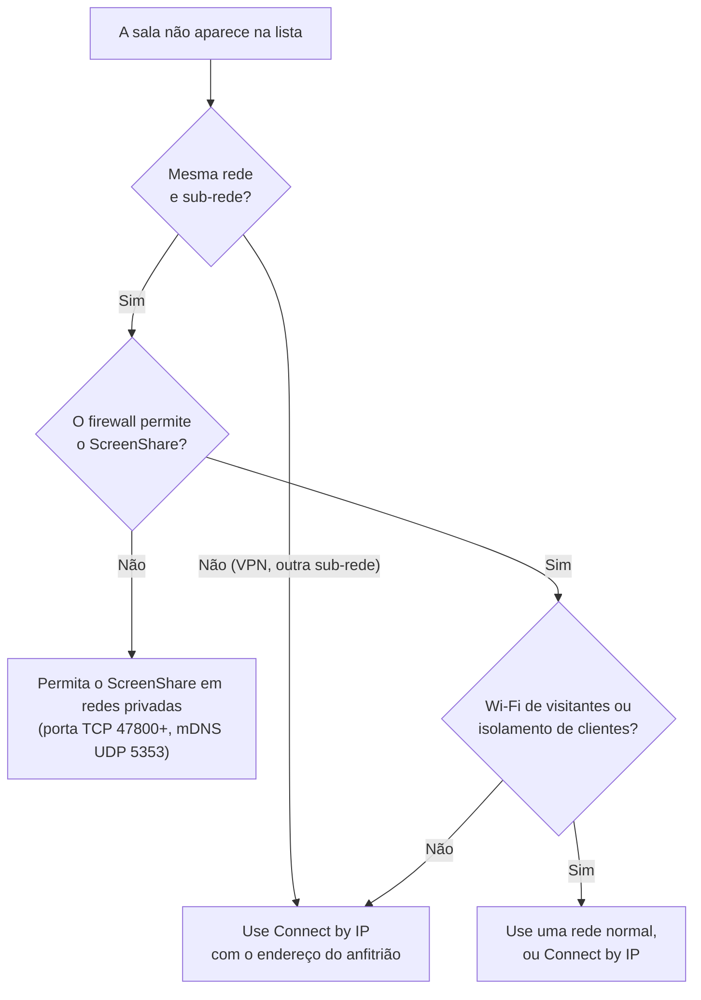

# Solução de problemas

Problemas comuns e como resolvê-los. Se o seu não estiver aqui, abra **Settings → Open logs** e veja o `screenshare.log`; as linhas perto do problema geralmente dizem o que deu errado.

> **Idioma:** [English](../en-US/troubleshooting.md) · Português (Brasil)

## Conteúdo

- [A sala não aparece](#a-sala-não-aparece)
- [Não consigo entrar](#não-consigo-entrar)
- [O vídeo não começa ou fica preto](#o-vídeo-não-começa-ou-fica-preto)
- [A qualidade está baixa](#a-qualidade-está-baixa)
- [Problemas de áudio](#problemas-de-áudio)
- [CPU alta ou notebook esquentando](#cpu-alta-ou-notebook-esquentando)
- [Permissões do macOS](#permissões-do-macos)
- [Reunindo informações para relatar um bug](#reunindo-informações-para-relatar-um-bug)

## A sala não aparece

- A descoberta usa **multicast (mDNS)**, que muitas VPNs, redes Wi-Fi de visitantes e alguns roteadores bloqueiam. O **Connect by IP** sempre funciona se o anfitrião estiver alcançável: ele vê os próprios endereços no painel **Access**.
- A porta padrão é **47800**. Se ela estava ocupada, o anfitrião escolheu a próxima livre; o painel Access mostra a correta.
- **Firewall do Windows**: na primeira vez que você hospeda, o Windows pergunta se deve permitir o ScreenShare. Permita em redes **privadas**. Se você clicou em Cancelar, permita depois em *Segurança do Windows → Firewall → Permitir um aplicativo*.
- Uma sala que para de responder por 10 segundos sai da lista. Ela volta assim que responder de novo.

## Não consigo entrar

| Mensagem | O que significa | O que fazer |
|---|---|---|
| *This room runs a different app version* | Você e o anfitrião usam versões incompatíveis | Todos atualizam para a mesma versão. |
| *Wrong PIN* (tentativas restantes) | O PIN não confere | Pergunte de novo ao anfitrião: o PIN pode mudar durante a sessão. |
| *Too many wrong PINs. Try again later.* | 3 PINs errados vindos do seu computador | Espere 5 minutos. |
| *Room is full* | Já há 10 pessoas dentro | Espere alguém sair. |
| *You were removed from this room* | O anfitrião removeu você | Só o anfitrião pode ajudar; uma nova sessão da sala limpa isso. |
| A sala fica cinza / *Unreachable* | O app não consegue alcançar o anfitrião | Confira a rede e o firewall, ou se o anfitrião ainda está com o app aberto. |
| Erro de certificado no log (`rejected certificate`) | O certificado do anfitrião não bate com o que o seu app viu antes | Reinicie o ScreenShare do seu lado para ele reconhecer o anfitrião de novo. Se o anfitrião apagou o `host-identity.json`, isso é esperado. |

## O vídeo não começa ou fica preto

- **"Connecting…" por alguns segundos e depois toca**: normal quando a sua rede bloqueia o WebRTC (UDP). Depois de 8 segundos o app passa sozinho para a conexão TCP. O botão ↻ no quadro tenta a conexão mais rápida de novo.
- **Nunca conecta**: confira se os dois computadores permitem o ScreenShare no firewall. Como último recurso, ligue **Settings → Network → Always use TCP transport** no espectador.
- **Quem transmite vê a própria transmissão normal, mas você vê preto**: a pessoa pode ter pausado (o quadro avisa) ou compartilhado uma janela minimizada. Peça para ela usar **Change source**.
- **Você não vê a sua própria transmissão**: é de propósito. Clique em **Show** no seu cartão **You**.
- **Capturas de tela do app saem pretas enquanto você assiste**: também é de propósito; gravar transmissões é bloqueado.

## A qualidade está baixa

1. Olhe os **selos de estatística** do quadro: resolução, fps e tipo de conexão.
2. Confira o **menu de qualidade** do quadro: deve estar em **Auto** (ou na qualidade que você quer).
3. **O Auto acompanha o tamanho do quadro**: um quadro pequeno recebe uma transmissão pequena. Coloque a transmissão em destaque, vá para tela cheia ou dê zoom e a qualidade sobe em menos de um segundo.
4. Peça para quem transmite conferir o **seletor de qualidade** na barra e **Settings → Upload limit when sharing** (os 100 Mbps padrão são divididos entre todos que assistem; no Wi-Fi, 30–60 Mbps é mais realista).
5. O **Stats → Limited by** de quem transmite diz o motivo: *bandwidth* (rede), *cpu* (computador ocupado demais) ou *none*.
6. Na conexão **TCP** o atraso é um pouco maior e uma única codificação é dividida entre todos os espectadores TCP.

## Problemas de áudio

| Problema | Solução |
|---|---|
| Nenhum áudio | Quem transmite precisa ligar **Share system audio** (pelo **Change source** durante a transmissão). O botão de mudo mostra **No audio** quando nada está sendo capturado. |
| Sem áudio com headset 5.1/7.1 no Windows | O app passa automaticamente para o próprio auxiliar de áudio. Se ainda falhar, deixe o dispositivo em estéreo: *Configurações de som → dispositivo → Propriedades → Avançado → 2 canais*, e depois **Change source**. |
| Quem está na minha chamada do Discord ouve a própria voz | Ligue **Leave out Discord** ao compartilhar (Windows, ligado por padrão). Se aparecer um aviso dizendo que não foi possível, seu Windows é anterior ao 10 versão 2004: use **Mute audio** ou silencie a saída do Discord. |
| Outras transmissões fazem eco na minha | Seu computador toca as transmissões que você assiste, e compartilhar o áudio do sistema captura isso também. Com **Leave out Discord** ligado e o Discord fechado, o app deixa a si mesmo de fora e isso não acontece; senão (só um app pode ficar de fora), abaixe o volume das transmissões que você assiste ou silencie o seu áudio compartilhado. |
| Sem áudio no macOS | Precisa do macOS 13+ e da permissão de Gravação de Tela. Ainda não foi testado no macOS. |
| O espectador não ouve nada, mas quem transmite tem áudio | Confira o volume do quadro (cada transmissão tem seu próprio volume e mudo). |

## CPU alta ou notebook esquentando

- Abra **Settings → Streaming quality**: a tabela de codecs mostra **Hardware** ou **Software** para cada codec. Codificar em software gasta muito mais CPU. O **Automatic** já prefere H.264 em hardware.
- Diminua a **qualidade máxima** na barra (por exemplo 720p @ 30 fps).
- Feche os quadros que você não está assistindo; cada transmissão assistida custa decodificação.
- Deixe a sua própria transmissão escondida (não clique em **Show**) enquanto compartilha.

## Permissões do macOS

- **Gravação de Tela**: *Ajustes do Sistema → Privacidade e Segurança → Gravação de Tela* → ative o ScreenShare e reinicie o app. O seletor de fonte mostra um botão que abre essa página quando falta a permissão.
- **Rede Local**: permita quando o sistema perguntar, senão as salas não são encontradas.

## Reunindo informações para relatar um bug

Inclua, por favor:

1. A versão do app (rodapé das configurações) e o sistema operacional de cada computador envolvido.
2. O que você fez, o que esperava e o que aconteceu.
3. O trecho relevante do `screenshare.log` de cada computador (**Settings → Open logs**). Tire antes qualquer informação privada.
4. Para problemas de qualidade: uma captura dos selos de estatística do quadro e do painel **Stats** de quem transmite.
