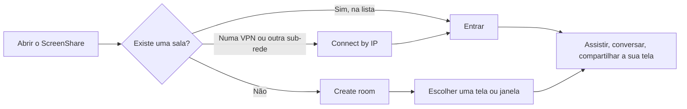

# Guia do usuário

Tudo o que dá para fazer no ScreenShare, de encontrar uma sala a ajustar a qualidade. Não precisa de conhecimento técnico.

> **Idioma:** [English](../en-US/user-guide.md) · Português (Brasil)

O app está em inglês, então os nomes dos botões aparecem aqui **como estão no app**.

## Conteúdo

- [Antes de começar](#antes-de-começar)
- [Seu nome e sua foto](#seu-nome-e-sua-foto)
- [Encontrar uma sala](#encontrar-uma-sala)
- [Criar uma sala](#criar-uma-sala)
- [Compartilhar sua tela](#compartilhar-sua-tela)
- [Assistir outras pessoas](#assistir-outras-pessoas)
- [Chat e pessoas](#chat-e-pessoas)
- [Se você é o anfitrião](#se-você-é-o-anfitrião)
- [Configurações](#configurações)
- [Mouse e teclado](#mouse-e-teclado)
- [Privacidade](#privacidade)
- [Onde ficam seus arquivos](#onde-ficam-seus-arquivos)

## Antes de começar

- **Computadores**: Windows 10/11 ou macOS. O áudio do sistema no macOS precisa do macOS 13 ou mais novo. Deixar o Discord fora do áudio precisa do Windows 10 versão 2004 ou mais novo.
- **Rede**: todos precisam estar na mesma rede local ou VPN. Nada passa pela internet e não existem contas.
- **Mesma versão**: todos na sala precisam usar a mesma versão do app. Senão aparece "This room runs a different app version".
- **macOS**: na primeira vez que você compartilhar, o macOS pede a permissão de **Gravação de Tela** e pode pedir acesso à **Rede Local**. Permita as duas e reinicie o app se ele pedir.

## Seu nome e sua foto

- Seu **nome** aparece no canto superior direito da tela inicial. Clique nele para mudar. Também dá para mudar em **Settings → Profile**.
- Sua **foto de perfil** fica em **Settings → Profile → Choose…**. Depois de escolher uma imagem, abre uma janela de recorte:
  - arraste a imagem para posicioná-la;
  - use a rodinha do mouse ou o controle deslizante para dar zoom;
  - o círculo mostra o que as outras pessoas vão ver, e uma prévia pequena mostra o resultado.

  Clique em **Use picture** para salvar ou em **Cancel** para manter a anterior. **Remove** volta a mostrar suas iniciais. Quem está na sala vê a mudança na hora.

## Encontrar uma sala

A tela inicial lista as salas da sua rede. Ela se atualiza sozinha (repare no ponto verde **live**).

Cada cartão de sala mostra se ela é **Public** ou **Private** (ícone de cadeado), quantas transmissões estão ao vivo (ou *No one sharing*, ou *Unreachable*), o nome, quem hospeda e há quanto tempo, quantas pessoas estão dentro e o endereço. Use **Search rooms** para filtrar a lista. Salas adicionadas pelo IP têm um botão de lixeira para tirá-las da lista.

**Connect by IP**: se você está numa VPN ou em outra sub-rede, as salas podem não aparecer sozinhas. Clique em **Connect by IP** e digite o endereço do anfitrião, por exemplo `10.8.0.5` ou `192.168.1.20:47800`. O anfitrião vê os endereços dele no painel **Access** da sala. A porta padrão é 47800.

**Salas privadas** pedem um PIN (de 4 a 6 dígitos). Depois de 3 PINs errados, seu computador precisa esperar 5 minutos para tentar de novo.

## Criar uma sala

1. Clique em **Create room**.
2. Dê um nome e escolha **Public** (qualquer pessoa da rede pode entrar) ou **Private** (as pessoas precisam de um PIN, que é gerado para você; escolha 4, 5 ou 6 dígitos).
3. Escolha o que compartilhar: uma **tela** inteira ou uma única **janela**.
4. **Share system audio** envia tudo que está tocando no seu computador. No Windows, **Leave out Discord** (ligado por padrão) deixa a sua chamada do Discord de fora, para quem está na mesma chamada não ouvir a própria voz pela sua transmissão.
5. Clique em **Start sharing**.

Numa sala privada, o PIN é copiado para a área de transferência para você colar para os seus amigos.

Agora é o seu computador que roda a sala. Se você fechar o ScreenShare, o app pergunta antes, porque fechar encerra a sala para todo mundo.

## Compartilhar sua tela

Qualquer pessoa na sala pode compartilhar, não só o anfitrião, e várias pessoas podem compartilhar ao mesmo tempo. Clique em **Share screen** na barra de baixo e escolha uma tela ou janela.

Enquanto você compartilha, a barra oferece:

| Botão | O que faz |
|---|---|
| **Pause / Resume** | Congela a transmissão (e o áudio) sem encerrar. |
| **Mute audio / Unmute audio** | Para de enviar o áudio do sistema enquanto o vídeo continua. Mostra **No audio** se o áudio não está sendo capturado. |
| **Change source** | Troca para outra tela ou janela, ou muda as opções de áudio, sem ninguém precisar reconectar. |
| **Seletor de qualidade** | A qualidade máxima que você envia (Native, 1080p, 720p a 60 ou 30 fps, 480p). Vale na hora. Cada espectador ainda pode receber menos, por exemplo se a janela dele for pequena ou a rede estiver lenta. |
| **Stop sharing** | Encerra a sua transmissão. |
| **Stats** | Resolução, taxa de quadros, upload, tempo de codificação, codec, codificador, CPU, memória e o que está limitando a qualidade. |

**A sua própria transmissão não é exibida para você**, o que poupa a GPU do seu computador. Você vê um cartão **You** com uma prévia que se atualiza a cada poucos segundos. Clique em **Show** para abrir a sua transmissão num quadro, e feche o quadro (×) para escondê-la de novo. Você continua compartilhando nos dois casos.

## Assistir outras pessoas

Nada toca até você escolher. Quem está compartilhando aparece em **cartões** com uma prévia que se atualiza a cada 5 segundos.

- Clique no botão **Watch** de um cartão, ou em **Watch all**.
- As transmissões assistidas aparecem numa **grade**. Clique no botão de foco na barra de um quadro para colocar aquela transmissão em **destaque**, com as outras numa faixa. Clique de novo para voltar à grade.
- As transmissões que você não abriu continuam disponíveis na barra **Also live** no topo.
- Feche um quadro (×) para parar de assistir.

Cada quadro tem:

| Controle | O que faz |
|---|---|
| **Menu de qualidade** (barra do quadro) | **Auto** acompanha o tamanho em que você assiste, então um quadro pequeno gasta pouca banda. Você também pode limitar em 1080p, 720p, ou 720p/480p/360p a 30 fps. Fica guardado por pessoa. |
| **Volume** | Cada transmissão tem seu próprio volume e mudo, guardados por pessoa. |
| **Zoom** | Rodinha do mouse (dá zoom onde está o ponteiro) ou os botões − / +. Arraste para se mover com zoom. Clique duas vezes para dar zoom de 2× ou voltar a caber na tela. |
| **Tela cheia** | Ocupa a tela toda. Os controles e o ponteiro somem depois de 2,5 s sem mexer o mouse e voltam quando você mexe. |
| **Selos de estatística** | Taxa de quadros, latência, resolução, codec e tipo de conexão. Dá para desligar nas configurações. |
| **Tentar de novo (↻)** | Só aparece quando a transmissão caiu para a conexão TCP, mais lenta. Tenta a conexão mais rápida de novo. |

Se uma transmissão não conectar em 8 segundos (algumas VPNs e firewalls bloqueiam), o app passa sozinho para uma conexão TCP. Ela acrescenta um pouco de atraso, mas continua funcionando.

## Chat e pessoas

- O **chat** fica à direita: mensagens com horário e foto, e um seletor de emojis. As mensagens só existem enquanto a sala existir.
- **People** mostra todos na sala e o que estão fazendo: *Sharing · 2 watching*, *Watching Alice, Bob*, *Connected* ou *Reconnecting*. Daqui você também pode assistir alguém (**Watch**) ou parar de assistir.

Se a sua rede cair por um instante, o app reconecta sozinho e te coloca de volta no mesmo lugar sem pedir o PIN de novo, desde que você volte em até 30 segundos. As transmissões que você assistia reconectam automaticamente.

## Se você é o anfitrião

O painel **Access** (no topo da barra lateral) permite:

- alternar entre **Public** e **Private** a qualquer momento; quem já está dentro continua conectado;
- mostrar ou esconder o **PIN**, **copiar**, **gerar um novo** ou **definir o seu**;
- ver os endereços que as pessoas podem usar no **Connect by IP**.

Na lista **People** você pode **parar a transmissão** de alguém ou **remover** alguém da sala (a pessoa não consegue voltar nesta sessão da sala). No chat você pode **apagar mensagens** e **silenciar o chat** (as pessoas continuam vendo o histórico).

**End room** encerra a sala para todos.

## Configurações

Abra as configurações pelo ícone de engrenagem (na tela inicial ou no topo da sala).

| Seção | Configuração | Padrão | Significado |
|---|---|---|---|
| Profile | Profile picture | nenhuma | Aparece no lugar das suas iniciais. |
| Profile | Display name | seu usuário do computador | Até 32 caracteres. |
| Streaming quality | Maximum quality | 1080p @ 60 fps | O máximo que você envia ao compartilhar. Vale na hora. |
| Streaming quality | Adaptive quality | ligado | Reduz resolução/taxa de quadros por espectador quando a rede dele sofre. |
| Streaming quality | Video codec | Automatic | O automático prefere H.264 em hardware. Dá para forçar H.264, H.265, VP9 ou AV1 se os dois lados suportarem. A tabela abaixo mostra o que o seu computador suporta. |
| Streaming quality | Optimize for | Smooth motion | *Smooth motion* mantém 60 fps. *Sharp text* mantém a resolução. |
| Streaming quality | Upload limit when sharing | 100 Mbps | O seu upload total, dividido de forma justa entre quem te assiste. Diminua no Wi-Fi ou na VPN. |
| Network | Encrypt connections (TLS) | ligado | Cifra o chat e a sinalização. O vídeo é sempre cifrado. |
| Network | Always use TCP transport | desligado | Para redes que bloqueiam UDP. Acrescenta um pouco de atraso. |
| Network | Hosting port | 47800 | A primeira porta tentada quando você hospeda. |
| Network | Rejoin last room on startup | desligado | Entra automaticamente na última sala quando o app abre. |
| Behaviour | Chat notifications | ligado | Quando a janela está em segundo plano. |
| Behaviour | Pause sharing while minimized | desligado | Retoma quando você restaura a janela. |
| Behaviour | Show FPS and latency overlay | ligado | Os selos em cada transmissão. |
| Behaviour | Share system audio by default | ligado | Deixa o interruptor de áudio pré-marcado. |
| Behaviour | Leave out Discord by default | ligado | Só no Windows. Deixa o interruptor do Discord pré-marcado. |

O rodapé mostra a versão do app e tem o botão **Open logs**.

## Mouse e teclado

| Onde | Ação | Resultado |
|---|---|---|
| Uma transmissão | Rodinha do mouse | Zoom para dentro/fora no ponteiro |
| Uma transmissão | Clique duplo | Zoom de 2× / voltar a caber |
| Uma transmissão com zoom | Arrastar | Mover a imagem |
| Tela cheia | Mexer o mouse | Mostrar os controles de novo |
| Recorte da foto | Arrastar / rodinha / controle deslizante | Mover / zoom |
| Recorte da foto | Setas, Shift + setas, + e − | Mover pouco, mover mais, zoom |
| Qualquer janela de diálogo | Esc | Fecha o diálogo do topo |

## Privacidade

- Tudo fica na sua rede. Não há contas, nuvem nem rastreamento.
- O PIN só existe na memória do anfitrião e nunca é salvo.
- O app não tem gravação nem exportação do chat. Enquanto você assiste uma transmissão, a janela do ScreenShare fica oculta para capturas e gravadores de tela no seu computador.
- Chat, prévias e fotos de perfil somem quando a sala termina.

## Onde ficam seus arquivos

| O quê | Windows | macOS |
|---|---|---|
| Configurações (`settings.json`) e identidade de anfitrião (`host-identity.json`) | `%APPDATA%\ScreenShare\` | `~/Library/Application Support/ScreenShare/` |
| Logs (`screenshare.log`) | `%APPDATA%\ScreenShare\logs\` | `~/Library/Logs/ScreenShare/` |

**Settings → Open logs** abre a pasta de logs. O log é trocado ao chegar em 5 MB (o anterior fica como `screenshare.old.log`). Apagar o `host-identity.json` dá ao seu computador um certificado novo na próxima vez que você hospedar; quem já tinha se conectado antes pode precisar encontrar sua sala de novo.

Algo não está funcionando? Veja a [solução de problemas](troubleshooting.md).
