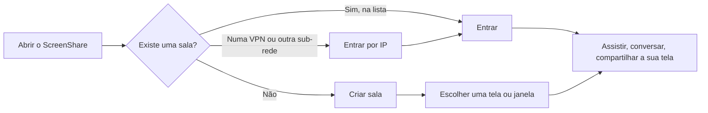

# Guia do usuário

Tudo o que dá para fazer no ScreenShare, de encontrar uma sala a ajustar a qualidade. Não precisa de conhecimento técnico.

> **Idioma:** [English](../en-US/user-guide.md) · Português (Brasil)

Os nomes dos botões aqui são os do app em português. Ele abre no idioma do seu computador (português ou inglês); dá para trocar em **Configurações → Aparência → Idioma**.

## Conteúdo

- [Antes de começar](#antes-de-começar)
- [Seu nome e sua foto](#seu-nome-e-sua-foto)
- [Encontrar uma sala](#encontrar-uma-sala)
- [Criar uma sala](#criar-uma-sala)
- [Compartilhar sua tela](#compartilhar-sua-tela)
- [Assistir outras pessoas](#assistir-outras-pessoas)
- [Chat e pessoas](#chat-e-pessoas)
- [Se você é o anfitrião](#se-você-é-o-anfitrião)
- [Configurações](#configurações)
- [Idioma](#idioma)
- [Atualizações](#atualizações)
- [Mouse e teclado](#mouse-e-teclado)
- [Privacidade](#privacidade)
- [Onde ficam seus arquivos](#onde-ficam-seus-arquivos)

## Antes de começar

- **Computadores**: Windows 10/11 ou macOS. O áudio do sistema no macOS precisa do macOS 13 ou mais novo. Deixar o Discord fora do áudio precisa do Windows 10 versão 2004 ou mais novo.
- **Rede**: todos precisam estar na mesma rede local ou VPN. Nada passa pela internet (fora a busca por atualizações) e não existem contas.
- **Versões compatíveis**: apps 1.x e 2.x podem estar na mesma sala (o 2.0.0 mudou a aparência, não a forma como os apps conversam). Só uma versão que muda o protocolo da sala, como um futuro 3.0.0, exige que todos atualizem; a lista de salas diz quem precisa, por exemplo "Esta sala usa o ScreenShare 3.0.0, você tem o 2.0.0: atualize para entrar". Quando alguém na sua sala usa uma versão mais nova, aparece uma sugestão (uma vez) para atualizar.
- **macOS**: na primeira vez que você abre o app, o macOS o bloqueia até você permitir uma vez; veja [abrir pela primeira vez no macOS](#abrir-pela-primeira-vez-no-macos). Na primeira vez que você compartilhar, o macOS pede a permissão de **Gravação de Tela** e pode pedir acesso à **Rede Local**. Permita as duas e reinicie o app se ele pedir.

```mermaid
flowchart LR
  A["Abrir o ScreenShare"] --> B{"Existe uma sala?"}
  B -->|"Sim, na lista"| C["Entrar"]
  B -->|"Numa VPN ou outra sub-rede"| D["Entrar por IP"] --> C
  B -->|"Não"| E["Criar sala"] --> F["Escolher uma tela ou janela"]
  C --> G["Assistir, conversar, compartilhar a sua tela"]
  F --> G
```

### Abrir pela primeira vez no macOS

O ScreenShare ainda não é notarizado pela Apple, então na primeira vez o macOS o impede com a mensagem de que não foi possível verificar se o "ScreenShare" está livre de malware. Fechar essa mensagem não basta; o app continua bloqueado até você permitir:

1. Arraste o ScreenShare da imagem de disco para **Aplicativos** e abra de lá (não pela janela da imagem de disco).
2. Quando a mensagem aparecer, feche-a (**OK**).
3. Abra *Ajustes do Sistema → Privacidade e Segurança* e role até **Segurança**. Ali diz que o ScreenShare foi bloqueado; clique em **Abrir Mesmo Assim** ao lado. O botão só aparece por mais ou menos uma hora depois que você tentou abrir o app: se ele não estiver lá, abra o ScreenShare de novo, feche a mensagem e volte.
4. Digite a sua senha ou use o Touch ID. O ScreenShare abre (se o macOS perguntar mais uma vez, clique em **Abrir Mesmo Assim** ou **Abrir**).

Isso é feito uma vez para cada versão baixada; depois o ScreenShare abre normalmente. No macOS 14 e anteriores, botão direito no app → **Abrir** → **Abrir** também funciona.

## Seu nome e sua foto

- Seu **nome** aparece embaixo da coluna de salas, à esquerda. Clique nele para mudar. Também dá para mudar em **Configurações → Perfil**.
- Sua **foto de perfil** fica em **Configurações → Perfil → Escolher…**. Depois de escolher uma imagem, abre uma janela de recorte:
  - arraste a imagem para posicioná-la;
  - use a rodinha do mouse ou o controle deslizante para dar zoom;
  - o círculo mostra o que as outras pessoas vão ver, e uma prévia pequena mostra o resultado.

  Clique em **Usar foto** para salvar ou em **Cancelar** para manter a anterior. **Remover** volta a mostrar suas iniciais. Quem está na sala vê a mudança na hora.

## Encontrar uma sala

A janela tem três colunas: as **salas** à esquerda, a sala em que você está (ou uma página de boas-vindas) no meio, e o **chat** da sala à direita.

A coluna de salas mostra:

- **Salas recentes**: as últimas 5 salas em que você entrou, da mais recente para a mais antiga, com a sala atual em destaque. Clique numa para voltar a ela, mesmo que esteja numa VPN e não apareça sozinha. Salas que não respondem aparecem como *offline*. O **×** de uma linha a esquece.
- **Salas na sua rede**: todas as outras salas encontradas na sua rede. A lista se atualiza sozinha (repare no ponto verde).

Cada linha mostra um cadeado para salas privadas, quantas transmissões estão ao vivo e quantas pessoas estão dentro; passe o mouse por cima para ver quem hospeda, há quanto tempo e o endereço. Uma sala numa versão incompatível diz *Atualize para entrar* ou *Versão antiga* (passe o mouse para ver quem precisa atualizar). Salas adicionadas pelo IP têm um **×** para tirá-las da lista. Clique numa sala para entrar. Se você já está numa sala, sai dela antes; o app pergunta antes quando isso encerra uma sala que você hospeda ou para o seu compartilhamento.

O botão no topo de cada coluna lateral a esconde (a coluna de salas vira uma faixa com as iniciais das salas; o botão do chat fica no canto de cima à direita da sala, embaixo dos botões da própria janela). O app lembra quais colunas você escondeu. Numa janela pequena (por exemplo encaixada ao lado de um jogo) as colunas abrem espaço para os quadros sozinhas: abaixo de 1100 px de largura o chat fica fechado, e abaixo de 760 px a coluna de salas vira uma faixa. Os botões delas então as abrem por cima da sala, e clicar ao lado as fecha.

**Entrar por IP**: se você está numa VPN ou em outra sub-rede, as salas podem não aparecer sozinhas. Clique em **Entrar por IP** (ao lado de **Criar sala**) e digite o endereço do anfitrião, por exemplo `10.8.0.5` ou `192.168.1.20:47800`. O anfitrião vê os endereços dele no **ⓘ** dos controles na parte de baixo da sala. A porta padrão é 47800.

**Amigos em outras redes**: coloque todos numa rede do [ZeroTier](zerotier.md). Leva poucos minutos, e as salas passam a aparecer na lista como se todos estivessem em casa.

**Salas privadas** pedem um PIN (de 4 a 6 dígitos) logo abaixo da sala na lista. Depois de 3 PINs errados, seu computador precisa esperar 5 minutos para tentar de novo.

## Criar uma sala

1. Clique em **Criar sala**.
2. Dê um nome e escolha **Pública** (qualquer pessoa da rede pode entrar) ou **Privada** (as pessoas precisam de um PIN, que é gerado para você; escolha 4, 5 ou 6 dígitos).
3. Escolha o que compartilhar: uma **tela** inteira ou uma única **janela**.
4. **Compartilhar o áudio do sistema** envia tudo que está tocando no seu computador. No Windows, **Deixar o Discord de fora** (ligado por padrão) deixa a sua chamada do Discord de fora, para quem está na mesma chamada não ouvir a própria voz pela sua transmissão. Quando você compartilha uma única **janela** no Windows, **Só o som deste app** (ligado por padrão) envia só o som daquele app, por exemplo só o seu jogo, sem Discord, música ou notificações.
5. Clique em **Começar a compartilhar**.

Numa sala privada, o PIN é copiado para a área de transferência para você colar para os seus amigos.

Agora é o seu computador que roda a sala. Se você fechar o ScreenShare, o app pergunta antes, porque fechar encerra a sala para todo mundo.

## Compartilhar sua tela

Qualquer pessoa na sala pode compartilhar, não só o anfitrião, e várias pessoas podem compartilhar ao mesmo tempo. Clique em **Compartilhar tela** nos controles na parte de baixo da sala e escolha uma tela ou janela.

**Os controles** ficam por cima da parte de baixo da sala: aparecem quando você mexe o mouse sobre ela, e somem depois de 2,5 s sem movimento ou quando o mouse sai dela. Da esquerda para a direita:

| Onde | Botões |
|---|---|
| Esquerda | **ⓘ** detalhes da sala e, com uma transmissão em destaque, **Grade** (volta à grade) e **Esconder os outros / Mostrar os outros** (a faixa) |
| Meio | **Compartilhar tela** (ou **Compartilhando** enquanto você compartilha), e o botão vermelho de **sair** |
| Direita | **Volume** e **Abrir em nova janela** (da transmissão em destaque), e **Tela cheia** |

Enquanto você compartilha, o botão vira um ícone de tela verde. Clique nele (ou clique com o botão direito no seu próprio quadro) para o menu de compartilhamento:

| Opção | O que faz |
|---|---|
| **Trocar fonte…** | Troca para outra tela ou janela, ou muda as opções de áudio, sem ninguém precisar reconectar. |
| **Silenciar áudio / Ativar áudio** | Para de enviar o áudio do sistema enquanto o vídeo continua. Mostra **Sem áudio** se o áudio não está sendo capturado. |
| **Qualidade que você envia** | A qualidade máxima que você envia (Nativa, 1080p, 720p a 60 ou 30 fps, 480p). Vale na hora; cada espectador ainda pode receber menos, por exemplo se a janela dele for pequena ou a rede estiver lenta. |
| **Estatísticas da transmissão** | Abre o painel de estatísticas (veja abaixo). |
| **Parar de compartilhar** | Encerra a sua transmissão. |

**Estatísticas da transmissão** mostra a resolução, taxa de quadros, upload, tempo de codificação, codec, codificador, CPU e memória (do app e do computador inteiro, jogos inclusive) e o que está limitando a qualidade da sua transmissão, e também permite mudar a qualidade que você envia.

O botão vermelho no fim sai da sala (para o anfitrião, encerra a sala para todos, depois de perguntar).

**Quando a sua transmissão tem dificuldade**, a sala diz o motivo: seu computador não consegue codificar rápido o bastante, seu upload não dá conta de todos que assistem, ou sua placa de vídeo ficou sem codificadores de hardware (alguns espectadores passam a ser codificados pela CPU). O aviso só aparece quando o problema dura vários segundos, some quando ele é resolvido e não volta pelo mesmo motivo por 10 minutos. **Baixar para …** baixa a sua qualidade máxima um degrau.

**A sua própria transmissão não é exibida para você**, o que poupa a GPU do seu computador. O seu quadro mostra uma prévia que se atualiza mais ou menos uma vez por minuto. Clique em **Mostrar minha transmissão** para exibi-la; **Esconder minha transmissão** no menu do botão direito a esconde de novo. Você continua compartilhando nos dois casos.

**Jogando enquanto compartilha a tela no Windows 10?** O Windows mostraria o cursor do mouse aos espectadores mesmo quando o jogo o esconde. Por isso, enquanto um jogo em tela cheia esconde o cursor, o app compartilha a janela do jogo no lugar, que fica igual sem o cursor, e volta para a sua tela quando você dá alt-tab. A sala mostra um aviso enquanto isso acontece. Veja [solução de problemas](troubleshooting.md#os-espectadores-veem-o-cursor-do-mouse-num-jogo) para jogos em janela.

## Assistir outras pessoas

Todos na sala têm um **quadro** no meio: a foto e o nome. Os quadros mantêm o formato 16:9 e crescem o quanto a janela permite. Nada toca até você escolher: quem está compartilhando tem um selo vermelho **Ao vivo**, e o quadro mostra uma prévia da transmissão, tirada quando a pessoa começa e atualizada mais ou menos uma vez por minuto.

- Clique em **Assistir** no quadro, ou clique na pessoa na coluna de salas (passe o mouse antes para ver a prévia). O quadro passa a exibir a transmissão, com o nome da pessoa por cima. Clique na pessoa de novo na coluna de salas, ou em **Parar de assistir** no menu do botão direito da transmissão, para parar; um olho marca as transmissões que você assiste.
- **A primeira transmissão que você assiste abre em destaque**, com todos os outros numa faixa embaixo. Uma segunda transmissão mantém a grade.
- **Clique num quadro** para colocá-lo em **destaque** (clicar num da faixa o coloca em destaque no lugar). Clique de novo no quadro em destaque, no botão **Grade** dos controles, ou aperte **Esc** para voltar à grade.
- **Mostrar só transmissões** (no menu do botão direito de qualquer quadro) deixa de fora quem não está compartilhando, para as transmissões ocuparem todo o espaço. A escolha é lembrada; enquanto ninguém compartilha, todos aparecem do mesmo jeito.
- **Quem está assistindo**: a barra com o nome da transmissão mostra um olho com quantas pessoas a assistem e as fotos delas; aponte para ver os nomes. Uma transmissão que você silenciou mostra um alto-falante riscado ao lado do nome.
- O nome da sala fica na barra de título, no topo da janela.
- **Dois cliques numa transmissão** a colocam em tela cheia, como num player de vídeo: a transmissão ocupa a tela toda, e a faixa e os controles ficam por cima da parte de baixo dela. Depois de 2,5 s sem mexer o mouse, tudo menos a imagem some (a faixa, os controles, o nome, os selos de estatística e o ponteiro); mexa o mouse para trazê-los de volta. **Esc** ou o botão **Tela cheia** volta à janela. O mesmo botão, na grade, coloca a grade em tela cheia.
- **Abrir em nova janela** (nos controles, ou no menu do botão direito da transmissão) abre a transmissão em destaque numa janela só dela, por exemplo em tela cheia num segundo monitor. Ela toca a mesma transmissão (sem carga a mais para quem compartilha), continua tocando quando você minimiza a sala e fica oculta para gravadores de tela como a sala. O quadro dela diz **Passando em outra janela**; **Trazer de volta**, ou fechar a janela, traz de volta. A janela tem a barra de título e as cores do app, e os mesmos controles da sala (volume, **Voltar para a sala**, **Tela cheia**); dois cliques nela colocam em tela cheia.
- No destaque, **Esconder os outros** guarda a faixa para o quadro em destaque ocupar toda a altura; as transmissões nela param de te mandar vídeo até você mostrá-las de novo (o som continua).
- Quando você está sozinho na sua sala, um quadro **Convide pessoas** mostra o endereço para passar a quem está numa VPN.

**Clique com o botão direito numa transmissão** para tudo sobre ela:

| Opção | O que faz |
|---|---|
| **Volume** (controle deslizante) e **Silenciar** | Cada transmissão tem seu próprio volume e mudo, guardados por pessoa. |
| **Parar de assistir**, **Destacar**, **Tela cheia**, **Abrir em nova janela** | Como acima. |
| **Mostrar só transmissões / Mostrar todos** | Deixa de fora quem não está compartilhando (menu de qualquer quadro). |
| **Qualidade que você recebe** | **Automática** acompanha o tamanho em que você assiste, então um quadro pequeno gasta pouca banda. Você também pode limitar em 1080p, 720p, ou 720p/480p/360p a 30 fps. Fica guardado por pessoa. |
| **Tentar a conexão mais rápida de novo** | Só quando a transmissão caiu para a conexão TCP, mais lenta. |
| **Parar a transmissão de *nome***, **Remover da sala** | Só o anfitrião. |

**Nos controles**, com uma transmissão em destaque, o alto-falante a silencia, ou volta ao último volume; aponte para ele para ver o controle de volume.

Os **selos de estatística** numa transmissão mostram taxa de quadros, latência, resolução, codec e tipo de conexão; dá para desligar em **Configurações → Aparência**.

Se uma transmissão não conectar em 8 segundos (algumas VPNs e firewalls bloqueiam), o app passa sozinho para uma conexão TCP. Ela acrescenta um pouco de atraso, mas continua funcionando.

Enquanto você **minimiza** o app, ou deixa um quadro em tela cheia, as transmissões que você não consegue ver param de te mandar vídeo (o som continua), o que poupa o upload de quem transmite e a sua rede. A imagem volta em menos de um segundo quando você olha de novo. Quem transmite vê "não está olhando" embaixo do seu nome.

## Chat e pessoas

- O **chat** fica à direita: mensagens com horário e foto, e um seletor de emojis. Mensagens que alguém manda com até 5 minutos de diferença ficam sob um só nome e foto (passe o mouse numa delas para ver o horário). Esconda o chat com o botão de chat no canto de cima à direita da sala; enquanto ele está escondido, o botão conta as mensagens novas. As mensagens só existem enquanto a sala existir.
- As **pessoas** aparecem embaixo da sala em que você está, na coluna de salas: quem hospeda, quem está ao vivo (**Ao vivo**, ou **Pausado**) e quem está reconectando. Enquanto você compartilha, quem está te assistindo mostra como está indo embaixo do nome (*assistindo você · 60 fps · 20 ms*, ou *não está olhando*).

Se a sua rede cair por um instante, o app reconecta sozinho e te coloca de volta no mesmo lugar sem pedir o PIN de novo, desde que você volte em até 30 segundos. As transmissões que você assistia reconectam automaticamente.

## Se você é o anfitrião

O **ⓘ** à esquerda dos controles mostra os detalhes dela: privacidade, há quanto tempo está aberta, quem hospeda e o tempo de ida e volta até ela (e, para convidados, o endereço para copiar). Para o anfitrião, ele também permite:

- alternar entre **Pública** e **Privada** a qualquer momento; quem já está dentro continua conectado;
- mostrar ou esconder o **PIN**, **copiar**, **gerar um novo** ou **definir o seu**;
- ver os endereços que as pessoas podem usar no **Entrar por IP**.

Clicar com o botão direito numa pessoa (no quadro dela, ou no nome dela na coluna de salas, onde também aparece um botão **⋯** ao passar o mouse) permite **parar a transmissão** dela ou **removê-la** da sala (a pessoa não consegue voltar nesta sessão da sala). No chat você pode **apagar mensagens** e **silenciar o chat** (as pessoas continuam vendo o histórico).

**Encerrar a sala para todo mundo** (também no **ⓘ**, ou o botão vermelho no fim dos controles) encerra a sala para todos.

## Configurações

Abra as configurações pelo ícone de engrenagem embaixo da coluna de salas. A lista à esquerda pula para uma seção e acompanha a rolagem.

| Seção | Configuração | Padrão | Significado |
|---|---|---|---|
| Perfil | Foto de perfil | nenhuma | Aparece no lugar das suas iniciais. |
| Perfil | Nome | seu usuário do computador | Até 32 caracteres. |
| Aparência | Idioma | Igual ao computador | Veja [idioma](#idioma). |
| Aparência | Tema | Clássico | As cores do app: **Clássico** (azul sobre cinza-azulado), **Grafite** (cinzas neutros e índigo, para as transmissões manterem as cores reais), **Meia-noite** (preto-azulado e verde-água) ou **Carvão** (cinzas quentes e violeta). Vale na hora. |
| Aparência | Mostrar FPS e atraso nas transmissões | ligado | Os selos em cada transmissão. |
| Compartilhamento | Qualidade máxima | 1080p @ 60 fps | O máximo que você envia ao compartilhar. Vale na hora. |
| Compartilhamento | Otimizar para | Automático | *Movimento suave* mantém 60 fps. *Texto nítido* mantém a resolução. *Automático* (Windows) usa movimento suave enquanto um jogo ou vídeo em tela cheia está na frente do que você compartilha, e texto nítido na área de trabalho; no macOS quer dizer movimento suave. As estatísticas da transmissão mostram qual está em uso. |
| Compartilhamento | Limite de upload ao compartilhar | 100 Mbps | O seu upload total, dividido de forma justa entre quem te assiste. Diminua no Wi-Fi ou na VPN. |
| Compartilhamento | Compartilhar o áudio do sistema por padrão | ligado | Deixa o interruptor de áudio pré-marcado. |
| Compartilhamento | Só o som do app compartilhado por padrão | ligado | Só no Windows. Deixa **Só o som deste app** pré-marcado quando você compartilha uma janela. |
| Compartilhamento | Deixar o Discord de fora por padrão | ligado | Só no Windows. Deixa o interruptor do Discord pré-marcado. |
| Compartilhamento | Pausar o compartilhamento ao minimizar | desligado | Retoma quando você restaura a janela. |
| Notificações | Notificações do chat | ligado | Quando a janela está em segundo plano. |
| Conexão | Voltar para a última sala ao abrir | desligado | Entra automaticamente na última sala quando o app abre. |
| Conexão | Criptografar conexões (TLS) | ligado | Cifra o chat e a sinalização. O vídeo é sempre cifrado. |
| Conexão | Sempre usar transporte TCP | desligado | Para redes que bloqueiam UDP. Acrescenta um pouco de atraso. |
| Conexão | Porta para hospedar | 47800 | A primeira porta tentada quando você hospeda. |
| Avançado | Codec de vídeo | Automático | O automático prefere H.264 em hardware. Dá para forçar H.264, H.265, VP9 ou AV1 se os dois lados suportarem. A tabela abaixo dele mostra o que o seu computador suporta. |
| Avançado | Qualidade adaptativa | ligado | Reduz resolução/taxa de quadros por espectador quando a rede dele sofre. |
| Sobre | Procurar atualizações automaticamente | ligado | Veja [atualizações](#atualizações). |

**Sobre** mostra a versão do app e tem o botão **Abrir logs**.

## Idioma

O app fala **português (Brasil)** e **inglês**. Em **Configurações → Aparência → Idioma**:

- **Igual ao computador** (o padrão) segue o idioma do Windows ou do macOS: português se ele estiver em português (de qualquer país), e inglês nos outros casos.
- **Português (Brasil)** ou **English** fixam o idioma, seja qual for o do computador.

A troca vale na hora, sem reiniciar. Cada pessoa vê a sala no próprio idioma: os avisos da sala no chat ("Bob entrou", "O anfitrião silenciou o chat") aparecem em português para você e em inglês para quem usa o app em inglês. Numa sala hospedada por um app anterior ao 2.4.0, esses avisos chegam em inglês. O nome padrão de uma sala nova segue o idioma de quem a cria ("Sala de Giu").

## Atualizações

O app procura uma versão nova na [página de versões](https://github.com/nsfxu/lan-screenshare/releases) logo depois de abrir e a cada algumas horas.

- **Windows**: a versão nova baixa em silêncio, em segundo plano. Quando ela está pronta, um botão verde **Reiniciar para atualizar** aparece na barra de título (e em **Configurações → Sobre**). Clique quando for melhor para você: o app fecha, instala a atualização e abre de novo. Se você está numa sala ele pergunta antes, porque reiniciar sai da sala (ou a encerra, se você é o anfitrião). Nada é instalado sozinho quando você fecha o app.
- **macOS**: a barra de título mostra **Atualizar para …**, que abre a página de download. A Apple só deixa apps assinados se substituírem, e o ScreenShare ainda não é assinado.

**Configurações → Sobre** mostra a situação e tem o botão **Verificar agora**. Desligue **Procurar atualizações automaticamente** se não quiser que o app fale com o GitHub; dá para procurar à mão do mesmo jeito. Versões anteriores ao 2.2.0 não se atualizam sozinhas: baixe o 2.2.0 uma vez, e as próximas chegam sozinhas.

## Mouse e teclado

| Onde | Ação | Resultado |
|---|---|---|
| Um quadro | Clique | Destaque / voltar à grade |
| Uma transmissão | Clique duplo | Tela cheia |
| Um quadro | Botão direito | O menu dele (volume, qualidade, …) |
| Uma transmissão em destaque | Esc | Sai da tela cheia, depois volta à grade |
| Tela cheia | Mexer o mouse | Mostrar a faixa e os controles de novo |
| Recorte da foto | Arrastar / rodinha / controle deslizante | Mover / zoom |
| Recorte da foto | Setas, Shift + setas, + e − | Mover pouco, mover mais, zoom |
| Qualquer janela de diálogo | Esc | Fecha o diálogo do topo |

## Privacidade

- Tudo fica na sua rede. Não há contas, nuvem nem rastreamento. A única coisa que o app faz na internet é procurar atualizações no GitHub, o que não envia nada sobre você além do que qualquer download envia, e pode ser desligado.
- O PIN só existe na memória do anfitrião e nunca é salvo.
- O app não tem gravação nem exportação do chat. Enquanto você assiste uma transmissão, a janela do ScreenShare fica oculta para capturas e gravadores de tela no seu computador.
- Chat, prévias e fotos de perfil somem quando a sala termina.

## Onde ficam seus arquivos

| O quê | Windows | macOS |
|---|---|---|
| Configurações (`settings.json`) e identidade de anfitrião (`host-identity.json`) | `%APPDATA%\ScreenShare\` | `~/Library/Application Support/ScreenShare/` |
| Logs (`screenshare.log`) | `%APPDATA%\ScreenShare\logs\` | `~/Library/Logs/ScreenShare/` |

**Configurações → Sobre → Abrir logs** abre a pasta de logs. O log é trocado ao chegar em 5 MB (o anterior fica como `screenshare.old.log`). Apagar o `host-identity.json` dá ao seu computador um certificado novo na próxima vez que você hospedar; quem já tinha se conectado antes pode precisar encontrar sua sala de novo.

Algo não está funcionando? Veja a [solução de problemas](troubleshooting.md).
