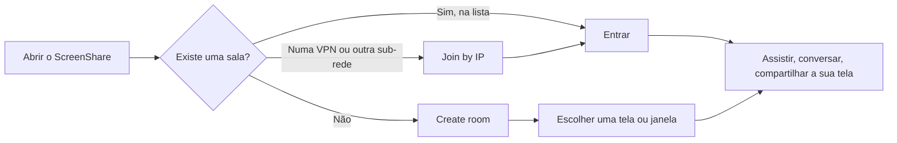

# Guia do usuário

Tudo o que dá para fazer no ScreenShare, de encontrar uma sala a ajustar a qualidade. Não precisa de conhecimento técnico.

> **Idioma:** [English](../en-US/user-guide.md) · Português (Brasil)

O app está em inglês, então os nomes dos botões aparecem aqui **como estão no app**.

## Conteúdo

- [Antes de começar](#antes-de-começar)
- [Seu nome e sua foto](#seu-nome-e-sua-foto)
- [Encontrar uma sala](#encontrar-uma-sala)
- [Criar uma sala](#criar-uma-sala)
- [Compartilhar sua tela](#compartilhar-sua-tela)
- [Assistir outras pessoas](#assistir-outras-pessoas)
- [Chat e pessoas](#chat-e-pessoas)
- [Se você é o anfitrião](#se-você-é-o-anfitrião)
- [Configurações](#configurações)
- [Mouse e teclado](#mouse-e-teclado)
- [Privacidade](#privacidade)
- [Onde ficam seus arquivos](#onde-ficam-seus-arquivos)

## Antes de começar

- **Computadores**: Windows 10/11 ou macOS. O áudio do sistema no macOS precisa do macOS 13 ou mais novo. Deixar o Discord fora do áudio precisa do Windows 10 versão 2004 ou mais novo.
- **Rede**: todos precisam estar na mesma rede local ou VPN. Nada passa pela internet e não existem contas.
- **Versões compatíveis**: apps 1.x e 2.x podem estar na mesma sala (o 2.0.0 mudou a aparência, não a forma como os apps conversam). Só uma versão que muda o protocolo da sala, como um futuro 3.0.0, exige que todos atualizem; a lista de salas diz quem precisa, por exemplo "This room runs ScreenShare 3.0.0, you have 2.0.0: update to join". Quando alguém na sua sala usa uma versão mais nova, aparece uma sugestão (uma vez) para atualizar.
- **macOS**: na primeira vez que você compartilhar, o macOS pede a permissão de **Gravação de Tela** e pode pedir acesso à **Rede Local**. Permita as duas e reinicie o app se ele pedir.

```mermaid
flowchart LR
  A["Abrir o ScreenShare"] --> B{"Existe uma sala?"}
  B -->|"Sim, na lista"| C["Entrar"]
  B -->|"Numa VPN ou outra sub-rede"| D["Join by IP"] --> C
  B -->|"Não"| E["Create room"] --> F["Escolher uma tela ou janela"]
  C --> G["Assistir, conversar, compartilhar a sua tela"]
  F --> G
```

## Seu nome e sua foto

- Seu **nome** aparece embaixo da coluna de salas, à esquerda. Clique nele para mudar. Também dá para mudar em **Settings → Profile**.
- Sua **foto de perfil** fica em **Settings → Profile → Choose…**. Depois de escolher uma imagem, abre uma janela de recorte:
  - arraste a imagem para posicioná-la;
  - use a rodinha do mouse ou o controle deslizante para dar zoom;
  - o círculo mostra o que as outras pessoas vão ver, e uma prévia pequena mostra o resultado.

  Clique em **Use picture** para salvar ou em **Cancel** para manter a anterior. **Remove** volta a mostrar suas iniciais. Quem está na sala vê a mudança na hora.

## Encontrar uma sala

A janela tem três colunas: as **salas** à esquerda, a sala em que você está (ou uma página de boas-vindas) no meio, e o **chat** da sala à direita.

A coluna de salas mostra:

- **Recent rooms**: as últimas 5 salas em que você entrou, da mais recente para a mais antiga, com a sala atual em destaque. Clique numa para voltar a ela, mesmo que esteja numa VPN e não apareça sozinha. Salas que não respondem aparecem como *offline*. O **×** de uma linha a esquece.
- **Rooms on your network**: todas as outras salas encontradas na sua rede. A lista se atualiza sozinha (repare no ponto verde).

Cada linha mostra um cadeado para salas privadas, quantas transmissões estão ao vivo e quantas pessoas estão dentro; passe o mouse por cima para ver quem hospeda, há quanto tempo e o endereço. Uma sala numa versão incompatível diz *Update to join* ou *Older version* (passe o mouse para ver quem precisa atualizar). Salas adicionadas pelo IP têm um **×** para tirá-las da lista. Clique numa sala para entrar. Se você já está numa sala, sai dela antes; o app pergunta antes quando isso encerra uma sala que você hospeda ou para o seu compartilhamento.

O botão no topo de cada coluna lateral a esconde (a coluna de salas vira uma faixa com as iniciais das salas; o botão do chat fica no topo da sala). O app lembra quais colunas você escondeu. Numa janela pequena (por exemplo encaixada ao lado de um jogo) as colunas abrem espaço para os quadros sozinhas: abaixo de 1100 px de largura o chat fica fechado, e abaixo de 760 px a coluna de salas vira uma faixa. Os botões delas então as abrem por cima da sala, e clicar ao lado as fecha.

**Join by IP**: se você está numa VPN ou em outra sub-rede, as salas podem não aparecer sozinhas. Clique em **Join by IP** (ao lado de **Create room**) e digite o endereço do anfitrião, por exemplo `10.8.0.5` ou `192.168.1.20:47800`. O anfitrião vê os endereços dele no **ⓘ** ao lado do nome da sala. A porta padrão é 47800.

**Amigos em outras redes**: coloque todos numa rede do [ZeroTier](zerotier.md). Leva poucos minutos, e as salas passam a aparecer na lista como se todos estivessem em casa.

**Salas privadas** pedem um PIN (de 4 a 6 dígitos) logo abaixo da sala na lista. Depois de 3 PINs errados, seu computador precisa esperar 5 minutos para tentar de novo.

## Criar uma sala

1. Clique em **Create room**.
2. Dê um nome e escolha **Public** (qualquer pessoa da rede pode entrar) ou **Private** (as pessoas precisam de um PIN, que é gerado para você; escolha 4, 5 ou 6 dígitos).
3. Escolha o que compartilhar: uma **tela** inteira ou uma única **janela**.
4. **Share system audio** envia tudo que está tocando no seu computador. No Windows, **Leave out Discord** (ligado por padrão) deixa a sua chamada do Discord de fora, para quem está na mesma chamada não ouvir a própria voz pela sua transmissão. Quando você compartilha uma única **janela** no Windows, **Only this app's sound** (ligado por padrão) envia só o som daquele app, por exemplo só o seu jogo, sem Discord, música ou notificações.
5. Clique em **Start sharing**.

Numa sala privada, o PIN é copiado para a área de transferência para você colar para os seus amigos.

Agora é o seu computador que roda a sala. Se você fechar o ScreenShare, o app pergunta antes, porque fechar encerra a sala para todo mundo.

## Compartilhar sua tela

Qualquer pessoa na sala pode compartilhar, não só o anfitrião, e várias pessoas podem compartilhar ao mesmo tempo. Clique em **Share screen** na barra de controles embaixo dos quadros (à direita do botão vermelho de sair) e escolha uma tela ou janela.

Enquanto você compartilha, o botão vira um botão verde **Sharing**. Clique nele (ou clique com o botão direito no seu próprio quadro) para o menu de compartilhamento:

| Opção | O que faz |
|---|---|
| **Change source…** | Troca para outra tela ou janela, ou muda as opções de áudio, sem ninguém precisar reconectar. |
| **Mute audio / Unmute audio** | Para de enviar o áudio do sistema enquanto o vídeo continua. Mostra **No audio** se o áudio não está sendo capturado. |
| **Quality you send** | A qualidade máxima que você envia (Native, 1080p, 720p a 60 ou 30 fps, 480p). Vale na hora; cada espectador ainda pode receber menos, por exemplo se a janela dele for pequena ou a rede estiver lenta. |
| **Stop sharing** | Encerra a sua transmissão. |

**Stats** (o botão de controles deslizantes ao lado) mostra a resolução, taxa de quadros, upload, tempo de codificação, codec, codificador, CPU, memória e o que está limitando a qualidade da sua transmissão, e também permite mudar a qualidade que você envia.

O botão vermelho à esquerda dele sai da sala (para o anfitrião, encerra a sala para todos, depois de perguntar).

**Quando a sua transmissão tem dificuldade**, a sala diz o motivo: seu computador não consegue codificar rápido o bastante, seu upload não dá conta de todos que assistem, ou sua placa de vídeo ficou sem codificadores de hardware (alguns espectadores passam a ser codificados pela CPU). O aviso só aparece quando o problema dura vários segundos, some quando ele é resolvido e não volta pelo mesmo motivo por 10 minutos. **Lower to …** baixa a sua qualidade máxima um degrau.

**A sua própria transmissão não é exibida para você**, o que poupa a GPU do seu computador. O seu quadro mostra uma prévia que se atualiza mais ou menos uma vez por minuto. Clique em **Show my stream** para exibi-la; **Hide my stream** no menu do botão direito a esconde de novo. Você continua compartilhando nos dois casos.

**Jogando enquanto compartilha a tela no Windows 10?** O Windows mostraria o cursor do mouse aos espectadores mesmo quando o jogo o esconde. Por isso, enquanto um jogo em tela cheia esconde o cursor, o app compartilha a janela do jogo no lugar, que fica igual sem o cursor, e volta para a sua tela quando você dá alt-tab. A sala mostra um aviso enquanto isso acontece. Veja [solução de problemas](troubleshooting.md#os-espectadores-veem-o-cursor-do-mouse-num-jogo) para jogos em janela.

## Assistir outras pessoas

Todos na sala têm um **quadro** no meio: a foto e o nome. Os quadros mantêm o formato 16:9 e crescem o quanto a janela permite. Nada toca até você escolher: quem está compartilhando tem um selo vermelho **Live**, e o quadro mostra uma prévia da transmissão, tirada quando a pessoa começa e atualizada mais ou menos uma vez por minuto.

- Clique em **Watch stream** no quadro, clique na pessoa na coluna de salas (passe o mouse antes para ver a prévia), ou em **Watch all** na barra de controles. O quadro passa a exibir a transmissão, com o nome da pessoa por cima. Clique na pessoa de novo na coluna de salas, ou em **Stop watching** no menu do botão direito da transmissão, para parar; um olho marca as transmissões que você assiste.
- **Clique num quadro** para colocá-lo em **destaque**, com todos os outros numa faixa embaixo (clicar num deles o coloca em destaque no lugar). Clique de novo no quadro em destaque, no botão de grade embaixo dele (à esquerda), ou aperte **Esc** para voltar à grade. O topo da sala mostra quem está nela em fotos (passe o mouse para ver os nomes) e quantas transmissões estão ao vivo.
- **Dois cliques numa transmissão** a colocam em tela cheia: a transmissão, todos os outros na faixa e os controles embaixo dela. A faixa, os controles e o ponteiro somem depois de 2,5 s sem mexer o mouse. **Esc** ou o botão embaixo da transmissão volta à janela.
- No destaque, **Hide others** guarda a faixa para o quadro em destaque ocupar toda a altura; as transmissões nela param de te mandar vídeo até você mostrá-las de novo (o som continua).
- Quando você está sozinho na sua sala, um quadro **Invite people** mostra o endereço para passar a quem está numa VPN.

**Clique com o botão direito numa transmissão** para tudo sobre ela:

| Opção | O que faz |
|---|---|
| **Volume** (controle deslizante) e **Mute** | Cada transmissão tem seu próprio volume e mudo, guardados por pessoa. |
| **Stop watching**, **Focus**, **Full screen** | Como acima. |
| **Quality you receive** | **Auto** acompanha o tamanho em que você assiste, então um quadro pequeno gasta pouca banda. Você também pode limitar em 1080p, 720p, ou 720p/480p/360p a 30 fps. Fica guardado por pessoa. |
| **Try the faster connection again** | Só quando a transmissão caiu para a conexão TCP, mais lenta. |
| **Stop *nome*'s stream**, **Remove from room** | Só o anfitrião. |

**Embaixo de uma transmissão em destaque**, o alto-falante a silencia, ou volta ao último volume; aponte para ele para ver o controle de volume. O botão ao lado coloca em tela cheia.

Os **selos de estatística** numa transmissão mostram taxa de quadros, latência, resolução, codec e tipo de conexão; dá para desligar em **Settings → Appearance**.

Se uma transmissão não conectar em 8 segundos (algumas VPNs e firewalls bloqueiam), o app passa sozinho para uma conexão TCP. Ela acrescenta um pouco de atraso, mas continua funcionando.

Enquanto você **minimiza** o app, ou deixa um quadro em tela cheia, as transmissões que você não consegue ver param de te mandar vídeo (o som continua), o que poupa o upload de quem transmite e a sua rede. A imagem volta em menos de um segundo quando você olha de novo. Quem transmite vê "not looking" embaixo do seu nome.

## Chat e pessoas

- O **chat** fica à direita: mensagens com horário e foto, e um seletor de emojis. Mensagens que alguém manda com até 5 minutos de diferença ficam sob um só nome e foto (passe o mouse numa delas para ver o horário). Esconda o chat com o botão de chat no canto superior direito; enquanto ele está escondido, o botão conta as mensagens novas. As mensagens só existem enquanto a sala existir.
- As **pessoas** aparecem embaixo da sala em que você está, na coluna de salas: quem hospeda, quem está ao vivo (**Live**, ou **Paused**) e quem está reconectando. Enquanto você compartilha, quem está te assistindo mostra como está indo embaixo do nome (*watching you · 60 fps · 20 ms*, ou *not looking*).

Se a sua rede cair por um instante, o app reconecta sozinho e te coloca de volta no mesmo lugar sem pedir o PIN de novo, desde que você volte em até 30 segundos. As transmissões que você assistia reconectam automaticamente.

## Se você é o anfitrião

O **ⓘ** ao lado do nome da sala mostra os detalhes dela: privacidade, há quanto tempo está aberta, quem hospeda e o tempo de ida e volta até ela (e, para convidados, o endereço para copiar). Para o anfitrião, ele também permite:

- alternar entre **Public** e **Private** a qualquer momento; quem já está dentro continua conectado;
- mostrar ou esconder o **PIN**, **copiar**, **gerar um novo** ou **definir o seu**;
- ver os endereços que as pessoas podem usar no **Join by IP**.

Clicar com o botão direito numa pessoa (no quadro dela, ou no nome dela na coluna de salas, onde também aparece um botão **⋯** ao passar o mouse) permite **parar a transmissão** dela ou **removê-la** da sala (a pessoa não consegue voltar nesta sessão da sala). No chat você pode **apagar mensagens** e **silenciar o chat** (as pessoas continuam vendo o histórico).

**End room for everyone** (também no **ⓘ**, ou o botão vermelho na barra de controles) encerra a sala para todos.

## Configurações

Abra as configurações pelo ícone de engrenagem embaixo da coluna de salas. A lista à esquerda pula para uma seção e acompanha a rolagem.

| Seção | Configuração | Padrão | Significado |
|---|---|---|---|
| Profile | Profile picture | nenhuma | Aparece no lugar das suas iniciais. |
| Profile | Display name | seu usuário do computador | Até 32 caracteres. |
| Appearance | Theme | Classic | As cores do app: **Classic** (azul sobre cinza-azulado), **Graphite** (cinzas neutros e índigo, para as transmissões manterem as cores reais), **Midnight** (preto-azulado e verde-água) ou **Charcoal** (cinzas quentes e violeta). Vale na hora. |
| Appearance | Show FPS and latency on streams | ligado | Os selos em cada transmissão. |
| Sharing | Maximum quality | 1080p @ 60 fps | O máximo que você envia ao compartilhar. Vale na hora. |
| Sharing | Optimize for | Automatic | *Smooth motion* mantém 60 fps. *Sharp text* mantém a resolução. *Automatic* (Windows) usa movimento suave enquanto um jogo ou vídeo em tela cheia está na frente do que você compartilha, e texto nítido na área de trabalho; no macOS quer dizer movimento suave. O painel Stats mostra qual está em uso. |
| Sharing | Upload limit when sharing | 100 Mbps | O seu upload total, dividido de forma justa entre quem te assiste. Diminua no Wi-Fi ou na VPN. |
| Sharing | Share system audio by default | ligado | Deixa o interruptor de áudio pré-marcado. |
| Sharing | Only the shared app's sound by default | ligado | Só no Windows. Deixa **Only this app's sound** pré-marcado quando você compartilha uma janela. |
| Sharing | Leave out Discord by default | ligado | Só no Windows. Deixa o interruptor do Discord pré-marcado. |
| Sharing | Pause sharing while minimized | desligado | Retoma quando você restaura a janela. |
| Notifications | Chat notifications | ligado | Quando a janela está em segundo plano. |
| Connection | Rejoin last room on startup | desligado | Entra automaticamente na última sala quando o app abre. |
| Connection | Encrypt connections (TLS) | ligado | Cifra o chat e a sinalização. O vídeo é sempre cifrado. |
| Connection | Always use TCP transport | desligado | Para redes que bloqueiam UDP. Acrescenta um pouco de atraso. |
| Connection | Hosting port | 47800 | A primeira porta tentada quando você hospeda. |
| Advanced | Video codec | Automatic | O automático prefere H.264 em hardware. Dá para forçar H.264, H.265, VP9 ou AV1 se os dois lados suportarem. A tabela abaixo dele mostra o que o seu computador suporta. |
| Advanced | Adaptive quality | ligado | Reduz resolução/taxa de quadros por espectador quando a rede dele sofre. |

**About** mostra a versão do app e tem o botão **Open logs**.

## Mouse e teclado

| Onde | Ação | Resultado |
|---|---|---|
| Um quadro | Clique | Destaque / voltar à grade |
| Uma transmissão | Clique duplo | Tela cheia |
| Um quadro | Botão direito | O menu dele (volume, qualidade, …) |
| Uma transmissão em destaque | Esc | Sai da tela cheia, depois volta à grade |
| Tela cheia | Mexer o mouse | Mostrar a faixa e os controles de novo |
| Recorte da foto | Arrastar / rodinha / controle deslizante | Mover / zoom |
| Recorte da foto | Setas, Shift + setas, + e − | Mover pouco, mover mais, zoom |
| Qualquer janela de diálogo | Esc | Fecha o diálogo do topo |

## Privacidade

- Tudo fica na sua rede. Não há contas, nuvem nem rastreamento.
- O PIN só existe na memória do anfitrião e nunca é salvo.
- O app não tem gravação nem exportação do chat. Enquanto você assiste uma transmissão, a janela do ScreenShare fica oculta para capturas e gravadores de tela no seu computador.
- Chat, prévias e fotos de perfil somem quando a sala termina.

## Onde ficam seus arquivos

| O quê | Windows | macOS |
|---|---|---|
| Configurações (`settings.json`) e identidade de anfitrião (`host-identity.json`) | `%APPDATA%\ScreenShare\` | `~/Library/Application Support/ScreenShare/` |
| Logs (`screenshare.log`) | `%APPDATA%\ScreenShare\logs\` | `~/Library/Logs/ScreenShare/` |

**Settings → About → Open logs** abre a pasta de logs. O log é trocado ao chegar em 5 MB (o anterior fica como `screenshare.old.log`). Apagar o `host-identity.json` dá ao seu computador um certificado novo na próxima vez que você hospedar; quem já tinha se conectado antes pode precisar encontrar sua sala de novo.

Algo não está funcionando? Veja a [solução de problemas](troubleshooting.md).
