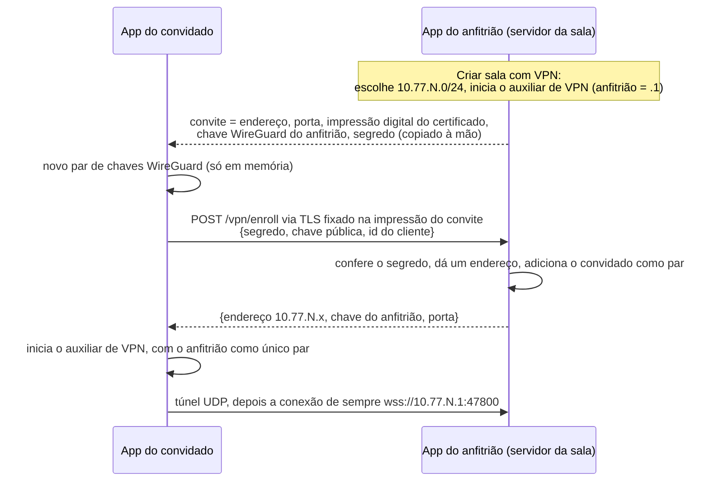

# Salas com VPN

Uma **sala com VPN** deixa entrar na sua sala quem *não* está na sua rede. Ao criar a sala você pode abrir uma pequena VPN (WireGuard) que existe só enquanto a sala existir; os convidados entram nela com um convite e depois usam a sala como qualquer pessoa: veem quem está compartilhando e assistem às transmissões.

> **Idioma:** [English](../en-US/vpn-rooms.md) · Português (Brasil)

## Conteúdo

- [O que você precisa](#o-que-você-precisa)
- [Hospedar uma sala com VPN](#hospedar-uma-sala-com-vpn)
- [Entrar numa sala com VPN](#entrar-numa-sala-com-vpn)
- [Como funciona](#como-funciona)
- [Limites](#limites)
- [Solução de problemas](#solução-de-problemas)

## O que você precisa

| | Anfitrião | Convidado |
|---|---|---|
| Sistema | Windows 10/11, macOS ou Linux | Windows 10/11, macOS ou Linux |
| Software | Nada a instalar: o auxiliar de VPN (WireGuard e, no Windows, a biblioteca do driver Wintun) vem dentro do ScreenShare. No Linux, o polkit (`pkexec`) pede a senha | o mesmo |
| Permissão | A permissão de administrador (UAC no Windows, sua senha no macOS e no Linux), uma vez ao abrir a sala | A mesma, uma vez ao entrar |
| Rede | Um caminho de fora: um endereço público (sem CGNAT) e a porta da sala (47800, se você não mudou) chegando a este computador, **em TCP e em UDP**. O ScreenShare descobre o endereço e, se o UPnP do roteador estiver ligado, abre a porta para você | Nada: o convidado só faz conexões de saída |

Se o auxiliar não estiver presente (uma versão compilada sem Go, veja o [desenvolvimento](development.md#o-auxiliar-de-vpn)), **Create room** avisa e a opção de VPN fica desligada.

## Hospedar uma sala com VPN

1. Clique em **Create room** e configure como de costume.
2. Ligue **Open Remote access for this room** e digite o endereço que seus amigos vão usar: seu IP público, ou um nome que aponte para ele.
3. Clique em **Start sharing** e digite a senha de administrador quando pedir.
4. Clique no **ⓘ** ao lado do nome da sala e em **Copy Remote invite**. Envie essa linha às pessoas que você convidar.

O painel mostra quantos convidados já entraram. Fechar a sala derruba a VPN.

**Trate o convite como uma senha.** Ele guarda um segredo que deixa entrar na VPN quem o tiver, e vale até você encerrar a sala. O **PIN** da sala continua valendo por cima: uma sala privada pede o PIN de cada convidado.

## Entrar numa sala com VPN

1. Clique em **Join Remote**, escolha **Remote invite**, cole o convite e clique em **Connect**.
2. Digite a senha de administrador quando pedir.
3. A sala abre sozinha. Se for privada, o PIN é pedido logo abaixo dela.

Enquanto você está conectado, a coluna de salas mostra **Remote connected** com um botão **Disconnect**. Sair da sala não desconecta a VPN: faça isso você mesmo, ou feche o app (ela também cai se o app travar).

## O endereço e a porta do roteador, descobertos para você

Ao ligar **Open Remote access for this room**, o app procura por você:

- **Seu endereço.** Pergunta ao `api.ipify.org` qual endereço a internet enxerga (é o único serviço externo que o ScreenShare usa, e só nesse momento) e, se falhar, usa o endereço do próprio roteador. O campo vem preenchido; mude se você usa um nome.
- **A porta do roteador.** Procura um roteador que fale UPnP e, se algum responder, abre a porta da sala em TCP e UDP enquanto a sala durar. A abertura tem validade de uma hora e é renovada, e é fechada quando a sala acaba, então uma queda não deixa nada aberto por muito tempo. Desmarque **Open the port on my router** para fazer isso você mesmo.
- **CGNAT.** Se sua operadora divide um endereço público entre clientes, nenhuma porta pode ser aberta para você e ninguém de fora da sua rede alcança este computador; o diálogo avisa. Amigos na sua própria rede ainda entram, e passar para uma conexão com endereço próprio resolve.

Se o roteador não responder (o UPnP costuma vir desligado), encaminhe a porta você mesmo; os detalhes da sala avisam.

## Como funciona

- **O anfitrião é o centro.** O túnel de todos termina nele, e ele repassa os pacotes entre os convidados; assim um convidado alcança os outros por ele. A mídia continua usando uma conexão WebRTC por par transmissor→espectador, mas numa sala com VPN esses pacotes passam pelo computador e pela conexão do anfitrião. Se o repasse não funcionar, o app cai para o caminho TCP da sala, como em qualquer rede que bloqueia UDP.
- **Um único passo privilegiado.** Só o auxiliar que vem no app (`ssvpn`) roda como administrador, depois do pedido de permissão do sistema. Ele cria a interface de rede virtual (Wintun no Windows, utun no macOS, TUN no Linux), dá a ela endereço e rota e abre o socket de controle do WireGuard só para o seu usuário (um named pipe restrito à sua conta no Windows). As chaves e os convidados são configurados depois pelo app, por esse socket; por isso nenhum segredo aparece numa linha de comando, num arquivo ou na lista de processos, e adicionar um convidado nunca pede a permissão de novo. Antes de pedir, o app confere os arquivos do auxiliar com somas de verificação feitas na compilação, então um arquivo trocado nunca é iniciado com esses direitos. O auxiliar desfaz tudo quando o app fecha ou trava, ou a VPN é encerrada.
- **Por sala, por sessão.** A rede (`10.77.N.0/24`, com `N` escolhido para não colidir com a sua) e as chaves são criadas quando a sala abre e esquecidas quando ela fecha.
- O código fica em `src/main/vpn/` (veja a [arquitetura](architecture.md#salas-com-vpn)); a requisição de inscrição está na [referência do protocolo](protocol.md#http-post-vpnenroll).

## Limites

- **O Windows é novo e só foi conferido compilando.** O auxiliar compila para Windows, mas ainda não rodou numa máquina Windows de verdade: [confira à mão](testing.md#conferindo-salas-com-vpn). Ele exige a instalação padrão (para todos os usuários), porque o auxiliar recebe direitos de administrador.
- **Uma VPN por vez**: você hospeda uma ou é convidado de uma.
- **No máximo 10 pessoas**, como qualquer sala (o anfitrião e 9 convidados).
- **O anfitrião precisa ser alcançável** de fora. Se os dois lados estão atrás de NAT sem porta encaminhada, o túnel não sobe; o ScreenShare não usa relay nem servidor STUN, de propósito.
- **A conexão do anfitrião carrega o vídeo** entre os convidados. Muitos convidados assistindo muito é o upload do anfitrião.
- Só IPv4 dentro da VPN.

## Solução de problemas

| Mensagem ou sintoma | O que fazer |
|---|---|
| *This build of ScreenShare has no VPN helper* | Você usa uma versão compilada sem Go. Use a versão oficial, ou rode `npm run build:vpn` (precisa do Go). |
| *…is not the one that came with ScreenShare, so it was not started* | Os arquivos do auxiliar mudaram depois da instalação. Reinstale o ScreenShare. |
| *VPN rooms need polkit…* (Linux) | Instale o pacote `polkit`, para haver uma janela que peça a senha. |
| *Administrator permission was not given…* | A janela de senha foi cancelada. Tente de novo. |
| *Could not reach the host at …* | A porta TCP não está encaminhada, o endereço do convite está errado ou o anfitrião fechou a sala. |
| *This is not the computer that made the invite* | O certificado não é o do convite: endereço errado, ou outra máquina responde ali. Peça um convite novo. |
| *The host did not accept this invite* | O convite é de uma sala que acabou, ou foi alterado. Peça um novo. |
| *Too many wrong tries* | 3 convites errados do seu endereço o bloqueiam por 5 minutos. |
| *The VPN is up, but the room does not answer through it* | O UDP não chega ao anfitrião: encaminhe a mesma porta também para **UDP**. |
| *Your network already uses 10.77.x…* | Colisão rara com a sua rede. O anfitrião pode fechar e reabrir a sala para ter outra faixa. |
| *The VPN room is full* | A sala já tem seus 9 convidados. |
| Adaptador sobrando depois de uma queda | Some sozinho em segundos. Se não, reinicie o computador ou remova a interface `utun`/`ssvpn0`/Wintun. |
